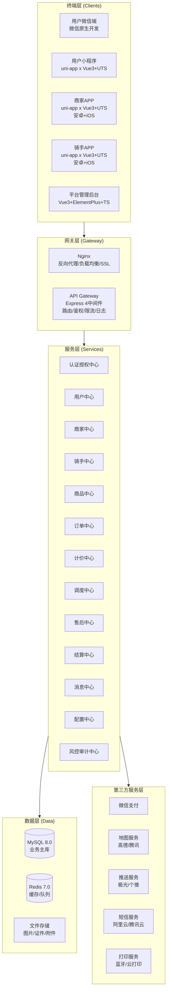
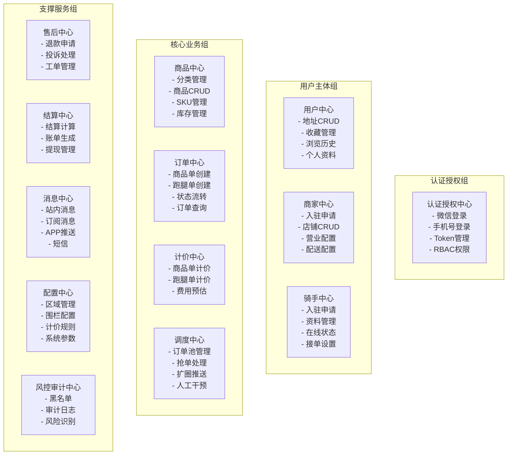
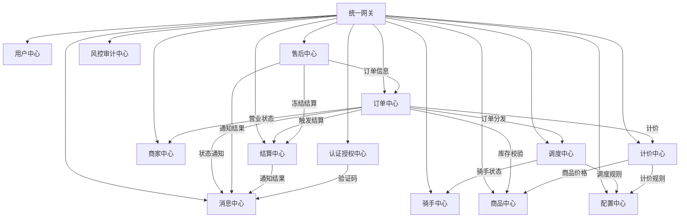
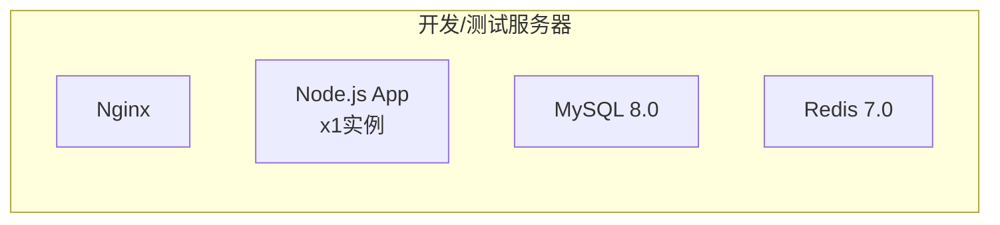
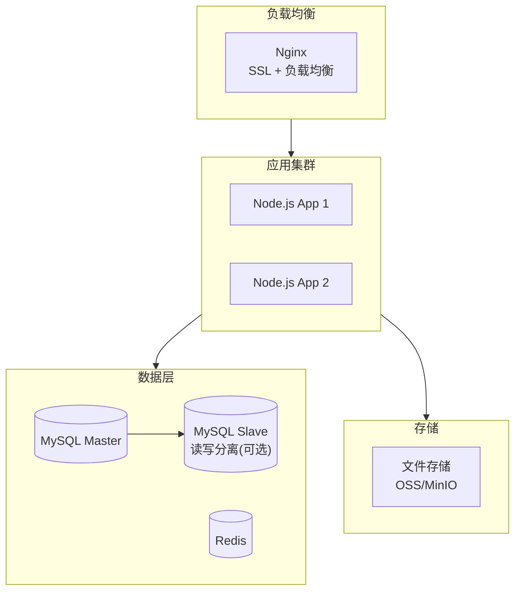
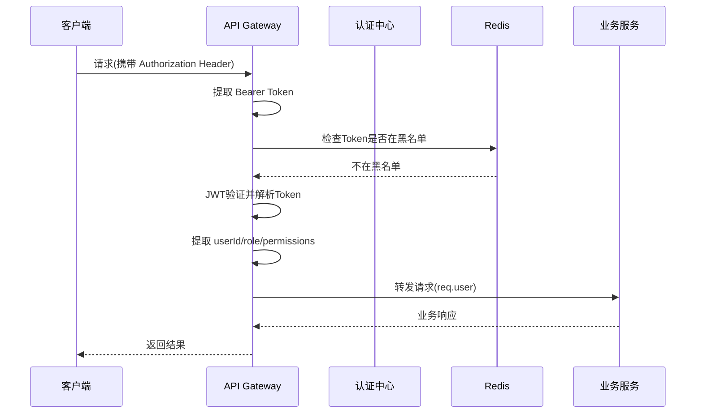

# 技术架构设计文档

> 版本: v1.0
> 状态: 基线版
> 所属阶段: 01_项目启动与架构设计

---

## 一、整体架构概览

### 1.1 架构分层图



### 1.2 架构原则

| 原则 | 说明 |
|------|------|
| 单体分模块 | 首期采用单体应用按服务域分模块组织，降低运维复杂度，后续可拆分微服务 |
| 统一网关 | 所有终端请求统一通过API Gateway接入，实现鉴权、限流、日志的集中管理 |
| 服务域内聚 | 每个服务域独立管理自己的数据表和业务逻辑，服务间通过内部方法调用 |
| 状态服务端为准 | 所有业务状态以服务端数据为准，终端不缓存关键状态 |
| 配置可管理 | 关键业务规则（计价、时限、围栏等）通过配置中心管理，避免硬编码 |

---

## 二、分层架构详解

### 2.1 终端层

| 终端 | 技术栈 | 核心职责 | 特殊能力需求 |
|------|--------|----------|-------------|
| 用户微信端 | 微信原生JS-SDK + HTML5/CSS3/JS | 轻量入口，活动承接，快捷查询 | 微信授权、模板消息、分享 |
| 用户小程序 | uni-app x (Vue3+UTS) | 主交易入口，完整商品下单+跑腿发单 | 微信支付、订阅消息、地图 |
| 商家APP | uni-app x (Vue3+UTS) | 店铺经营、订单履约、财务 | 蓝牙打印、离线推送、后台保活、语音播报 |
| 骑手APP | uni-app x (Vue3+UTS) | 接单配送、轨迹上报、收入管理 | 持续定位、锁屏播报、导航、扫码 |
| 平台管理后台 | Vue3 + Element Plus + Tailwind CSS 4 + TS (art-design-pro) | 全系统配置、监控、审核、财务 | 复杂表单、数据可视化、导出 |

**终端通信协议：**
- HTTP/HTTPS：所有终端与服务端的常规接口调用
- WebSocket：骑手实时位置上报、订单状态实时推送、新订单通知
- 微信消息通道：小程序订阅消息、模板消息

### 2.2 网关层

#### Nginx 职责

| 功能 | 说明 |
|------|------|
| 反向代理 | 转发请求至 Node.js 应用服务器 |
| 负载均衡 | 多实例部署时的请求分发 |
| SSL终止 | HTTPS证书管理和SSL卸载 |
| 静态资源 | 管理后台前端静态资源托管 |
| 请求限制 | 基础层面的连接数和请求频率限制 |

#### API Gateway（Express 4中间件链）

请求处理流程：

```mermaid
flowchart LR
    REQ["客户端请求"] --> CORS["CORS处理"]
    CORS --> BODY["请求体解析"]
    BODY --> LOG["请求日志记录"]
    LOG --> RATE["限流中间件"]
    RATE --> TOKEN["Token验证"]
    TOKEN --> PERM["权限校验"]
    PERM --> VALID["参数校验"]
    VALID --> ROUTE["路由分发"]
    ROUTE --> BIZ["业务处理"]
    BIZ --> FORMAT["响应格式化"]
    FORMAT --> RES["返回响应"]
```



网关核心中间件清单：

| 中间件 | 职责 | 执行顺序 |
|--------|------|----------|
| cors | 跨域资源共享 | 1 |
| helmet | 安全HTTP头设置 | 2 |
| express.json / express.urlencoded | 请求体解析（JSON/FormData），Express内置 | 3 |
| morgan / requestLogger | 记录请求方法、路径、参数、耗时、响应码 | 4 |
| rateLimiter | 基于IP和Token的请求限流（Redis实现） | 5 |
| tokenAuth | JWT Token验证，提取用户信息注入req.user | 6 |
| permissionCheck | 基于角色和权限点的访问控制 | 7 |
| express-validator | 基于链式API的请求参数校验 | 8 |
| router | 按服务域分组的路由分发（/api/v1/mobile、/api/v1/admin） | 9 |
| responseFormatter | 统一响应格式包装 | 10 |
| errorHandler | 全局异常捕获和错误响应（Express错误处理中间件） | 全局 |

### 2.3 服务层

#### 服务域职责总览



#### 各服务域详细说明

**1. 认证授权中心**

| 项目 | 说明 |
|------|------|
| 职责 | 统一管理所有角色的登录注册、Token签发续期、权限校验 |
| 核心接口方向 | 微信授权登录、手机号+验证码登录、密码登录、Token刷新、权限校验 |
| 依赖服务 | 用户中心、商家中心、骑手中心（获取角色信息）、消息中心（发送验证码） |
| 被依赖方 | 网关（Token校验）、所有需要身份识别的服务 |
| 关键技术点 | JWT Token（Access Token + Refresh Token双令牌）、Redis存储Token黑名单和验证码 |

**2. 用户中心**

| 项目 | 说明 |
|------|------|
| 职责 | 管理用户个人资料、地址、收藏、浏览历史、消息订阅设置 |
| 核心接口方向 | 个人资料CRUD、地址CRUD、收藏CRUD、浏览历史记录和查询 |
| 依赖服务 | 认证授权中心（身份验证） |
| 被依赖方 | 订单中心（获取地址信息）、消息中心（获取用户推送设置） |
| 关键技术点 | 地址经纬度解析、默认地址管理 |

**3. 商家中心**

| 项目 | 说明 |
|------|------|
| 职责 | 管理商家入驻审核、店铺信息、营业配置、配送设置、员工管理 |
| 核心接口方向 | 入驻申请、店铺CRUD、营业时间配置、配送范围配置、起送价设置 |
| 依赖服务 | 认证授权中心、配置中心（区域信息）、消息中心（审核通知） |
| 被依赖方 | 商品中心（店铺信息）、订单中心（营业状态和配送范围校验）、结算中心（结算信息） |
| 关键技术点 | 配送范围围栏计算、营业时段判断、多门店管理 |

**4. 骑手中心**

| 项目 | 说明 |
|------|------|
| 职责 | 管理骑手入驻审核、个人资料、在线状态、接单偏好设置、轨迹记录 |
| 核心接口方向 | 入驻申请、资料管理、在线状态切换、接单设置、轨迹上报和查询 |
| 依赖服务 | 认证授权中心、配置中心（服务区域）、消息中心（审核通知） |
| 被依赖方 | 调度中心（骑手状态和位置）、订单中心（骑手信息）、结算中心（骑手收入） |
| 关键技术点 | 实时位置上报（WebSocket）、轨迹点压缩存储、在线状态管理（Redis） |

**5. 商品中心**

| 项目 | 说明 |
|------|------|
| 职责 | 管理商品分类、商品信息、SKU规格、库存 |
| 核心接口方向 | 分类CRUD、商品CRUD、SKU管理、库存查询/扣减/释放、商品上下架 |
| 依赖服务 | 商家中心（店铺归属校验） |
| 被依赖方 | 订单中心（商品信息和库存校验）、计价中心（商品价格） |
| 关键技术点 | 库存并发扣减（Redis预扣 + MySQL落库）、多规格SKU建模 |

**6. 订单中心**

| 项目 | 说明 |
|------|------|
| 职责 | 统一管理商品订单和跑腿订单的创建、状态流转、查询和关闭 |
| 核心接口方向 | 商品订单创建、跑腿订单创建、订单详情查询、订单列表查询、订单状态更新、订单取消 |
| 依赖服务 | 计价中心（费用计算）、商品中心（库存校验）、商家中心（营业状态）、调度中心（订单分发）、消息中心（状态通知）、结算中心（触发结算） |
| 被依赖方 | 售后中心（订单信息）、结算中心（订单金额） |
| 关键技术点 | 分布式订单号生成、状态机引擎、支付回调幂等处理、超时自动关闭（Redis延迟队列） |

**7. 计价中心**

| 项目 | 说明 |
|------|------|
| 职责 | 负责商品订单和跑腿订单的费用计算 |
| 核心接口方向 | 商品订单计价、跑腿订单计价、费用预估、配送费计算 |
| 依赖服务 | 配置中心（计价规则模板）、商品中心（商品价格） |
| 被依赖方 | 订单中心（创建订单时计价） |
| 关键技术点 | 阶梯计价引擎、时段和天气加价因子、优惠券抵扣计算 |

商品订单计价公式：
```
应付金额(total_amount) = 商品金额 + 打包费 + 配送费 + 时段加价 + 天气加价 + 小费
实付金额(paid_amount)  = 应付金额 - 优惠券抵扣(discount_amount)
```

跑腿订单计价公式：
```
应付金额(total_amount) = 基础服务费 + 距离费 + 重量费 + 楼层费 + 时段加价 + 天气加价 + 小费 + 代买垫付金额
实付金额(paid_amount)  = 应付金额 - 优惠券抵扣(discount_amount)
```

**8. 调度中心**

| 项目 | 说明 |
|------|------|
| 职责 | 管理骑手订单池、抢单逻辑、扩圈推送、人工干预 |
| 核心接口方向 | 订单入池、订单池查询（骑手端）、抢单、扩圈推送、手动指派 |
| 依赖服务 | 骑手中心（骑手状态和位置）、配置中心（调度规则） |
| 被依赖方 | 订单中心（订单分发） |
| 关键技术点 | Redis有序集合管理订单池、抢单并发控制（Redis分布式锁）、扩圈推送策略 |

**9. 售后中心**

| 项目 | 说明 |
|------|------|
| 职责 | 处理退款申请、投诉工单、售后状态流转 |
| 核心接口方向 | 退款申请提交、退款审核、投诉提交、工单处理、售后详情查询 |
| 依赖服务 | 订单中心（订单信息）、结算中心（冻结/回滚结算）、消息中心（通知处理结果） |
| 被依赖方 | 订单中心（售后状态同步） |
| 关键技术点 | 售后状态机、退款金额计算（全额/部分）、微信退款接口对接 |

**10. 结算中心**

| 项目 | 说明 |
|------|------|
| 职责 | 按规则计算商家和骑手收入，生成结算账单，管理提现 |
| 核心接口方向 | 结算触发、账单查询、提现申请、提现审核、余额查询 |
| 依赖服务 | 订单中心（订单金额和完成状态）、消息中心（通知结算和提现结果） |
| 被依赖方 | 售后中心（冻结结算） |
| 关键技术点 | 佣金分账计算、结算冻结与解冻、提现流程控制 |

**11. 消息中心**

| 项目 | 说明 |
|------|------|
| 职责 | 统一管理所有通知消息的发送和记录 |
| 核心接口方向 | 发送消息、站内消息查询、消息已读标记、消息模板管理 |
| 依赖服务 | 第三方推送服务、微信订阅消息API、短信服务 |
| 被依赖方 | 订单中心、售后中心、结算中心、认证授权中心（所有需要发通知的服务） |
| 关键技术点 | 多通道消息分发（站内消息 + 订阅消息 + APP推送 + 短信）、消息模板引擎、推送失败降级 |

**12. 配置中心**

| 项目 | 说明 |
|------|------|
| 职责 | 管理全局可配置项：区域、围栏、计价规则、服务类型、系统参数 |
| 核心接口方向 | 区域CRUD、围栏配置、计价规则CRUD、服务类型CRUD、系统参数CRUD |
| 依赖服务 | 无 |
| 被依赖方 | 计价中心、调度中心、订单中心、商家中心（几乎所有服务都可能读取配置） |
| 关键技术点 | 配置缓存（Redis）、配置变更通知、配置版本管理 |

**13. 风控审计中心**

| 项目 | 说明 |
|------|------|
| 职责 | 黑名单管理、操作审计日志记录、异常行为识别 |
| 核心接口方向 | 黑名单CRUD、审计日志写入和查询、风险标记 |
| 依赖服务 | 无 |
| 被依赖方 | 网关（黑名单检查）、所有执行敏感操作的服务（写审计日志） |
| 关键技术点 | 异步审计日志写入、黑名单缓存（Redis Set） |

#### 服务间调用关系图



### 2.4 数据层

#### MySQL 8.0 存储策略

| 存储内容 | 说明 |
|----------|------|
| 用户数据 | 用户、地址、收藏、浏览历史 |
| 商家数据 | 商家、门店、商品、分类、SKU |
| 骑手数据 | 骑手资料、接单设置 |
| 交易数据 | 订单、订单明细、跑腿订单扩展、支付记录 |
| 售后数据 | 售后单、投诉工单 |
| 财务数据 | 结算单、提现记录 |
| 配置数据 | 区域、围栏、计价规则、服务类型、系统参数 |
| 营销数据 | 优惠券模板、用户优惠券、Banner |
| 权限数据 | 管理员、角色、权限 |
| 日志数据 | 审计日志、订单操作日志 |
| 轨迹数据 | 骑手轨迹点（量大时可考虑按月分表或归档） |

MySQL 配置要点：
- 字符集：utf8mb4（支持emoji）
- 排序规则：utf8mb4_general_ci
- 引擎：InnoDB
- 事务隔离级别：READ COMMITTED（平衡性能与一致性）
- 连接池：使用 mysql2 库的连接池，最大连接数根据服务器配置调整

#### Redis 7.0 存储策略

| 用途 | 数据结构 | Key示例 | TTL |
|------|----------|---------|-----|
| Access Token存储 | String | `token:access:{userId}` | 2小时 |
| Refresh Token存储 | String | `token:refresh:{userId}` | 7天 |
| Token黑名单 | Set | `token:blacklist` | Token剩余有效期 |
| 验证码 | String | `sms:code:{phone}` | 5分钟 |
| 验证码频率限制 | String | `sms:limit:{phone}` | 1分钟 |
| 配置缓存 | Hash | `config:{category}` | 10分钟 |
| 商家营业状态 | String | `store:status:{storeId}` | 实时更新 |
| 骑手在线状态 | Hash | `rider:online:{areaId}` | 实时更新 |
| 骑手位置 | Geo | `rider:location:{areaId}` | 实时更新 |
| 订单池 | Sorted Set | `dispatch:pool:{areaId}` | 订单过期自动移除 |
| 抢单锁 | String | `dispatch:lock:{orderId}` | 30秒 |
| 库存预扣 | Hash | `stock:prelock:{skuId}` | 15分钟 |
| 订单超时关闭 | Sorted Set | `order:timeout` | 由定时任务处理 |
| 接口限流计数 | String | `ratelimit:{ip}:{api}` | 1分钟 |
| 黑名单 | Set | `blacklist:{type}` | 无过期（手动管理） |
| 幂等键 | String | `idempotent:{key}` | 24小时 |

### 2.5 第三方服务层

#### 第三方服务对接方案

**1. 微信支付**

| 项目 | 说明 |
|------|------|
| 对接方式 | 微信支付V3 API |
| 核心能力 | JSAPI支付（小程序）、APP支付（商家/骑手APP）、退款、查询 |
| 安全要求 | 证书存储在服务端安全目录、回调验签、金额一致性校验 |
| 回调处理 | 幂等处理、重复回调忽略、失败重试（微信自动重试） |
| 配置项 | appId、mchId、apiKey、certPath（均存.env，不入库不入代码） |

**2. 地图服务（高德/腾讯二选一）**

| 项目 | 说明 |
|------|------|
| 对接方式 | REST API + 前端 JS SDK + 原生地图插件 |
| 核心能力 | 地理编码、逆地理编码、距离计算、路线规划、实时导航 |
| 使用场景 | 地址解析经纬度、配送距离计算、骑手导航、围栏范围判断 |
| 配置项 | apiKey（服务端）、jsKey（前端）（存.env） |

**3. 推送服务（极光/个推二选一）**

| 项目 | 说明 |
|------|------|
| 对接方式 | 服务端 REST API + 客户端 SDK |
| 核心能力 | APP离线推送、自定义消息、标签/别名推送 |
| 使用场景 | 商家新订单提醒、骑手订单推送、状态变更通知 |
| 降级策略 | 推送失败 → 站内消息 + 短信补发 |
| 配置项 | appKey、masterSecret（存.env） |

**4. 短信服务（阿里云/腾讯云）**

| 项目 | 说明 |
|------|------|
| 对接方式 | 服务端 SDK |
| 核心能力 | 验证码发送、通知短信、营销短信 |
| 频率限制 | 同一手机号1分钟内仅允许1次、每日上限5-10次 |
| 配置项 | accessKeyId、accessKeySecret、signName、templateId（存.env） |

**5. 蓝牙/云打印**

| 项目 | 说明 |
|------|------|
| 对接方式 | 蓝牙：uni-app x原生蓝牙API；云打印：服务端API |
| 核心能力 | 小票打印（接单后自动/手动打印） |
| 使用场景 | 商家APP接单后打印订单小票 |

---

## 三、服务间通信方式

### 3.1 同步调用

首期采用单体应用内部直接方法调用，服务间通过 Service 层引用：

```typescript
// 示例：订单中心调用计价中心
class OrderService {
  constructor(
    private pricingService: PricingService,
    private productService: ProductService,
    private dispatchService: DispatchService,
  ) {}

  async createOrder(params: CreateOrderDTO) {
    const price = await this.pricingService.calculate(params);
    // ...
  }
}
```

### 3.2 异步处理

对于不需要同步等待结果的操作，使用以下方式：

| 场景 | 实现方式 | 说明 |
|------|----------|------|
| 订单超时关闭 | Redis Sorted Set + 定时轮询 | Score为过期时间戳，定时任务扫描并关闭 |
| 消息通知发送 | Redis List 作为简单队列 | 业务方push消息，消息中心消费并发送 |
| 审计日志写入 | Redis List 异步写入 | 避免日志写入影响主流程性能 |
| 扩圈推送 | 定时任务 | 定时扫描长时间无人接单的订单 |

### 3.3 实时通信

| 场景 | 协议 | 实现方式 |
|------|------|----------|
| 骑手位置上报 | WebSocket | 骑手APP建立长连接，定期上报位置 |
| 新订单通知 | WebSocket + 推送 | WebSocket在线通知 + APP推送离线通知 |
| 订单状态变更 | WebSocket | 实时推送状态变更给相关终端 |

WebSocket 连接管理：
- 使用 `ws` 库或 `socket.io`
- 连接认证：建立连接时验证Token
- 心跳检测：每30秒一次，超时断开
- 重连机制：客户端自动重连，指数退避

---

## 四、部署架构

### 4.1 开发/测试环境



- 单台服务器部署全部服务
- 建议配置：4核8G内存 + 100G SSD
- Node.js 使用 PM2 管理进程

### 4.2 生产环境（建议）



- 应用层：至少2个Node.js实例，PM2 Cluster模式
- 数据库：MySQL主库 + 从库（读写分离可选）
- 缓存：Redis单实例（首期数据量不需要集群）
- 文件存储：OSS或自建MinIO
- 建议配置：8核16G内存 + 200G SSD（应用服务器） + 8核16G + 500G SSD（数据库服务器）

---

## 五、安全架构

### 5.1 认证鉴权方案



Token 策略：

| 项目 | Access Token | Refresh Token |
|------|-------------|---------------|
| 有效期 | 2小时 | 7天 |
| 存储位置 | 客户端内存/Storage + Redis | 客户端Storage + Redis |
| 用途 | 接口鉴权 | 刷新Access Token |
| 失效时机 | 过期/手动登出/修改密码 | 过期/手动登出/修改密码 |

权限控制：

| 层级 | 说明 | 实现方式 |
|------|------|----------|
| 接口级 | 控制哪些角色可调用哪些接口 | 路由级中间件 + 角色白名单 |
| 数据级 | 控制用户只能访问自己的数据 | Service层过滤 user_id/store_id/rider_id |
| 菜单级 | 控制后台不同角色看到不同菜单 | 前端根据权限点动态渲染 |

### 5.2 数据安全

| 安全项 | 措施 |
|--------|------|
| 传输加密 | 全站HTTPS，API强制HTTPS |
| 密码存储 | bcrypt 哈希（cost factor >= 10） |
| 敏感信息 | 手机号展示脱敏（138****1234）、身份证脱敏 |
| 支付安全 | 微信支付回调验签、金额服务端校验、幂等处理 |
| SQL注入 | 参数化查询（mysql2 prepared statement） |
| XSS防护 | 输入过滤 + 输出转义 |
| CSRF防护 | Token机制已覆盖（无Cookie认证） |
| 文件上传 | 文件类型白名单、大小限制、病毒扫描（可选） |
| 环境变量 | 所有密钥和第三方凭证存.env，不入代码库 |

### 5.3 接口安全

| 安全项 | 措施 |
|--------|------|
| 限流 | 基于IP + Token的请求频率限制（Redis计数） |
| 黑名单 | IP黑名单 + 账号黑名单（Redis Set） |
| 幂等 | 关键接口（支付回调、订单创建）基于幂等键去重 |
| 签名 | 支付回调等第三方通知必须验签 |
| 日志 | 所有请求记录访问日志，敏感操作记录审计日志 |

---

## 六、技术选型版本清单

### 6.1 后端依赖

| 依赖 | 版本 | 用途 |
|------|------|------|
| Node.js | 18.x LTS | 运行时 |
| Express | 4.18 | Web框架 |
| mysql2 | 3.6 | MySQL驱动 |
| redis | 4.6 | Redis客户端 |
| jsonwebtoken | 9.0 | JWT签发验证 |
| bcrypt | 5.1 | 密码哈希 |
| express-validator | latest | 参数校验（链式API） |
| cors | latest | 跨域处理 |
| helmet | latest | 安全HTTP头 |
| morgan | latest | HTTP请求日志 |
| winston | latest | 应用日志 |
| dotenv | latest | 环境变量加载 |
| multer | latest | 文件上传 |
| ws | 8.x | WebSocket |
| node-cron | 3.x | 定时任务 |
| nodemon | latest | 开发热更新 |
| pm2 | 5.x | 进程管理 |

### 6.2 前端依赖（管理后台）

| 依赖 | 版本 | 用途 |
|------|------|------|
| Vue | 3.5.21 | 前端框架 |
| TypeScript | 5.6.3 | 类型安全 |
| Vite | 7.1.5 | 构建工具 |
| Element Plus | 2.11.2 | UI组件库 |
| Tailwind CSS | 4.1.14 | 原子化CSS框架 |
| Vue Router | 4.5.1 | 路由 |
| Pinia | 3.0.3 | 状态管理 |
| Axios | 1.12.2 | HTTP请求 |
| ECharts | 6.0.0 | 图表可视化 |
| vue-i18n | 9.14 | 国际化 |
| art-design-pro | - | 管理后台模板 |

### 6.3 前端依赖（uni-app x项目）

| 依赖 | 版本 | 用途 |
|------|------|------|
| HBuilderX | ^4.66 | IDE |
| uni-app x | Vue3版 | 跨端框架（.uvue文件格式） |
| UTS | - | 类型安全语言（替代标准TypeScript） |
| Pinia | 2.x | 状态管理 |
| unix-ui (uXui) | 1.2.0 | UI组件库 |

### 6.4 基础设施

| 组件 | 版本 | 用途 |
|------|------|------|
| MySQL | 8.0.x | 关系数据库 |
| Redis | 7.0.x | 缓存和队列 |
| Nginx | 1.24+ | 反向代理 |
| PM2 | 5.x | Node进程管理 |
| Git | latest | 版本控制 |
