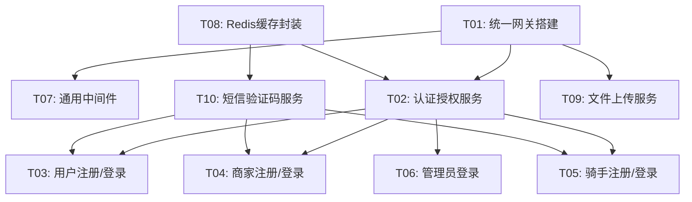

# 基础服务开发任务

> 版本: v1.1
> 状态: 基线版
> 所属阶段: 02_数据库设计与基础服务
> 后端框架: Express 4（中间件风格 `(req, res, next)`）
> 路由结构: `/api/v1/mobile`、`/api/v1/admin`

---

## 全局约定：金额单位

> **所有金额字段在接口传输和数据库存储中统一使用"分"（整数，类型为 `INT` 或 `BIGINT`）。**
> - 前端负责显示时除以 100 转为元（如 `amount / 100`）。
> - 后端接收和返回的金额字段值均为整数分，例如 `5800` 表示 `58.00 元`。
> - 数据库中金额字段类型为 `INT`（单位：分），而非 `DECIMAL`。
> - 此约定覆盖所有服务域：订单中心、计价中心、结算中心、售后中心等。

---

## 一、任务总览

| 序号 | 任务名称 | 优先级 | 预估复杂度 | 依赖 |
|------|----------|--------|-----------|------|
| T01 | 统一网关搭建 | P0 | 中 | 项目骨架 |
| T02 | 认证授权服务 | P0 | 高 | T01 |
| T03 | 用户注册/登录流程 | P0 | 中 | T02 |
| T04 | 商家注册/登录流程 | P0 | 中 | T02 |
| T05 | 骑手注册/登录流程 | P0 | 中 | T02 |
| T06 | 管理员登录流程 | P0 | 低 | T02 |
| T07 | 通用中间件 | P0 | 中 | T01 |
| T08 | Redis缓存封装 | P0 | 中 | 项目骨架 |
| T09 | 文件上传服务 | P1 | 低 | T01 |
| T10 | 短信验证码服务 | P0 | 低 | T08 |



---

## 二、任务详细定义

### T01: 统一网关搭建

**目标：** 搭建API Gateway，实现所有请求的统一接入、中间件链处理和路由分发。

**输入：**
- 阶段01的后端项目骨架
- API接口规范（URL规则、响应格式、错误码）

**输出：**
- 可运行的Express应用，包含完整中间件链
- 路由按服务域分组注册
- 全局错误处理和日志记录

**实现要点：**

1. **应用入口（app.ts）**

```typescript
import express from 'express';
import cors from 'cors';
import { errorHandler } from './middleware/errorHandler';
import { requestLogger } from './middleware/requestLogger';
import { responseFormatter } from './middleware/responseFormatter';
import { rateLimiter } from './middleware/rateLimiter';
import mobileRouter from './routes/mobile';
import adminRouter from './routes/admin';

const app = express();

app.use(cors({ origin: '*', credentials: true }));
app.use(express.json({ limit: '10mb' }));
app.use(express.urlencoded({ extended: true }));
app.use(requestLogger());
app.use(rateLimiter());
app.use(responseFormatter());

app.use('/api/v1/mobile', mobileRouter);
app.use('/api/v1/admin', adminRouter);

app.use(errorHandler());

export default app;
```

2. **路由注册（routes/index.ts）**

按服务域分组注册路由，前缀 `/api/v1/{service}`：

| 路由文件 | 前缀 | 说明 |
|----------|------|------|
| auth.routes.ts | /api/v1/auth | 认证相关 |
| user.routes.ts | /api/v1/user | 用户中心 |
| merchant.routes.ts | /api/v1/merchant | 商家中心 |
| rider.routes.ts | /api/v1/rider | 骑手中心 |
| product.routes.ts | /api/v1/product | 商品中心 |
| order.routes.ts | /api/v1/order | 订单中心 |
| pricing.routes.ts | /api/v1/pricing | 计价中心 |
| dispatch.routes.ts | /api/v1/dispatch | 调度中心 |
| aftersale.routes.ts | /api/v1/aftersale | 售后中心 |
| settlement.routes.ts | /api/v1/settlement | 结算中心 |
| message.routes.ts | /api/v1/message | 消息中心 |
| config.routes.ts | /api/v1/config | 配置中心 |
| risk.routes.ts | /api/v1/risk | 风控审计 |
| admin.routes.ts | /api/v1/admin | 管理后台 |
| common.routes.ts | /api/v1/common | 公共接口（健康检查、文件上传） |

3. **请求日志中间件（requestLogger.ts）**

记录每个请求的：
- 请求方法、路径、查询参数
- 请求来源IP、客户端类型（从X-Client-Type头获取）
- 响应状态码、耗时（ms）
- 错误信息（如果有）

使用 winston 写入日志文件，按天切割。

4. **全局错误处理中间件（errorHandler.ts）**

```typescript
export function errorHandler() {
  return (err: any, req: Request, res: Response, next: NextFunction) => {
    const status = err.status || 500;
    const code = err.code || 10005;
    const message = err.message || '服务器内部错误';

    res.status(status).json({
      code,
      message,
      data: null,
    });

    if (status >= 500) {
      logger.error(`[${req.method}] ${req.path} - ${err.stack}`);
    }
  };
}
```

5. **限流中间件（rateLimiter.ts）**

基于Redis实现滑动窗口限流：
- 默认限制：每个IP每分钟60次请求
- 登录接口：每个IP每分钟10次
- 验证码接口：每个手机号每分钟1次
- 返回 `429 Too Many Requests`，错误码 10100

6. **健康检查接口**

```
GET /api/v1/common/health
响应: { code: 0, message: "success", data: { status: "ok", timestamp: "..." } }
```

**验收标准：**
- [ ] 应用可正常启动并监听端口
- [ ] 所有路由文件已注册（可返回空响应或404）
- [ ] 请求日志正常记录到文件
- [ ] 错误处理中间件能捕获异常并返回统一格式
- [ ] 健康检查接口返回200
- [ ] 限流中间件可正常工作（超限返回429）

---

### T02: 认证授权服务

**目标：** 实现统一的Token签发、验证、刷新和权限控制。

**输入：**
- JWT配置（.env中的密钥和有效期）
- 角色权限定义（roles + role_permissions 表）
- 用户/商家/骑手/管理员数据表

**输出：**
- Token签发和刷新接口
- Token验证中间件
- 权限校验中间件
- Token黑名单管理

**接口定义：**

| 接口 | 方法 | 路径 | 角色 | 说明 |
|------|------|------|------|------|
| 刷新Token | POST | /api/v1/auth/refresh-token | 任意已登录 | 用Refresh Token换取新的Access Token |
| 登出 | POST | /api/v1/auth/logout | 任意已登录 | 将当前Token加入黑名单 |

**刷新Token接口：**

请求体：
```json
{
  "refreshToken": "eyJhbGciOiJIUzI1NiIs..."
}
```

响应：
```json
{
  "code": 0,
  "message": "success",
  "data": {
    "accessToken": "eyJhbGciOiJIUzI1NiIs...",
    "refreshToken": "eyJhbGciOiJIUzI1NiIs...",
    "expiresIn": 7200
  }
}
```

**Token结构（JWT Payload）：**

```json
{
  "userId": 10001,
  "role": "USER",
  "clientType": "miniapp",
  "iat": 1700000000,
  "exp": 1700007200
}
```

role取值：USER / MERCHANT / RIDER / ADMIN

**Token验证中间件（auth.ts）：**

```typescript
export function tokenAuth(options?: { optional?: boolean }) {
  return async (req: Request, res: Response, next: NextFunction) => {
    const token = req.headers.authorization?.replace('Bearer ', '');

    if (!token) {
      if (options?.optional) return next();
      return next(new AppError(11001, '未登录或Token过期', 401));
    }

    const isBlacklisted = await redis.sismember('token:blacklist', token);
    if (isBlacklisted) {
      return next(new AppError(11002, 'Token无效', 401));
    }

    const payload = jwt.verify(token, config.jwt.accessSecret);
    (req as any).user = payload;

    next();
  };
}
```

**权限校验中间件（permission.ts）：**

```typescript
export function requirePermission(...permissions: string[]) {
  return async (req: Request, res: Response, next: NextFunction) => {
    const { role, userId } = (req as any).user;

    if (role === 'ADMIN') {
      const admin = await getAdminById(userId);
      const roleInfo = await getRoleById(admin.role_id);
      if (roleInfo.code === 'SUPER_ADMIN') return next();

      const rolePerms = await getPermissionsByRoleId(admin.role_id);
      const hasPermission = permissions.some(p => rolePerms.includes(p));
      if (!hasPermission) return next(new AppError(11003, '权限不足', 403));
    }

    next();
  };
}

export function requireRole(...roles: string[]) {
  return (req: Request, res: Response, next: NextFunction) => {
    const { role } = (req as any).user;
    if (!roles.includes(role)) {
      return next(new AppError(11003, '权限不足', 403));
    }
    next();
  };
}
```

**验收标准：**
- [ ] Token签发包含正确的payload字段
- [ ] Access Token 2小时过期
- [ ] Refresh Token 7天过期
- [ ] 过期Token返回11001错误
- [ ] 黑名单Token返回11002错误
- [ ] 登出后Token立即失效
- [ ] Refresh Token可成功换取新Access Token
- [ ] 权限中间件对无权限角色返回403

---

### T03: 用户注册/登录流程

**目标：** 实现用户通过微信小程序授权登录和手机号绑定。

**接口定义：**

| 接口 | 方法 | 路径 | 认证 | 说明 |
|------|------|------|------|------|
| 微信登录 | POST | /api/v1/auth/user/wx-login | 否 | 用微信code换取Token |
| 绑定手机号 | POST | /api/v1/auth/user/bind-phone | 是 | 绑定手机号 |
| 更新用户信息 | PUT | /api/v1/auth/user/profile | 是 | 更新昵称、头像 |

**微信登录接口：**

请求体：
```json
{
  "code": "微信wx.login()获取的code",
  "encryptedData": "加密数据(可选,获取手机号用)",
  "iv": "加密向量(可选)"
}
```

业务流程：
1. 调用微信 `auth.code2Session` 接口，用code换取 openid + session_key
2. 根据 openid 查找用户表
3. 如果用户不存在，自动创建用户记录（status=ACTIVE）
4. 签发 Access Token + Refresh Token
5. 将 session_key 加密后存入用户表

响应：
```json
{
  "code": 0,
  "message": "success",
  "data": {
    "accessToken": "...",
    "refreshToken": "...",
    "expiresIn": 7200,
    "isNewUser": true,
    "hasPhone": false,
    "userInfo": {
      "id": 10001,
      "nickname": "",
      "avatar": "",
      "phone": null
    }
  }
}
```

**绑定手机号接口：**

请求体：
```json
{
  "phone": "13800138000",
  "code": "1234"
}
```

业务流程：
1. 验证短信验证码（从Redis中获取并比对）
2. 检查手机号是否已被其他用户绑定
3. 更新用户表phone字段

响应：
```json
{
  "code": 0,
  "message": "success",
  "data": { "phone": "138****8000" }
}
```

错误码：
| 错误码 | 说明 |
|--------|------|
| 11005 | 验证码错误或已过期 |
| 12001 | 手机号已被其他账号绑定 |
| 12002 | 微信授权失败 |

**验收标准：**
- [ ] 微信code可成功换取Token
- [ ] 新用户自动创建记录
- [ ] 老用户直接登录
- [ ] 手机号绑定成功
- [ ] 重复手机号绑定报错
- [ ] 验证码错误报错

---

### T04: 商家注册/登录流程

**接口定义：**

| 接口 | 方法 | 路径 | 认证 | 说明 |
|------|------|------|------|------|
| 发送验证码 | POST | /api/v1/auth/merchant/send-code | 否 | 发送手机号验证码 |
| 商家注册 | POST | /api/v1/auth/merchant/register | 否 | 手机号+验证码注册 |
| 商家登录 | POST | /api/v1/auth/merchant/login | 否 | 手机号+验证码登录 |
| 密码登录 | POST | /api/v1/auth/merchant/login-pwd | 否 | 手机号+密码登录 |

**商家注册接口：**

请求体：
```json
{
  "phone": "13800138000",
  "code": "1234",
  "password": "商家设置的密码",
  "name": "商家名称",
  "contactName": "联系人姓名"
}
```

业务流程：
1. 验证短信验证码
2. 检查手机号是否已注册
3. 密码bcrypt哈希
4. 创建merchants记录（status=PENDING, audit_status=PENDING）
5. 签发Token（role=MERCHANT）

响应：
```json
{
  "code": 0,
  "message": "success",
  "data": {
    "accessToken": "...",
    "refreshToken": "...",
    "expiresIn": 7200,
    "merchantInfo": {
      "id": 1001,
      "name": "商家名称",
      "status": "PENDING",
      "auditStatus": "PENDING"
    }
  }
}
```

**商家验证码登录接口：**

请求体：
```json
{
  "phone": "13800138000",
  "code": "1234"
}
```

业务流程：
1. 验证短信验证码
2. 根据手机号查找商家记录
3. 检查商家状态（FROZEN则拒绝登录）
4. 签发Token

**商家密码登录接口：**

请求体：
```json
{
  "phone": "13800138000",
  "password": "密码"
}
```

错误码：
| 错误码 | 说明 |
|--------|------|
| 13001 | 商家账号不存在 |
| 13002 | 密码错误 |
| 13003 | 商家账号已冻结 |
| 13004 | 手机号已注册 |

**验收标准：**
- [ ] 商家可通过手机号+验证码注册
- [ ] 注册后状态为PENDING
- [ ] 可通过验证码登录
- [ ] 可通过密码登录
- [ ] 冻结商家不能登录
- [ ] 密码错误提示明确

---

### T05: 骑手注册/登录流程

**接口定义：**

| 接口 | 方法 | 路径 | 认证 | 说明 |
|------|------|------|------|------|
| 发送验证码 | POST | /api/v1/auth/rider/send-code | 否 | 发送手机号验证码 |
| 骑手注册 | POST | /api/v1/auth/rider/register | 否 | 手机号+验证码注册 |
| 骑手登录 | POST | /api/v1/auth/rider/login | 否 | 手机号+验证码登录 |

**骑手注册接口：**

请求体：
```json
{
  "phone": "13800138000",
  "code": "1234",
  "password": "密码",
  "name": "真实姓名"
}
```

业务流程：
1. 验证短信验证码
2. 检查手机号是否已注册
3. 密码bcrypt哈希
4. 创建riders记录（status=PENDING, audit_status=PENDING, online_status=OFFLINE）
5. 签发Token（role=RIDER）

响应结构与商家注册类似。

错误码：
| 错误码 | 说明 |
|--------|------|
| 14001 | 骑手账号不存在 |
| 14002 | 密码错误 |
| 14003 | 骑手账号已冻结 |
| 14004 | 手机号已注册 |

**验收标准：**
- [ ] 骑手可通过手机号+验证码注册
- [ ] 注册后状态为PENDING，在线状态为OFFLINE
- [ ] 可通过验证码登录
- [ ] 冻结骑手不能登录

---

### T06: 管理员登录流程

**接口定义：**

| 接口 | 方法 | 路径 | 认证 | 说明 |
|------|------|------|------|------|
| 管理员登录 | POST | /api/v1/auth/admin/login | 否 | 用户名+密码登录 |
| 获取当前管理员信息 | GET | /api/v1/auth/admin/info | 是 | 获取个人信息和权限 |

**管理员登录接口：**

请求体：
```json
{
  "username": "admin",
  "password": "密码"
}
```

业务流程：
1. 根据用户名查找admins记录
2. bcrypt验证密码
3. 检查状态（FROZEN拒绝）
4. 签发Token（role=ADMIN）
5. 更新last_login_at和last_login_ip
6. 写审计日志

响应：
```json
{
  "code": 0,
  "message": "success",
  "data": {
    "accessToken": "...",
    "refreshToken": "...",
    "expiresIn": 7200,
    "adminInfo": {
      "id": 1,
      "username": "admin",
      "realName": "超级管理员",
      "roleName": "超级管理员",
      "permissions": ["*"]
    }
  }
}
```

**初始化种子数据：** 系统首次部署时需要插入一条超级管理员记录和对应角色：

```sql
INSERT INTO roles (name, code, description, status)
VALUES ('超级管理员', 'SUPER_ADMIN', '拥有所有权限', 'ACTIVE');

INSERT INTO admins (username, password_hash, real_name, role_id, status)
VALUES ('admin', '$2b$10$...哈希后的密码...', '超级管理员', 1, 'ACTIVE');
```

**验收标准：**
- [ ] 管理员可通过用户名+密码登录
- [ ] 登录成功返回Token和权限列表
- [ ] 密码错误返回明确提示
- [ ] 冻结管理员不能登录
- [ ] 登录操作记录审计日志

---

### T07: 通用中间件

**目标：** 开发可复用的通用中间件，供所有路由使用。

**1. 参数校验中间件（validator.ts）**

基于 Joi 或 Zod 实现声明式参数校验：

```typescript
import Joi from 'joi';

export function validate(schema: {
  body?: Joi.ObjectSchema;
  query?: Joi.ObjectSchema;
  params?: Joi.ObjectSchema;
}) {
  return (req: Request, res: Response, next: NextFunction) => {
    if (schema.body) {
      const { error, value } = schema.body.validate(req.body, { abortEarly: false });
      if (error) {
        return next(new AppError(10001, '参数校验失败', 400, formatErrors(error)));
      }
      req.body = value;
    }
    // params 和 query 同理
    next();
  };
}
```

使用示例：
```typescript
const createOrderSchema = {
  body: Joi.object({
    storeId: Joi.number().required(),
    addressId: Joi.number().required(),
    items: Joi.array().items(
      Joi.object({
        skuId: Joi.number().required(),
        quantity: Joi.number().integer().min(1).required(),
      })
    ).min(1).required(),
    remark: Joi.string().max(200).allow(''),
    couponRecordId: Joi.number().optional(),
  }),
};

router.post('/orders', tokenAuth(), validate(createOrderSchema), orderController.create);
```

**2. 分页中间件（pagination.ts）**

```typescript
export function paginate() {
  return (req: Request, res: Response, next: NextFunction) => {
    const page = Math.max(1, parseInt(req.query.page as string) || 1);
    const pageSize = Math.min(100, Math.max(1, parseInt(req.query.pageSize as string) || 20));
    const sortBy = (req.query.sortBy as string) || 'created_at';
    const sortOrder = (req.query.sortOrder as string) === 'asc' ? 'ASC' : 'DESC';

    (req as any).pagination = { page, pageSize, offset: (page - 1) * pageSize, sortBy, sortOrder };
    next();
  };
}
```

**3. 响应格式化中间件（responseFormatter.ts）**

确保所有成功响应遵循统一格式 `{ code: 0, message: "success", data: ... }`。

**4. 自定义错误类（AppError）**

```typescript
export class AppError extends Error {
  code: number;
  status: number;
  errors?: any[];

  constructor(code: number, message: string, status: number = 400, errors?: any[]) {
    super(message);
    this.code = code;
    this.status = status;
    this.errors = errors;
  }
}
```

**验收标准：**
- [ ] 参数校验中间件能拦截不合法参数
- [ ] 校验失败返回10001错误码及详细字段信息
- [ ] 分页中间件正确解析page/pageSize参数
- [ ] pageSize最大限制为100
- [ ] 响应格式统一为 { code, message, data }
- [ ] AppError可携带自定义错误码和HTTP状态码

---

### T08: Redis缓存封装

**目标：** 封装Redis操作工具，支持Token管理、验证码、配置缓存等场景。

**实现要点：**

```typescript
import Redis from 'ioredis';

class RedisClient {
  private client: Redis;

  constructor() {
    this.client = new Redis({
      host: config.redis.host,
      port: config.redis.port,
      password: config.redis.password,
      db: config.redis.db,
    });
  }

  // Token 存储
  async setAccessToken(userId: number, role: string, token: string, ttl: number): Promise<void>;
  async setRefreshToken(userId: number, role: string, token: string, ttl: number): Promise<void>;
  async addToBlacklist(token: string, ttl: number): Promise<void>;
  async isBlacklisted(token: string): Promise<boolean>;

  // 验证码
  async setSmsCode(phone: string, code: string, ttl: number): Promise<void>;
  async getSmsCode(phone: string): Promise<string | null>;
  async deleteSmsCode(phone: string): Promise<void>;
  async setSmsLimit(phone: string, ttl: number): Promise<void>;
  async hasSmsLimit(phone: string): Promise<boolean>;

  // 配置缓存
  async setConfig(category: string, key: string, value: string, ttl: number): Promise<void>;
  async getConfig(category: string, key: string): Promise<string | null>;
  async deleteConfig(category: string, key?: string): Promise<void>;

  // 限流
  async incrementRateLimit(key: string, ttl: number): Promise<number>;

  // 通用
  async get(key: string): Promise<string | null>;
  async set(key: string, value: string, ttl?: number): Promise<void>;
  async del(key: string): Promise<void>;
  async exists(key: string): Promise<boolean>;
}

export const redisClient = new RedisClient();
```

**Key命名规范：**

| 用途 | Key格式 | TTL |
|------|---------|-----|
| Access Token | `token:access:{role}:{userId}` | 2h |
| Refresh Token | `token:refresh:{role}:{userId}` | 7d |
| Token黑名单 | `token:blacklist` (Set) | 无限（定期清理） |
| 短信验证码 | `sms:code:{phone}` | 5min |
| 短信频率限制 | `sms:limit:{phone}` | 60s |
| 配置缓存 | `config:{category}:{key}` | 10min |
| 接口限流 | `ratelimit:{ip}:{path}` | 60s |

**验收标准：**
- [ ] Redis连接正常，启动时日志显示连接成功
- [ ] Token存取正确
- [ ] 黑名单判断正确
- [ ] 验证码存取和过期正确
- [ ] 频率限制计数正确
- [ ] 连接断开后自动重连

---

### T09: 文件上传服务

**接口定义：**

| 接口 | 方法 | 路径 | 认证 | 说明 |
|------|------|------|------|------|
| 上传图片 | POST | /api/v1/common/upload/image | 是 | 上传单张图片 |
| 上传多图 | POST | /api/v1/common/upload/images | 是 | 上传多张图片（最多9张） |

**上传图片接口：**

请求：`multipart/form-data`，字段名 `file`

校验规则：
- 允许类型：image/jpeg, image/png, image/gif, image/webp
- 最大大小：10MB
- 文件名生成：`{年月日}/{uuid}.{ext}`

响应：
```json
{
  "code": 0,
  "message": "success",
  "data": {
    "url": "/uploads/20260415/a1b2c3d4.jpg",
    "filename": "a1b2c3d4.jpg",
    "size": 102400,
    "mimeType": "image/jpeg"
  }
}
```

**实现要点：**
- 使用 multer 处理文件上传
- 文件存储到本地 `uploads/` 目录（首期），后续可迁移到 OSS
- Nginx 配置静态文件访问路径
- 图片可做基础压缩（使用 sharp 库，可选）

**验收标准：**
- [ ] 可成功上传图片并返回URL
- [ ] 非图片类型文件上传被拒绝
- [ ] 超大文件上传被拒绝
- [ ] 返回的URL可以通过浏览器访问
- [ ] 多图上传正确返回所有URL

---

### T10: 短信验证码服务

**接口定义：**

| 接口 | 方法 | 路径 | 认证 | 说明 |
|------|------|------|------|------|
| 发送验证码 | POST | /api/v1/common/sms/send-code | 否 | 发送短信验证码 |

**发送验证码接口：**

请求体：
```json
{
  "phone": "13800138000",
  "scene": "LOGIN"
}
```

scene 取值：LOGIN / REGISTER / BIND_PHONE / RESET_PASSWORD

业务流程：
1. 校验手机号格式（11位中国大陆手机号）
2. 检查频率限制（同一手机号60秒内不重复发送）
3. 检查每日上限（同一手机号每天最多10次）
4. 生成6位随机数字验证码
5. 存入Redis，TTL 5分钟
6. 调用短信服务商API发送
7. 设置60秒频率限制

响应：
```json
{
  "code": 0,
  "message": "验证码已发送",
  "data": {
    "expireIn": 300
  }
}
```

错误码：
| 错误码 | 说明 |
|--------|------|
| 10001 | 手机号格式不正确 |
| 11006 | 操作过于频繁，请稍后重试 |
| 11007 | 今日发送次数已达上限 |
| 21001 | 短信发送失败 |

**开发环境特殊处理：**
- 开发环境可配置固定验证码（如 123456），不实际调用短信API
- 通过 `NODE_ENV=development` 和 `.env` 中的 `SMS_MOCK=true` 控制

**验收标准：**
- [ ] 手机号格式校验正确
- [ ] 60秒内重复发送被拒绝
- [ ] 验证码存入Redis且5分钟过期
- [ ] 开发环境可使用固定验证码
- [ ] 验证码校验成功后自动删除（防重放）
- [ ] 错误手机号格式返回10001错误
