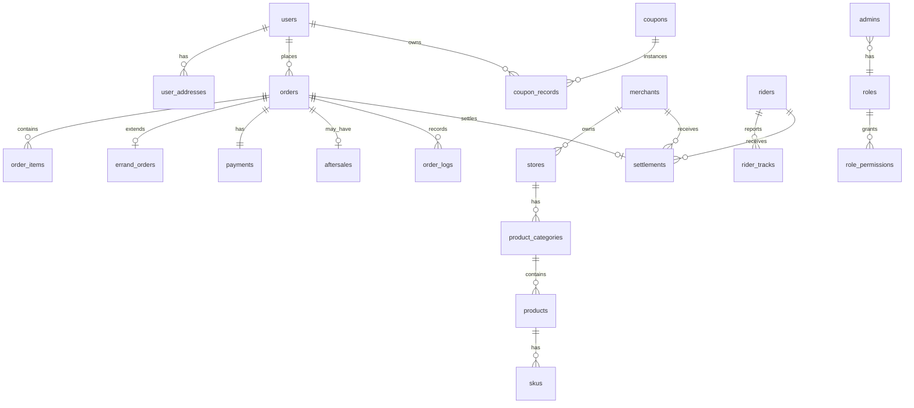

# 数据库设计文档

> 版本: v1.0
> 状态: 基线版
> 所属阶段: 02_数据库设计与基础服务
> 数据库: MySQL 8.0，字符集 utf8mb4，排序规则 utf8mb4_general_ci，引擎 InnoDB

---

## 一、ER 关系图



---

## 二、全局约定

| 约定项 | 规则 |
|--------|------|
| 主键 | `id BIGINT UNSIGNED NOT NULL AUTO_INCREMENT PRIMARY KEY` |
| 时间字段 | `DATETIME NOT NULL DEFAULT CURRENT_TIMESTAMP` |
| 软删除 | `is_deleted TINYINT(1) NOT NULL DEFAULT 0` |
| 金额字段 | `DECIMAL(10,2) NOT NULL DEFAULT 0.00` |
| 状态字段 | `VARCHAR(32) NOT NULL`，使用英文状态码 |
| 外键 | 逻辑外键（不建物理外键约束），字段名 `{关联表单数}_id` |
| 索引 | 频繁查询字段建索引，组合查询建组合索引 |
| JSON字段 | 灵活扩展字段使用 `JSON` 类型 |

每张表必含的公共字段：

```sql
id          BIGINT UNSIGNED NOT NULL AUTO_INCREMENT PRIMARY KEY,
created_at  DATETIME NOT NULL DEFAULT CURRENT_TIMESTAMP,
updated_at  DATETIME NOT NULL DEFAULT CURRENT_TIMESTAMP ON UPDATE CURRENT_TIMESTAMP,
is_deleted  TINYINT(1) NOT NULL DEFAULT 0
```

---

## 三、表结构定义

### 3.1 users（用户表）

存储平台所有C端用户信息。

| 字段名 | 类型 | 必填 | 默认值 | 说明 |
|--------|------|------|--------|------|
| id | BIGINT UNSIGNED | 是 | AUTO_INCREMENT | 主键 |
| phone | VARCHAR(20) | 否 | NULL | 手机号（绑定后必填） |
| nickname | VARCHAR(64) | 否 | '' | 昵称 |
| avatar | VARCHAR(512) | 否 | '' | 头像URL |
| gender | TINYINT(1) | 否 | 0 | 性别：0未知 1男 2女 |
| openid | VARCHAR(128) | 否 | NULL | 微信小程序openid |
| unionid | VARCHAR(128) | 否 | NULL | 微信unionid |
| wx_session_key | VARCHAR(256) | 否 | NULL | 微信session_key（加密存储） |
| status | VARCHAR(32) | 是 | 'ACTIVE' | 状态：ACTIVE正常 FROZEN冻结 CANCELLED注销 |
| last_login_at | DATETIME | 否 | NULL | 最后登录时间 |
| created_at | DATETIME | 是 | CURRENT_TIMESTAMP | 创建时间 |
| updated_at | DATETIME | 是 | CURRENT_TIMESTAMP | 更新时间 |
| is_deleted | TINYINT(1) | 是 | 0 | 软删除 |

**索引：**
- `uk_users_openid` UNIQUE (openid) — 微信openid唯一
- `uk_users_phone` UNIQUE (phone) — 手机号唯一
- `idx_users_unionid` (unionid)
- `idx_users_status` (status)

---

### 3.2 user_addresses（用户地址表）

存储用户的收货地址。

| 字段名 | 类型 | 必填 | 默认值 | 说明 |
|--------|------|------|--------|------|
| id | BIGINT UNSIGNED | 是 | AUTO_INCREMENT | 主键 |
| user_id | BIGINT UNSIGNED | 是 | - | 用户ID |
| contact_name | VARCHAR(32) | 是 | - | 联系人姓名 |
| contact_phone | VARCHAR(20) | 是 | - | 联系人手机号 |
| province | VARCHAR(32) | 是 | - | 省份 |
| city | VARCHAR(32) | 是 | - | 城市 |
| district | VARCHAR(32) | 是 | - | 区/县 |
| address | VARCHAR(256) | 是 | - | 详细地址 |
| house_number | VARCHAR(64) | 否 | '' | 门牌号/楼号 |
| lat | DECIMAL(10,7) | 是 | - | 纬度 |
| lng | DECIMAL(10,7) | 是 | - | 经度 |
| tag | VARCHAR(16) | 否 | '' | 地址标签：家/公司/学校 |
| is_default | TINYINT(1) | 是 | 0 | 是否默认地址 |
| created_at | DATETIME | 是 | CURRENT_TIMESTAMP | 创建时间 |
| updated_at | DATETIME | 是 | CURRENT_TIMESTAMP | 更新时间 |
| is_deleted | TINYINT(1) | 是 | 0 | 软删除 |

**索引：**
- `idx_user_addresses_user_id` (user_id)
- `idx_user_addresses_user_default` (user_id, is_default)

---

### 3.3 merchants（商家表）

存储商家主体信息。

| 字段名 | 类型 | 必填 | 默认值 | 说明 |
|--------|------|------|--------|------|
| id | BIGINT UNSIGNED | 是 | AUTO_INCREMENT | 主键 |
| name | VARCHAR(128) | 是 | - | 商家名称 |
| contact_name | VARCHAR(32) | 是 | - | 联系人姓名 |
| contact_phone | VARCHAR(20) | 是 | - | 联系人手机号 |
| password_hash | VARCHAR(256) | 是 | - | 登录密码哈希 |
| license_no | VARCHAR(64) | 否 | '' | 营业执照号 |
| license_image | VARCHAR(512) | 否 | '' | 营业执照图片URL |
| id_card_front | VARCHAR(512) | 否 | '' | 法人身份证正面URL |
| id_card_back | VARCHAR(512) | 否 | '' | 法人身份证反面URL |
| category | VARCHAR(64) | 否 | '' | 经营类目 |
| balance | DECIMAL(10,2) | 是 | 0.00 | 可用余额 |
| frozen_balance | DECIMAL(10,2) | 是 | 0.00 | 冻结余额 |
| status | VARCHAR(32) | 是 | 'PENDING' | 账号状态：PENDING待审核 ACTIVE正常 FROZEN冻结 REJECTED驳回 |
| audit_status | VARCHAR(32) | 是 | 'PENDING' | 审核状态：PENDING APPROVED REJECTED |
| audit_remark | VARCHAR(512) | 否 | '' | 审核备注 |
| audited_at | DATETIME | 否 | NULL | 审核时间 |
| created_at | DATETIME | 是 | CURRENT_TIMESTAMP | 创建时间 |
| updated_at | DATETIME | 是 | CURRENT_TIMESTAMP | 更新时间 |
| is_deleted | TINYINT(1) | 是 | 0 | 软删除 |

**索引：**
- `uk_merchants_contact_phone` UNIQUE (contact_phone)
- `idx_merchants_status` (status)
- `idx_merchants_audit_status` (audit_status)

---

### 3.4 stores（门店表）

存储商家的门店信息，一个商家可有多个门店。

| 字段名 | 类型 | 必填 | 默认值 | 说明 |
|--------|------|------|--------|------|
| id | BIGINT UNSIGNED | 是 | AUTO_INCREMENT | 主键 |
| merchant_id | BIGINT UNSIGNED | 是 | - | 商家ID |
| name | VARCHAR(128) | 是 | - | 门店名称 |
| logo | VARCHAR(512) | 否 | '' | 门店Logo URL |
| images | JSON | 否 | NULL | 门店图片数组 |
| phone | VARCHAR(20) | 是 | - | 门店联系电话 |
| province | VARCHAR(32) | 是 | - | 省份 |
| city | VARCHAR(32) | 是 | - | 城市 |
| district | VARCHAR(32) | 是 | - | 区/县 |
| address | VARCHAR(256) | 是 | - | 详细地址 |
| lat | DECIMAL(10,7) | 是 | - | 纬度 |
| lng | DECIMAL(10,7) | 是 | - | 经度 |
| business_hours | JSON | 否 | NULL | 营业时间JSON，如 [{"start":"08:00","end":"22:00"}] |
| min_order_amount | DECIMAL(10,2) | 是 | 0.00 | 起送价 |
| delivery_fee | DECIMAL(10,2) | 是 | 0.00 | 基础配送费 |
| delivery_range | INT | 是 | 3000 | 配送范围(米) |
| delivery_time | INT | 是 | 30 | 预计配送时长(分钟) |
| packing_fee | DECIMAL(10,2) | 是 | 0.00 | 打包费 |
| announcement | VARCHAR(512) | 否 | '' | 店铺公告 |
| status | VARCHAR(32) | 是 | 'OPEN' | 门店状态：OPEN营业中 CLOSED休息 SUSPENDED暂停 |
| is_busy | TINYINT(1) | 是 | 0 | 是否忙碌（临时休息） |
| sort | INT | 是 | 0 | 排序权重 |
| commission_rate | DECIMAL(5,2) | 是 | 0.00 | 平台佣金比例(%) |
| area_id | BIGINT UNSIGNED | 否 | NULL | 所属区域ID |
| printer_config | JSON | 否 | NULL | 打印机配置 |
| created_at | DATETIME | 是 | CURRENT_TIMESTAMP | 创建时间 |
| updated_at | DATETIME | 是 | CURRENT_TIMESTAMP | 更新时间 |
| is_deleted | TINYINT(1) | 是 | 0 | 软删除 |

**索引：**
- `idx_stores_merchant_id` (merchant_id)
- `idx_stores_status` (status)
- `idx_stores_area_id` (area_id)
- `idx_stores_lat_lng` (lat, lng) — 用于附近商家查询

---

### 3.5 riders（骑手表）

| 字段名 | 类型 | 必填 | 默认值 | 说明 |
|--------|------|------|--------|------|
| id | BIGINT UNSIGNED | 是 | AUTO_INCREMENT | 主键 |
| phone | VARCHAR(20) | 是 | - | 手机号 |
| password_hash | VARCHAR(256) | 是 | - | 登录密码哈希 |
| name | VARCHAR(32) | 是 | - | 真实姓名 |
| avatar | VARCHAR(512) | 否 | '' | 头像URL |
| id_card_no | VARCHAR(32) | 否 | '' | 身份证号（加密存储） |
| id_card_front | VARCHAR(512) | 否 | '' | 身份证正面URL |
| id_card_back | VARCHAR(512) | 否 | '' | 身份证反面URL |
| health_cert | VARCHAR(512) | 否 | '' | 健康证图片URL |
| vehicle_type | VARCHAR(32) | 否 | '' | 车辆类型：BICYCLE ELECTRIC MOTORCYCLE |
| vehicle_no | VARCHAR(32) | 否 | '' | 车牌号 |
| emergency_contact | VARCHAR(32) | 否 | '' | 紧急联系人 |
| emergency_phone | VARCHAR(20) | 否 | '' | 紧急联系电话 |
| status | VARCHAR(32) | 是 | 'PENDING' | 账号状态：PENDING ACTIVE FROZEN REJECTED |
| audit_status | VARCHAR(32) | 是 | 'PENDING' | 审核状态：PENDING APPROVED REJECTED |
| audit_remark | VARCHAR(512) | 否 | '' | 审核备注 |
| audited_at | DATETIME | 否 | NULL | 审核时间 |
| online_status | VARCHAR(32) | 是 | 'OFFLINE' | 在线状态：ONLINE OFFLINE BUSY |
| accept_order_types | JSON | 否 | NULL | 接单类型偏好JSON |
| accept_radius | INT | 是 | 5000 | 接单半径(米) |
| service_area_id | BIGINT UNSIGNED | 否 | NULL | 服务区域ID |
| current_lat | DECIMAL(10,7) | 否 | NULL | 当前纬度 |
| current_lng | DECIMAL(10,7) | 否 | NULL | 当前经度 |
| last_location_at | DATETIME | 否 | NULL | 最后定位时间 |
| balance | DECIMAL(10,2) | 是 | 0.00 | 可用余额 |
| frozen_balance | DECIMAL(10,2) | 是 | 0.00 | 冻结余额 |
| total_orders | INT | 是 | 0 | 累计完成订单数 |
| rating | DECIMAL(3,2) | 是 | 5.00 | 评分 |
| created_at | DATETIME | 是 | CURRENT_TIMESTAMP | 创建时间 |
| updated_at | DATETIME | 是 | CURRENT_TIMESTAMP | 更新时间 |
| is_deleted | TINYINT(1) | 是 | 0 | 软删除 |

**索引：**
- `uk_riders_phone` UNIQUE (phone)
- `idx_riders_status` (status)
- `idx_riders_online_status` (online_status)
- `idx_riders_service_area_id` (service_area_id)

---

### 3.6 product_categories（商品分类表）

| 字段名 | 类型 | 必填 | 默认值 | 说明 |
|--------|------|------|--------|------|
| id | BIGINT UNSIGNED | 是 | AUTO_INCREMENT | 主键 |
| store_id | BIGINT UNSIGNED | 是 | - | 门店ID |
| parent_id | BIGINT UNSIGNED | 否 | 0 | 父分类ID，0表示一级分类 |
| name | VARCHAR(64) | 是 | - | 分类名称 |
| icon | VARCHAR(512) | 否 | '' | 分类图标URL |
| sort | INT | 是 | 0 | 排序权重（越大越靠前） |
| status | VARCHAR(32) | 是 | 'ACTIVE' | 状态：ACTIVE启用 INACTIVE禁用 |
| created_at | DATETIME | 是 | CURRENT_TIMESTAMP | 创建时间 |
| updated_at | DATETIME | 是 | CURRENT_TIMESTAMP | 更新时间 |
| is_deleted | TINYINT(1) | 是 | 0 | 软删除 |

**索引：**
- `idx_product_categories_store_id` (store_id)
- `idx_product_categories_parent_id` (parent_id)
- `idx_product_categories_store_sort` (store_id, sort)

---

### 3.7 products（商品表）

| 字段名 | 类型 | 必填 | 默认值 | 说明 |
|--------|------|------|--------|------|
| id | BIGINT UNSIGNED | 是 | AUTO_INCREMENT | 主键 |
| store_id | BIGINT UNSIGNED | 是 | - | 门店ID |
| category_id | BIGINT UNSIGNED | 是 | - | 分类ID |
| name | VARCHAR(128) | 是 | - | 商品名称 |
| description | TEXT | 否 | NULL | 商品描述 |
| images | JSON | 否 | NULL | 商品图片数组 |
| base_price | DECIMAL(10,2) | 是 | 0.00 | 基础价格（展示用，实际以SKU为准） |
| packing_fee | DECIMAL(10,2) | 是 | 0.00 | 单品打包费 |
| unit | VARCHAR(16) | 否 | '份' | 单位 |
| min_buy | INT | 是 | 1 | 最小购买量 |
| max_buy | INT | 是 | 0 | 最大购买量（0不限） |
| sales_count | INT | 是 | 0 | 销量 |
| sort | INT | 是 | 0 | 排序权重 |
| is_hot | TINYINT(1) | 是 | 0 | 是否热销 |
| is_new | TINYINT(1) | 是 | 0 | 是否新品 |
| is_recommend | TINYINT(1) | 是 | 0 | 是否推荐 |
| status | VARCHAR(32) | 是 | 'ON_SHELF' | 状态：ON_SHELF上架 OFF_SHELF下架 |
| created_at | DATETIME | 是 | CURRENT_TIMESTAMP | 创建时间 |
| updated_at | DATETIME | 是 | CURRENT_TIMESTAMP | 更新时间 |
| is_deleted | TINYINT(1) | 是 | 0 | 软删除 |

**索引：**
- `idx_products_store_id` (store_id)
- `idx_products_category_id` (category_id)
- `idx_products_store_status` (store_id, status)
- `idx_products_store_sort` (store_id, sort)

---

### 3.8 skus（SKU表）

| 字段名 | 类型 | 必填 | 默认值 | 说明 |
|--------|------|------|--------|------|
| id | BIGINT UNSIGNED | 是 | AUTO_INCREMENT | 主键 |
| product_id | BIGINT UNSIGNED | 是 | - | 商品ID |
| spec_values | JSON | 否 | NULL | 规格值JSON，如 {"size":"大杯","sugar":"半糖"} |
| spec_text | VARCHAR(256) | 否 | '' | 规格描述文本，如"大杯/半糖" |
| price | DECIMAL(10,2) | 是 | 0.00 | SKU价格 |
| original_price | DECIMAL(10,2) | 否 | 0.00 | 原价（划线价） |
| stock | INT | 是 | 0 | 库存数量 |
| sales_count | INT | 是 | 0 | 销量 |
| sku_code | VARCHAR(64) | 否 | '' | SKU编码 |
| status | VARCHAR(32) | 是 | 'ACTIVE' | 状态：ACTIVE INACTIVE |
| created_at | DATETIME | 是 | CURRENT_TIMESTAMP | 创建时间 |
| updated_at | DATETIME | 是 | CURRENT_TIMESTAMP | 更新时间 |
| is_deleted | TINYINT(1) | 是 | 0 | 软删除 |

**索引：**
- `idx_skus_product_id` (product_id)
- `idx_skus_product_status` (product_id, status)

---

### 3.9 orders（订单主表）

统一存储商品订单和跑腿订单。

| 字段名 | 类型 | 必填 | 默认值 | 说明 |
|--------|------|------|--------|------|
| id | BIGINT UNSIGNED | 是 | AUTO_INCREMENT | 主键 |
| order_no | VARCHAR(32) | 是 | - | 订单编号（唯一） |
| user_id | BIGINT UNSIGNED | 是 | - | 用户ID |
| store_id | BIGINT UNSIGNED | 否 | NULL | 门店ID（商品订单必填，跑腿订单为NULL） |
| rider_id | BIGINT UNSIGNED | 否 | NULL | 骑手ID（接单后填入） |
| order_type | VARCHAR(32) | 是 | - | 订单类型：PRODUCT商品订单 ERRAND跑腿订单 |
| status | VARCHAR(32) | 是 | 'PENDING_PAYMENT' | 订单状态（见状态机定义） |
| payment_status | VARCHAR(32) | 是 | 'UNPAID' | 支付状态：UNPAID PAYING PAID REFUNDING PARTIAL_REFUNDED FULL_REFUNDED PAY_FAILED |
| settlement_status | VARCHAR(32) | 是 | 'UNSETTLED' | 结算状态：UNSETTLED FROZEN SETTLED WITHDRAWN |
| total_amount | DECIMAL(10,2) | 是 | 0.00 | 订单总金额（应付） |
| product_amount | DECIMAL(10,2) | 是 | 0.00 | 商品金额 |
| delivery_fee | DECIMAL(10,2) | 是 | 0.00 | 配送费 |
| packing_fee | DECIMAL(10,2) | 是 | 0.00 | 打包费 |
| extra_fee | DECIMAL(10,2) | 是 | 0.00 | 附加费（时段加价+天气加价等） |
| tip_amount | DECIMAL(10,2) | 是 | 0.00 | 小费 |
| discount_amount | DECIMAL(10,2) | 是 | 0.00 | 优惠金额 |
| paid_amount | DECIMAL(10,2) | 是 | 0.00 | 实付金额 |
| refund_amount | DECIMAL(10,2) | 是 | 0.00 | 已退款金额 |
| coupon_record_id | BIGINT UNSIGNED | 否 | NULL | 使用的优惠券记录ID（关联coupon_records.id） |
| contact_name | VARCHAR(32) | 是 | - | 收货人/联系人姓名 |
| contact_phone | VARCHAR(20) | 是 | - | 收货人/联系人手机号 |
| delivery_address | VARCHAR(256) | 是 | - | 配送地址 |
| delivery_lat | DECIMAL(10,7) | 是 | - | 配送地址纬度 |
| delivery_lng | DECIMAL(10,7) | 是 | - | 配送地址经度 |
| user_remark | VARCHAR(512) | 否 | '' | 用户备注 |
| merchant_remark | VARCHAR(512) | 否 | '' | 商家备注 |
| expected_delivery_time | DATETIME | 否 | NULL | 期望送达时间（预约单） |
| pay_deadline | DATETIME | 否 | NULL | 支付截止时间 |
| merchant_accepted_at | DATETIME | 否 | NULL | 商家接单时间 |
| rider_accepted_at | DATETIME | 否 | NULL | 骑手接单时间 |
| picked_up_at | DATETIME | 否 | NULL | 取货时间 |
| delivered_at | DATETIME | 否 | NULL | 送达时间 |
| completed_at | DATETIME | 否 | NULL | 完成时间 |
| cancelled_at | DATETIME | 否 | NULL | 取消时间 |
| cancel_reason | VARCHAR(256) | 否 | '' | 取消原因 |
| rating_score | TINYINT | 否 | NULL | 用户评分 1-5 |
| rating_content | VARCHAR(512) | 否 | '' | 用户评价内容 |
| rating_images | JSON | 否 | NULL | 评价图片 |
| rated_at | DATETIME | 否 | NULL | 评价时间 |
| created_at | DATETIME | 是 | CURRENT_TIMESTAMP | 创建时间 |
| updated_at | DATETIME | 是 | CURRENT_TIMESTAMP | 更新时间 |
| is_deleted | TINYINT(1) | 是 | 0 | 软删除 |

**索引：**
- `uk_orders_order_no` UNIQUE (order_no)
- `idx_orders_user_id` (user_id)
- `idx_orders_store_id` (store_id)
- `idx_orders_rider_id` (rider_id)
- `idx_orders_order_type` (order_type)
- `idx_orders_status` (status)
- `idx_orders_payment_status` (payment_status)
- `idx_orders_user_status` (user_id, status) — 用户订单列表查询
- `idx_orders_store_status` (store_id, status) — 商家订单列表查询
- `idx_orders_rider_status` (rider_id, status) — 骑手订单列表查询
- `idx_orders_created_at` (created_at)

---

### 3.10 order_items（订单商品明细表）

| 字段名 | 类型 | 必填 | 默认值 | 说明 |
|--------|------|------|--------|------|
| id | BIGINT UNSIGNED | 是 | AUTO_INCREMENT | 主键 |
| order_id | BIGINT UNSIGNED | 是 | - | 订单ID |
| product_id | BIGINT UNSIGNED | 是 | - | 商品ID |
| sku_id | BIGINT UNSIGNED | 是 | - | SKU ID |
| product_name | VARCHAR(128) | 是 | - | 商品名称（下单时快照） |
| sku_text | VARCHAR(256) | 否 | '' | 规格描述（下单时快照） |
| product_image | VARCHAR(512) | 否 | '' | 商品图片（下单时快照） |
| price | DECIMAL(10,2) | 是 | - | 单价（下单时快照） |
| quantity | INT | 是 | - | 数量 |
| subtotal | DECIMAL(10,2) | 是 | - | 小计 = price * quantity |
| created_at | DATETIME | 是 | CURRENT_TIMESTAMP | 创建时间 |
| updated_at | DATETIME | 是 | CURRENT_TIMESTAMP | 更新时间 |

**索引：**
- `idx_order_items_order_id` (order_id)

---

### 3.11 errand_orders（跑腿订单扩展表）

跑腿订单的额外字段，与 orders 表 1:1 关联。

| 字段名 | 类型 | 必填 | 默认值 | 说明 |
|--------|------|------|--------|------|
| id | BIGINT UNSIGNED | 是 | AUTO_INCREMENT | 主键 |
| order_id | BIGINT UNSIGNED | 是 | - | 订单ID |
| service_type | VARCHAR(32) | 是 | - | 服务类型：DELIVER帮送 PICKUP帮取 BUY帮买 ERRAND代办 |
| pickup_address | VARCHAR(256) | 否 | '' | 取件/办事地址 |
| pickup_lat | DECIMAL(10,7) | 否 | NULL | 取件地址纬度 |
| pickup_lng | DECIMAL(10,7) | 否 | NULL | 取件地址经度 |
| pickup_contact_name | VARCHAR(32) | 否 | '' | 取件联系人 |
| pickup_contact_phone | VARCHAR(20) | 否 | '' | 取件联系电话 |
| item_description | TEXT | 否 | NULL | 物品/任务描述 |
| item_type | VARCHAR(32) | 否 | '' | 物品类型 |
| item_weight | DECIMAL(5,2) | 否 | 0.00 | 物品重量(kg) |
| pickup_code | VARCHAR(32) | 否 | '' | 取件码（帮取场景） |
| budget_amount | DECIMAL(10,2) | 否 | 0.00 | 预算金额（帮买场景） |
| actual_buy_amount | DECIMAL(10,2) | 否 | 0.00 | 实际购买金额（帮买场景） |
| advance_amount | DECIMAL(10,2) | 否 | 0.00 | 骑手垫付金额（帮买场景） |
| floor_info | VARCHAR(32) | 否 | '' | 楼层信息 |
| has_elevator | TINYINT(1) | 否 | 1 | 是否有电梯 |
| images | JSON | 否 | NULL | 任务相关图片 |
| requires_review | TINYINT(1) | 是 | 0 | 是否需要审核 |
| review_status | VARCHAR(32) | 否 | '' | 审核状态：PENDING APPROVED REJECTED |
| review_remark | VARCHAR(512) | 否 | '' | 审核备注 |
| distance | INT | 否 | 0 | 预估距离(米) |
| base_fee | DECIMAL(10,2) | 是 | 0.00 | 基础服务费 |
| distance_fee | DECIMAL(10,2) | 是 | 0.00 | 距离费 |
| weight_fee | DECIMAL(10,2) | 是 | 0.00 | 重量费 |
| floor_fee | DECIMAL(10,2) | 是 | 0.00 | 楼层费 |
| created_at | DATETIME | 是 | CURRENT_TIMESTAMP | 创建时间 |
| updated_at | DATETIME | 是 | CURRENT_TIMESTAMP | 更新时间 |

**索引：**
- `uk_errand_orders_order_id` UNIQUE (order_id)
- `idx_errand_orders_service_type` (service_type)

---

### 3.12 payments（支付表）

| 字段名 | 类型 | 必填 | 默认值 | 说明 |
|--------|------|------|--------|------|
| id | BIGINT UNSIGNED | 是 | AUTO_INCREMENT | 主键 |
| order_id | BIGINT UNSIGNED | 是 | - | 订单ID |
| payment_no | VARCHAR(64) | 是 | - | 支付单号 |
| transaction_id | VARCHAR(64) | 否 | '' | 第三方支付交易号（微信支付） |
| amount | DECIMAL(10,2) | 是 | - | 支付金额 |
| channel | VARCHAR(32) | 是 | 'WECHAT' | 支付渠道：WECHAT |
| status | VARCHAR(32) | 是 | 'UNPAID' | 支付状态：UNPAID PAYING PAID REFUNDING PARTIAL_REFUNDED FULL_REFUNDED PAY_FAILED |
| paid_at | DATETIME | 否 | NULL | 支付成功时间 |
| refund_amount | DECIMAL(10,2) | 是 | 0.00 | 累计退款金额 |
| callback_raw | TEXT | 否 | NULL | 支付回调原始数据（JSON） |
| created_at | DATETIME | 是 | CURRENT_TIMESTAMP | 创建时间 |
| updated_at | DATETIME | 是 | CURRENT_TIMESTAMP | 更新时间 |

**索引：**
- `uk_payments_payment_no` UNIQUE (payment_no)
- `idx_payments_order_id` (order_id)
- `idx_payments_transaction_id` (transaction_id)
- `idx_payments_status` (status)

---

### 3.13 aftersales（售后表）

| 字段名 | 类型 | 必填 | 默认值 | 说明 |
|--------|------|------|--------|------|
| id | BIGINT UNSIGNED | 是 | AUTO_INCREMENT | 主键 |
| aftersale_no | VARCHAR(32) | 是 | - | 售后单号 |
| order_id | BIGINT UNSIGNED | 是 | - | 订单ID |
| user_id | BIGINT UNSIGNED | 是 | - | 用户ID |
| type | VARCHAR(32) | 是 | - | 售后类型：REFUND退款 CANCEL取消 |
| reason | VARCHAR(512) | 是 | - | 申请原因 |
| description | TEXT | 否 | NULL | 详细描述 |
| images | JSON | 否 | NULL | 凭证图片 |
| refund_amount | DECIMAL(10,2) | 是 | 0.00 | 申请退款金额 |
| actual_refund_amount | DECIMAL(10,2) | 是 | 0.00 | 实际退款金额 |
| status | VARCHAR(32) | 是 | 'PENDING_ACCEPT' | 状态：PENDING_ACCEPT PROCESSING PENDING_REFUND REFUNDED REJECTED CLOSED |
| handler_id | BIGINT UNSIGNED | 否 | NULL | 处理人ID（管理员/商家） |
| handler_type | VARCHAR(32) | 否 | '' | 处理人类型：ADMIN MERCHANT |
| handle_remark | VARCHAR(512) | 否 | '' | 处理备注 |
| handled_at | DATETIME | 否 | NULL | 处理时间 |
| refunded_at | DATETIME | 否 | NULL | 退款到账时间 |
| created_at | DATETIME | 是 | CURRENT_TIMESTAMP | 创建时间 |
| updated_at | DATETIME | 是 | CURRENT_TIMESTAMP | 更新时间 |
| is_deleted | TINYINT(1) | 是 | 0 | 软删除 |

**索引：**
- `uk_aftersales_aftersale_no` UNIQUE (aftersale_no)
- `idx_aftersales_order_id` (order_id)
- `idx_aftersales_user_id` (user_id)
- `idx_aftersales_status` (status)

---

### 3.14 settlements（结算表）

| 字段名 | 类型 | 必填 | 默认值 | 说明 |
|--------|------|------|--------|------|
| id | BIGINT UNSIGNED | 是 | AUTO_INCREMENT | 主键 |
| settlement_no | VARCHAR(32) | 是 | - | 结算单号 |
| order_id | BIGINT UNSIGNED | 是 | - | 订单ID |
| target_type | VARCHAR(32) | 是 | - | 结算对象类型：MERCHANT商家 RIDER骑手 |
| target_id | BIGINT UNSIGNED | 是 | - | 结算对象ID |
| order_amount | DECIMAL(10,2) | 是 | 0.00 | 订单金额 |
| commission_amount | DECIMAL(10,2) | 是 | 0.00 | 平台佣金 |
| delivery_fee | DECIMAL(10,2) | 是 | 0.00 | 配送费 |
| net_amount | DECIMAL(10,2) | 是 | 0.00 | 净结算金额 |
| status | VARCHAR(32) | 是 | 'UNSETTLED' | 状态：UNSETTLED FROZEN SETTLED WITHDRAWN |
| settled_at | DATETIME | 否 | NULL | 结算时间 |
| created_at | DATETIME | 是 | CURRENT_TIMESTAMP | 创建时间 |
| updated_at | DATETIME | 是 | CURRENT_TIMESTAMP | 更新时间 |

**索引：**
- `uk_settlements_settlement_no` UNIQUE (settlement_no)
- `idx_settlements_order_id` (order_id)
- `idx_settlements_target` (target_type, target_id)
- `idx_settlements_status` (status)
- `idx_settlements_target_status` (target_type, target_id, status)

---

### 3.15 withdrawals（提现表）

| 字段名 | 类型 | 必填 | 默认值 | 说明 |
|--------|------|------|--------|------|
| id | BIGINT UNSIGNED | 是 | AUTO_INCREMENT | 主键 |
| withdrawal_no | VARCHAR(32) | 是 | - | 提现单号 |
| target_type | VARCHAR(32) | 是 | - | 提现方：MERCHANT RIDER |
| target_id | BIGINT UNSIGNED | 是 | - | 提现方ID |
| amount | DECIMAL(10,2) | 是 | - | 提现金额 |
| fee | DECIMAL(10,2) | 是 | 0.00 | 手续费 |
| actual_amount | DECIMAL(10,2) | 是 | 0.00 | 实际到账金额 |
| account_type | VARCHAR(32) | 是 | - | 到账方式：WECHAT微信 BANK银行卡 |
| account_name | VARCHAR(64) | 否 | '' | 账户名 |
| account_no | VARCHAR(64) | 否 | '' | 账户号 |
| bank_name | VARCHAR(64) | 否 | '' | 开户银行 |
| status | VARCHAR(32) | 是 | 'PENDING' | 状态：PENDING待审核 APPROVED已审核 PROCESSING处理中 SUCCESS成功 FAILED失败 REJECTED驳回 |
| audit_admin_id | BIGINT UNSIGNED | 否 | NULL | 审核管理员ID |
| audit_remark | VARCHAR(512) | 否 | '' | 审核备注 |
| audited_at | DATETIME | 否 | NULL | 审核时间 |
| transferred_at | DATETIME | 否 | NULL | 转账完成时间 |
| created_at | DATETIME | 是 | CURRENT_TIMESTAMP | 创建时间 |
| updated_at | DATETIME | 是 | CURRENT_TIMESTAMP | 更新时间 |

**索引：**
- `uk_withdrawals_withdrawal_no` UNIQUE (withdrawal_no)
- `idx_withdrawals_target` (target_type, target_id)
- `idx_withdrawals_status` (status)

---

### 3.16 rider_tracks（骑手轨迹表）

| 字段名 | 类型 | 必填 | 默认值 | 说明 |
|--------|------|------|--------|------|
| id | BIGINT UNSIGNED | 是 | AUTO_INCREMENT | 主键 |
| rider_id | BIGINT UNSIGNED | 是 | - | 骑手ID |
| order_id | BIGINT UNSIGNED | 否 | NULL | 订单ID（配送中关联） |
| lat | DECIMAL(10,7) | 是 | - | 纬度 |
| lng | DECIMAL(10,7) | 是 | - | 经度 |
| accuracy | DECIMAL(10,2) | 否 | 0.00 | 定位精度(米) |
| speed | DECIMAL(10,2) | 否 | 0.00 | 速度(km/h) |
| bearing | DECIMAL(10,2) | 否 | 0.00 | 方向角(度) |
| recorded_at | DATETIME | 是 | CURRENT_TIMESTAMP | 记录时间 |
| created_at | DATETIME | 是 | CURRENT_TIMESTAMP | 创建时间 |

**索引：**
- `idx_rider_tracks_rider_id` (rider_id)
- `idx_rider_tracks_order_id` (order_id)
- `idx_rider_tracks_rider_recorded` (rider_id, recorded_at)

**注意：** 轨迹数据量较大，建议后续按月分表或定期归档历史数据。

---

### 3.17 messages（消息表）

| 字段名 | 类型 | 必填 | 默认值 | 说明 |
|--------|------|------|--------|------|
| id | BIGINT UNSIGNED | 是 | AUTO_INCREMENT | 主键 |
| target_type | VARCHAR(32) | 是 | - | 接收方类型：USER MERCHANT RIDER ADMIN |
| target_id | BIGINT UNSIGNED | 是 | - | 接收方ID |
| type | VARCHAR(32) | 是 | - | 消息类型：ORDER订单消息 SYSTEM系统通知 ACTIVITY活动消息 AFTERSALE售后消息 |
| title | VARCHAR(128) | 是 | - | 消息标题 |
| content | TEXT | 是 | - | 消息内容 |
| extra | JSON | 否 | NULL | 扩展数据（如订单号、跳转链接等） |
| is_read | TINYINT(1) | 是 | 0 | 是否已读 |
| read_at | DATETIME | 否 | NULL | 阅读时间 |
| created_at | DATETIME | 是 | CURRENT_TIMESTAMP | 创建时间 |
| is_deleted | TINYINT(1) | 是 | 0 | 软删除 |

**索引：**
- `idx_messages_target` (target_type, target_id)
- `idx_messages_target_read` (target_type, target_id, is_read)
- `idx_messages_target_type_msg` (target_type, target_id, type)

---

### 3.18 audit_logs（审计日志表）

| 字段名 | 类型 | 必填 | 默认值 | 说明 |
|--------|------|------|--------|------|
| id | BIGINT UNSIGNED | 是 | AUTO_INCREMENT | 主键 |
| operator_id | BIGINT UNSIGNED | 是 | - | 操作者ID |
| operator_type | VARCHAR(32) | 是 | - | 操作者类型：ADMIN USER MERCHANT RIDER SYSTEM |
| operator_name | VARCHAR(64) | 否 | '' | 操作者名称 |
| action | VARCHAR(64) | 是 | - | 操作动作：CREATE UPDATE DELETE APPROVE REJECT REFUND等 |
| module | VARCHAR(64) | 是 | - | 模块：USER MERCHANT RIDER ORDER SETTLEMENT等 |
| target_type | VARCHAR(64) | 否 | '' | 操作对象类型 |
| target_id | BIGINT UNSIGNED | 否 | NULL | 操作对象ID |
| detail | JSON | 否 | NULL | 操作详情（变更前后值等） |
| ip | VARCHAR(64) | 否 | '' | 操作者IP |
| user_agent | VARCHAR(512) | 否 | '' | 客户端UA |
| created_at | DATETIME | 是 | CURRENT_TIMESTAMP | 创建时间 |

**索引：**
- `idx_audit_logs_operator` (operator_type, operator_id)
- `idx_audit_logs_action` (action)
- `idx_audit_logs_module` (module)
- `idx_audit_logs_target` (target_type, target_id)
- `idx_audit_logs_created_at` (created_at)

---

### 3.19 configs（配置表）

| 字段名 | 类型 | 必填 | 默认值 | 说明 |
|--------|------|------|--------|------|
| id | BIGINT UNSIGNED | 是 | AUTO_INCREMENT | 主键 |
| category | VARCHAR(64) | 是 | - | 配置分类：SYSTEM PAYMENT MAP SMS PUSH DISPATCH PRICING |
| config_key | VARCHAR(128) | 是 | - | 配置键名 |
| config_value | TEXT | 是 | - | 配置值（可为JSON字符串） |
| value_type | VARCHAR(32) | 是 | 'STRING' | 值类型：STRING NUMBER BOOLEAN JSON |
| description | VARCHAR(256) | 否 | '' | 配置说明 |
| is_sensitive | TINYINT(1) | 是 | 0 | 是否敏感配置（API返回时脱敏） |
| status | VARCHAR(32) | 是 | 'ACTIVE' | 状态：ACTIVE INACTIVE |
| created_at | DATETIME | 是 | CURRENT_TIMESTAMP | 创建时间 |
| updated_at | DATETIME | 是 | CURRENT_TIMESTAMP | 更新时间 |

**索引：**
- `uk_configs_category_key` UNIQUE (category, config_key)
- `idx_configs_category` (category)

---

### 3.20 areas（区域表）

| 字段名 | 类型 | 必填 | 默认值 | 说明 |
|--------|------|------|--------|------|
| id | BIGINT UNSIGNED | 是 | AUTO_INCREMENT | 主键 |
| parent_id | BIGINT UNSIGNED | 是 | 0 | 父区域ID，0为顶级 |
| name | VARCHAR(64) | 是 | - | 区域名称 |
| level | TINYINT | 是 | - | 层级：1省 2市 3区 4商圈/片区 |
| code | VARCHAR(16) | 否 | '' | 行政区划代码 |
| lat | DECIMAL(10,7) | 否 | NULL | 中心纬度 |
| lng | DECIMAL(10,7) | 否 | NULL | 中心经度 |
| boundary | JSON | 否 | NULL | 围栏坐标点数组 |
| status | VARCHAR(32) | 是 | 'ACTIVE' | 状态：ACTIVE INACTIVE |
| sort | INT | 是 | 0 | 排序 |
| created_at | DATETIME | 是 | CURRENT_TIMESTAMP | 创建时间 |
| updated_at | DATETIME | 是 | CURRENT_TIMESTAMP | 更新时间 |
| is_deleted | TINYINT(1) | 是 | 0 | 软删除 |

**索引：**
- `idx_areas_parent_id` (parent_id)
- `idx_areas_level` (level)
- `idx_areas_code` (code)

---

### 3.21 pricing_rules（计价规则表）

| 字段名 | 类型 | 必填 | 默认值 | 说明 |
|--------|------|------|--------|------|
| id | BIGINT UNSIGNED | 是 | AUTO_INCREMENT | 主键 |
| type | VARCHAR(32) | 是 | - | 规则类型：PRODUCT_DELIVERY商品配送 ERRAND_DELIVER帮送 ERRAND_PICKUP帮取 ERRAND_BUY帮买 ERRAND_ERRAND代办 |
| rule_name | VARCHAR(64) | 是 | - | 规则名称 |
| area_id | BIGINT UNSIGNED | 否 | NULL | 适用区域ID（NULL表示全局） |
| base_fee | DECIMAL(10,2) | 是 | 0.00 | 基础费用 |
| distance_rules | JSON | 否 | NULL | 距离计价规则JSON，如 [{"from":0,"to":3,"price":0},{"from":3,"to":5,"price":1}] |
| weight_rules | JSON | 否 | NULL | 重量计价规则JSON |
| floor_rules | JSON | 否 | NULL | 楼层计价规则JSON |
| time_rules | JSON | 否 | NULL | 时段加价规则JSON |
| weather_rules | JSON | 否 | NULL | 天气加价规则JSON |
| priority | INT | 是 | 0 | 优先级（高优先） |
| status | VARCHAR(32) | 是 | 'ACTIVE' | 状态：ACTIVE INACTIVE |
| effective_from | DATETIME | 否 | NULL | 生效开始时间 |
| effective_to | DATETIME | 否 | NULL | 生效结束时间 |
| created_at | DATETIME | 是 | CURRENT_TIMESTAMP | 创建时间 |
| updated_at | DATETIME | 是 | CURRENT_TIMESTAMP | 更新时间 |

**索引：**
- `idx_pricing_rules_type` (type)
- `idx_pricing_rules_area_id` (area_id)
- `idx_pricing_rules_type_status` (type, status)

---

### 3.22 coupons（优惠券模板表）

| 字段名 | 类型 | 必填 | 默认值 | 说明 |
|--------|------|------|--------|------|
| id | BIGINT UNSIGNED | 是 | AUTO_INCREMENT | 主键 |
| name | VARCHAR(64) | 是 | - | 优惠券名称 |
| type | VARCHAR(32) | 是 | - | 类型：FIXED满减 PERCENT折扣 |
| discount_value | DECIMAL(10,2) | 是 | 0.00 | 优惠值（满减金额或折扣百分比） |
| min_amount | DECIMAL(10,2) | 是 | 0.00 | 最低消费门槛 |
| max_discount | DECIMAL(10,2) | 否 | 0.00 | 最大优惠金额（折扣券用） |
| applicable_type | VARCHAR(32) | 是 | 'ALL' | 适用订单类型：ALL PRODUCT ERRAND |
| applicable_stores | JSON | 否 | NULL | 适用门店ID数组（NULL表示全部） |
| total_count | INT | 是 | 0 | 发放总量（0不限） |
| issued_count | INT | 是 | 0 | 已发放数量 |
| used_count | INT | 是 | 0 | 已使用数量 |
| valid_days | INT | 否 | 0 | 领取后有效天数 |
| valid_start | DATETIME | 否 | NULL | 固定有效期起始 |
| valid_end | DATETIME | 否 | NULL | 固定有效期结束 |
| status | VARCHAR(32) | 是 | 'ACTIVE' | 状态：ACTIVE启用 INACTIVE停用 EXPIRED过期 |
| created_at | DATETIME | 是 | CURRENT_TIMESTAMP | 创建时间 |
| updated_at | DATETIME | 是 | CURRENT_TIMESTAMP | 更新时间 |
| is_deleted | TINYINT(1) | 是 | 0 | 软删除 |

**索引：**
- `idx_coupons_status` (status)
- `idx_coupons_type` (type)

---

### 3.23 coupon_records（用户优惠券表）

| 字段名 | 类型 | 必填 | 默认值 | 说明 |
|--------|------|------|--------|------|
| id | BIGINT UNSIGNED | 是 | AUTO_INCREMENT | 主键 |
| coupon_id | BIGINT UNSIGNED | 是 | - | 优惠券模板ID |
| user_id | BIGINT UNSIGNED | 是 | - | 用户ID |
| status | VARCHAR(32) | 是 | 'UNUSED' | 状态：UNUSED未使用 USED已使用 EXPIRED过期 |
| used_order_id | BIGINT UNSIGNED | 否 | NULL | 使用的订单ID |
| valid_start | DATETIME | 是 | - | 有效期开始 |
| valid_end | DATETIME | 是 | - | 有效期结束 |
| used_at | DATETIME | 否 | NULL | 使用时间 |
| created_at | DATETIME | 是 | CURRENT_TIMESTAMP | 领取时间 |
| updated_at | DATETIME | 是 | CURRENT_TIMESTAMP | 更新时间 |

**索引：**
- `idx_coupon_records_user_id` (user_id)
- `idx_coupon_records_user_status` (user_id, status)
- `idx_coupon_records_coupon_id` (coupon_id)

---

### 3.24 admins（管理员表）

| 字段名 | 类型 | 必填 | 默认值 | 说明 |
|--------|------|------|--------|------|
| id | BIGINT UNSIGNED | 是 | AUTO_INCREMENT | 主键 |
| username | VARCHAR(64) | 是 | - | 登录用户名 |
| password_hash | VARCHAR(256) | 是 | - | 密码哈希 |
| real_name | VARCHAR(32) | 否 | '' | 真实姓名 |
| phone | VARCHAR(20) | 否 | '' | 手机号 |
| email | VARCHAR(128) | 否 | '' | 邮箱 |
| avatar | VARCHAR(512) | 否 | '' | 头像URL |
| role_id | BIGINT UNSIGNED | 是 | - | 角色ID |
| status | VARCHAR(32) | 是 | 'ACTIVE' | 状态：ACTIVE启用 FROZEN冻结 |
| last_login_at | DATETIME | 否 | NULL | 最后登录时间 |
| last_login_ip | VARCHAR(64) | 否 | '' | 最后登录IP |
| created_at | DATETIME | 是 | CURRENT_TIMESTAMP | 创建时间 |
| updated_at | DATETIME | 是 | CURRENT_TIMESTAMP | 更新时间 |
| is_deleted | TINYINT(1) | 是 | 0 | 软删除 |

**索引：**
- `uk_admins_username` UNIQUE (username)
- `idx_admins_role_id` (role_id)
- `idx_admins_status` (status)

---

### 3.25 roles（角色表）

| 字段名 | 类型 | 必填 | 默认值 | 说明 |
|--------|------|------|--------|------|
| id | BIGINT UNSIGNED | 是 | AUTO_INCREMENT | 主键 |
| name | VARCHAR(64) | 是 | - | 角色名称 |
| code | VARCHAR(64) | 是 | - | 角色编码：SUPER_ADMIN OPERATOR AUDITOR CUSTOMER_SERVICE FINANCE |
| description | VARCHAR(256) | 否 | '' | 角色描述 |
| status | VARCHAR(32) | 是 | 'ACTIVE' | 状态：ACTIVE INACTIVE |
| created_at | DATETIME | 是 | CURRENT_TIMESTAMP | 创建时间 |
| updated_at | DATETIME | 是 | CURRENT_TIMESTAMP | 更新时间 |
| is_deleted | TINYINT(1) | 是 | 0 | 软删除 |

**索引：**
- `uk_roles_code` UNIQUE (code)

---

### 3.26 role_permissions（角色权限表）

| 字段名 | 类型 | 必填 | 默认值 | 说明 |
|--------|------|------|--------|------|
| id | BIGINT UNSIGNED | 是 | AUTO_INCREMENT | 主键 |
| role_id | BIGINT UNSIGNED | 是 | - | 角色ID |
| permission | VARCHAR(128) | 是 | - | 权限标识，如 order:view, merchant:audit, settlement:export |
| created_at | DATETIME | 是 | CURRENT_TIMESTAMP | 创建时间 |

**索引：**
- `uk_role_permissions_role_perm` UNIQUE (role_id, permission)
- `idx_role_permissions_role_id` (role_id)

---

### 3.27 banners（轮播图表）

| 字段名 | 类型 | 必填 | 默认值 | 说明 |
|--------|------|------|--------|------|
| id | BIGINT UNSIGNED | 是 | AUTO_INCREMENT | 主键 |
| title | VARCHAR(128) | 是 | - | 标题 |
| image | VARCHAR(512) | 是 | - | 图片URL |
| link_type | VARCHAR(32) | 是 | 'NONE' | 跳转类型：NONE无跳转 PAGE页面 URL链接 STORE商家 PRODUCT商品 |
| link_value | VARCHAR(512) | 否 | '' | 跳转值 |
| position | VARCHAR(32) | 是 | 'HOME' | 展示位置：HOME首页 CATEGORY分类页 |
| target_client | VARCHAR(32) | 是 | 'ALL' | 目标终端：ALL MINIAPP WXAPP |
| sort | INT | 是 | 0 | 排序（越大越靠前） |
| status | VARCHAR(32) | 是 | 'ACTIVE' | 状态：ACTIVE INACTIVE |
| start_time | DATETIME | 否 | NULL | 展示开始时间 |
| end_time | DATETIME | 否 | NULL | 展示结束时间 |
| created_at | DATETIME | 是 | CURRENT_TIMESTAMP | 创建时间 |
| updated_at | DATETIME | 是 | CURRENT_TIMESTAMP | 更新时间 |
| is_deleted | TINYINT(1) | 是 | 0 | 软删除 |

**索引：**
- `idx_banners_position_status` (position, status)
- `idx_banners_sort` (sort)

---

### 3.28 order_logs（订单操作日志表）

| 字段名 | 类型 | 必填 | 默认值 | 说明 |
|--------|------|------|--------|------|
| id | BIGINT UNSIGNED | 是 | AUTO_INCREMENT | 主键 |
| order_id | BIGINT UNSIGNED | 是 | - | 订单ID |
| operator_type | VARCHAR(32) | 是 | - | 操作者类型：USER MERCHANT RIDER ADMIN SYSTEM |
| operator_id | BIGINT UNSIGNED | 否 | NULL | 操作者ID（SYSTEM时为NULL） |
| action | VARCHAR(64) | 是 | - | 操作动作：CREATE PAY MERCHANT_ACCEPT RIDER_GRAB PICKUP DELIVER COMPLETE CANCEL REFUND等 |
| from_status | VARCHAR(32) | 否 | '' | 变更前状态 |
| to_status | VARCHAR(32) | 否 | '' | 变更后状态 |
| remark | VARCHAR(512) | 否 | '' | 操作备注 |
| extra | JSON | 否 | NULL | 额外数据 |
| created_at | DATETIME | 是 | CURRENT_TIMESTAMP | 操作时间 |

**索引：**
- `idx_order_logs_order_id` (order_id)
- `idx_order_logs_order_action` (order_id, action)

---

### 3.29 complaints（投诉工单表）

| 字段名 | 类型 | 必填 | 默认值 | 说明 |
|--------|------|------|--------|------|
| id | BIGINT UNSIGNED | 是 | AUTO_INCREMENT | 主键 |
| complaint_no | VARCHAR(32) | 是 | - | 工单号 |
| order_id | BIGINT UNSIGNED | 否 | NULL | 关联订单ID |
| complainant_type | VARCHAR(32) | 是 | - | 投诉人类型：USER MERCHANT RIDER |
| complainant_id | BIGINT UNSIGNED | 是 | - | 投诉人ID |
| target_type | VARCHAR(32) | 是 | - | 被投诉方类型：MERCHANT RIDER PLATFORM |
| target_id | BIGINT UNSIGNED | 否 | NULL | 被投诉方ID |
| type | VARCHAR(64) | 是 | - | 投诉类型：SERVICE_ATTITUDE DELIVERY_ISSUE FOOD_QUALITY ORDER_ISSUE OTHER |
| description | TEXT | 是 | - | 投诉描述 |
| images | JSON | 否 | NULL | 凭证图片 |
| status | VARCHAR(32) | 是 | 'PENDING' | 状态：PENDING待处理 PROCESSING处理中 RESOLVED已解决 CLOSED已关闭 |
| handler_id | BIGINT UNSIGNED | 否 | NULL | 处理人ID |
| handle_result | TEXT | 否 | NULL | 处理结果 |
| handled_at | DATETIME | 否 | NULL | 处理时间 |
| created_at | DATETIME | 是 | CURRENT_TIMESTAMP | 创建时间 |
| updated_at | DATETIME | 是 | CURRENT_TIMESTAMP | 更新时间 |

**索引：**
- `uk_complaints_complaint_no` UNIQUE (complaint_no)
- `idx_complaints_order_id` (order_id)
- `idx_complaints_complainant` (complainant_type, complainant_id)
- `idx_complaints_status` (status)

---

### 3.30 blacklist（黑名单表）

| 字段名 | 类型 | 必填 | 默认值 | 说明 |
|--------|------|------|--------|------|
| id | BIGINT UNSIGNED | 是 | AUTO_INCREMENT | 主键 |
| type | VARCHAR(32) | 是 | - | 黑名单类型：USER用户 MERCHANT商家 RIDER骑手 IP地址 PHONE手机号 |
| value | VARCHAR(128) | 是 | - | 黑名单值（用户ID/商家ID/骑手ID/IP/手机号） |
| reason | VARCHAR(512) | 是 | - | 拉黑原因 |
| operator_id | BIGINT UNSIGNED | 否 | NULL | 操作人ID |
| expire_at | DATETIME | 否 | NULL | 过期时间（NULL永久） |
| status | VARCHAR(32) | 是 | 'ACTIVE' | 状态：ACTIVE生效 INACTIVE解除 |
| created_at | DATETIME | 是 | CURRENT_TIMESTAMP | 创建时间 |
| updated_at | DATETIME | 是 | CURRENT_TIMESTAMP | 更新时间 |

**索引：**
- `uk_blacklist_type_value` UNIQUE (type, value)
- `idx_blacklist_status` (status)
- `idx_blacklist_expire_at` (expire_at)
