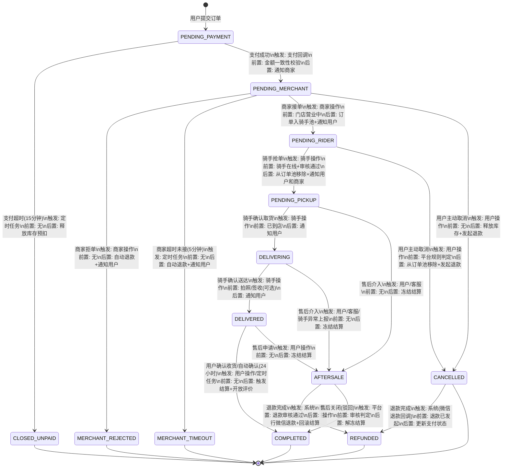
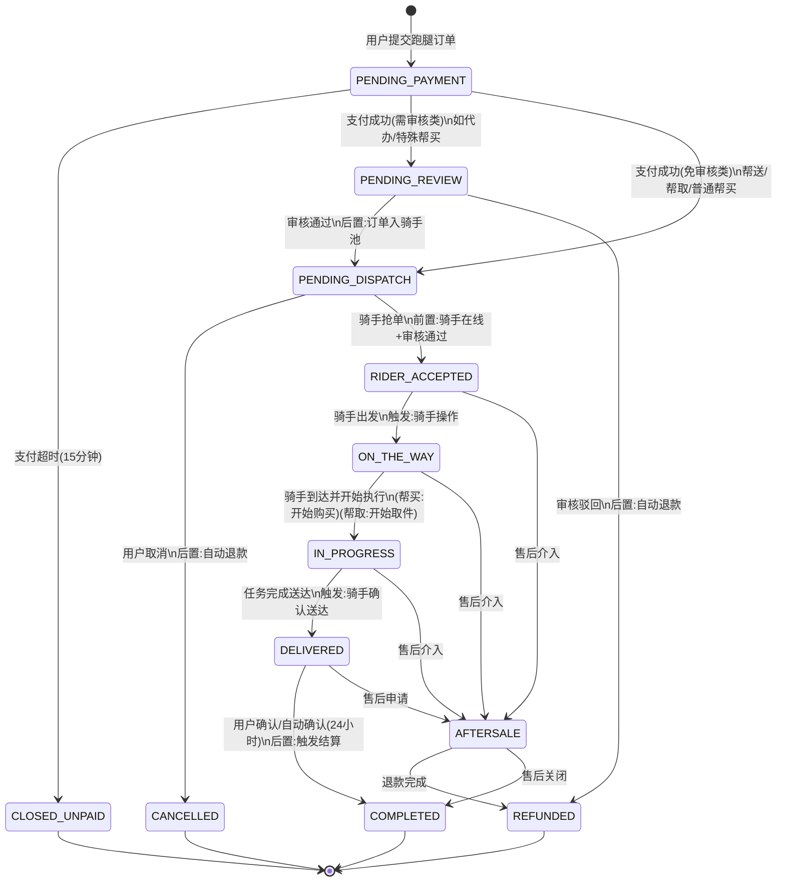
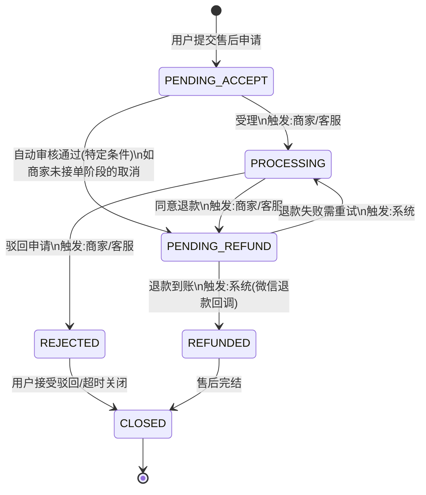
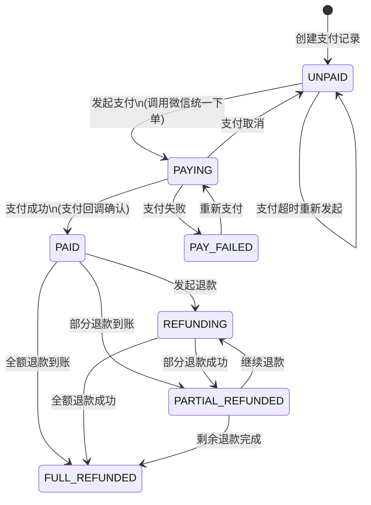
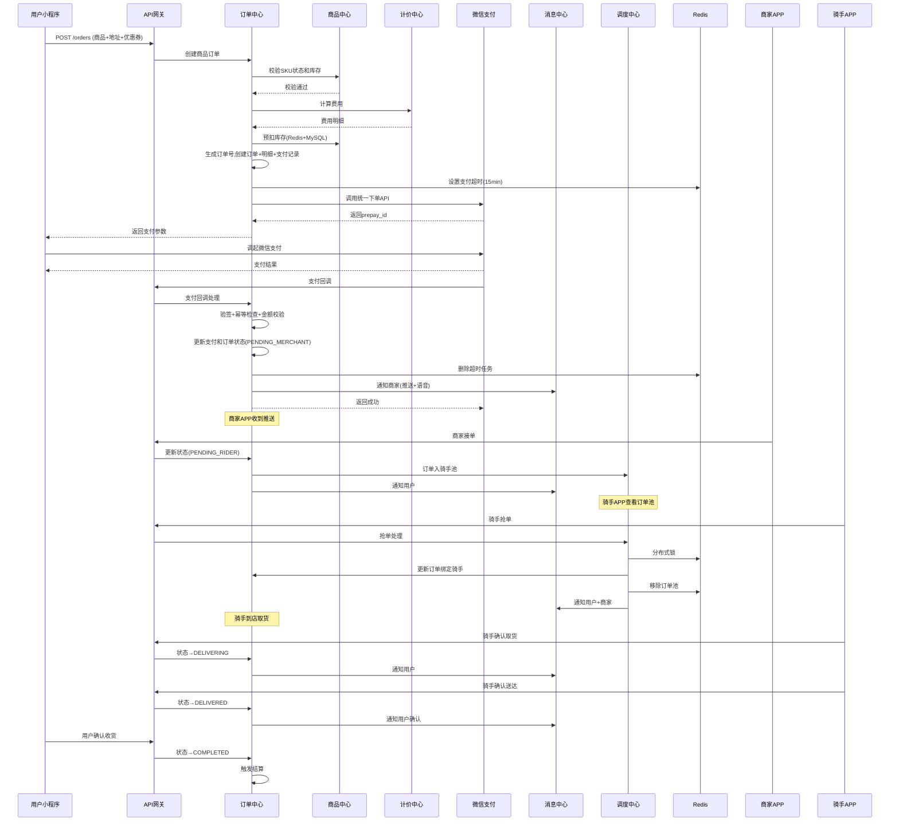
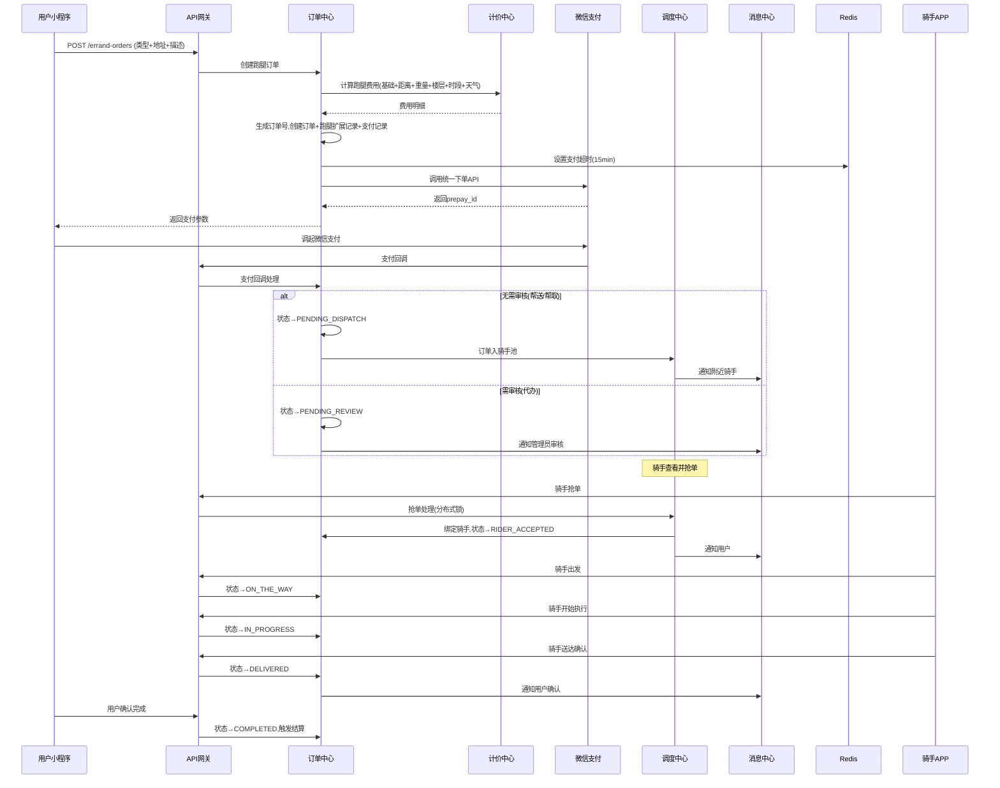
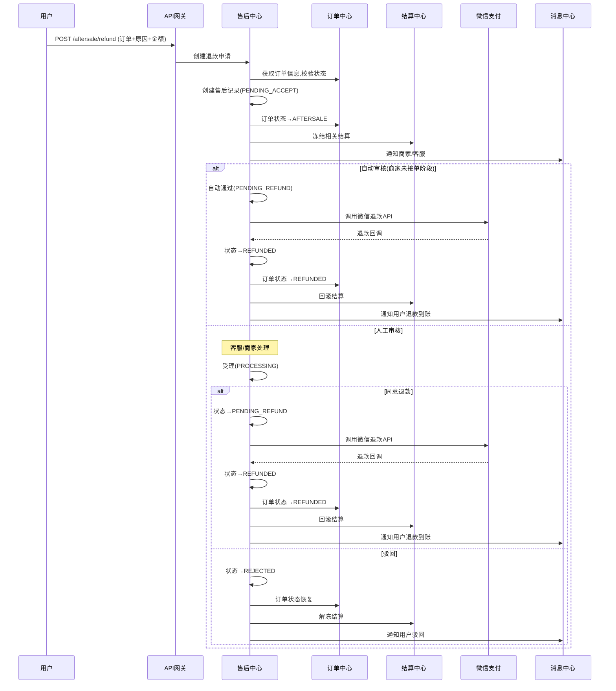
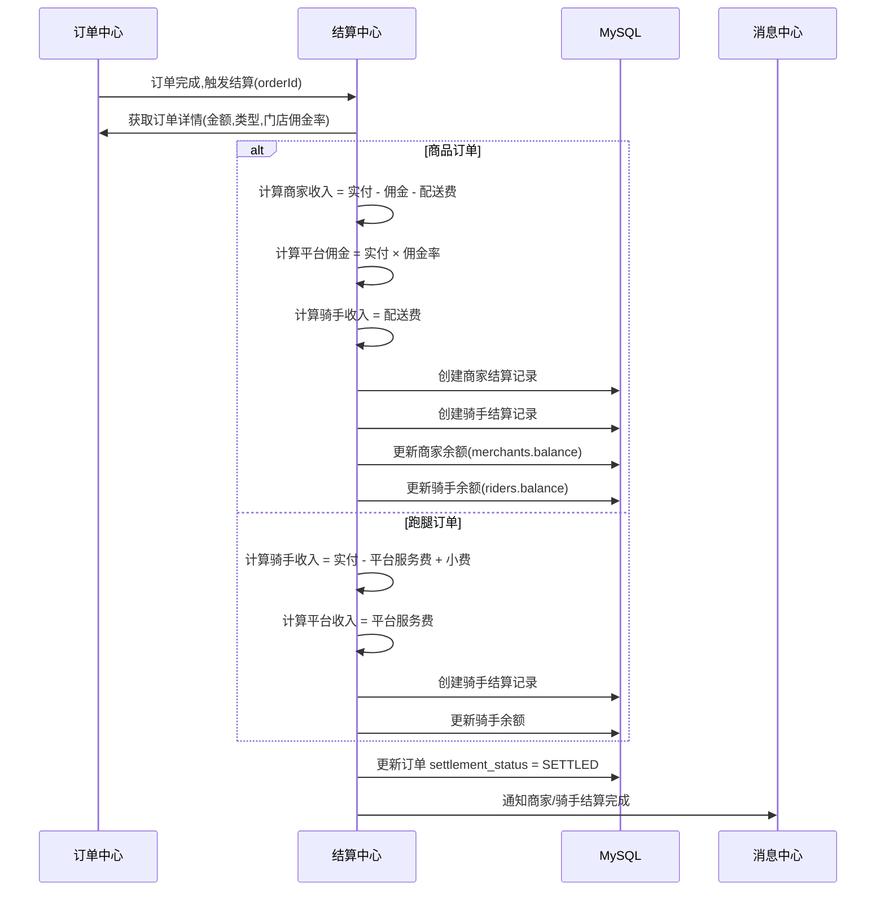

# 接口规范与状态机

> 版本: v1.0
> 状态: 基线版
> 所属阶段: 03_后端核心业务服务开发

---

## 一、统一接口响应格式

### 1.1 成功响应

```json
{
  "code": 0,
  "message": "success",
  "data": { }
}
```

### 1.2 分页响应

```json
{
  "code": 0,
  "message": "success",
  "data": {
    "list": [],
    "pagination": {
      "page": 1,
      "pageSize": 20,
      "total": 100,
      "totalPages": 5
    }
  }
}
```

### 1.3 错误响应

```json
{
  "code": 10001,
  "message": "参数校验失败",
  "data": null,
  "errors": [
    { "field": "phone", "message": "手机号格式不正确" }
  ]
}
```

---

## 二、统一错误码表

### 2.1 通用错误码 (10000-10099)

| 错误码 | HTTP状态码 | 说明 |
|--------|-----------|------|
| 0 | 200 | 成功 |
| 10001 | 400 | 参数校验失败 |
| 10002 | 404 | 数据不存在 |
| 10003 | 409 | 数据已存在（重复） |
| 10004 | 500 | 操作失败（通用） |
| 10005 | 500 | 服务器内部错误 |

### 2.2 网关错误码 (10100-10199)

| 错误码 | HTTP状态码 | 说明 |
|--------|-----------|------|
| 10100 | 429 | 请求频率超限 |
| 10101 | 400 | 请求格式错误 |
| 10102 | 405 | 请求方法不允许 |

### 2.3 认证授权错误码 (11000-11099)

| 错误码 | HTTP状态码 | 说明 |
|--------|-----------|------|
| 11001 | 401 | 未登录或Token过期 |
| 11002 | 401 | Token无效（已注销或被拉黑） |
| 11003 | 403 | 权限不足 |
| 11004 | 403 | 账号已被冻结 |
| 11005 | 400 | 验证码错误或已过期 |
| 11006 | 429 | 验证码发送过于频繁 |
| 11007 | 429 | 今日验证码发送次数已达上限 |

### 2.4 用户中心错误码 (12000-12099)

| 错误码 | HTTP状态码 | 说明 |
|--------|-----------|------|
| 12001 | 409 | 手机号已被其他账号绑定 |
| 12002 | 400 | 微信授权失败 |
| 12003 | 400 | 地址数量已达上限 |
| 12004 | 404 | 地址不存在 |
| 12005 | 403 | 不能操作他人地址 |

### 2.5 商家中心错误码 (13000-13099)

| 错误码 | HTTP状态码 | 说明 |
|--------|-----------|------|
| 13001 | 404 | 商家账号不存在 |
| 13002 | 401 | 密码错误 |
| 13003 | 403 | 商家账号已冻结 |
| 13004 | 409 | 手机号已注册 |
| 13005 | 400 | 商家审核未通过，无法操作 |
| 13006 | 404 | 门店不存在 |
| 13007 | 403 | 不能操作他人门店 |
| 13008 | 400 | 当前状态不允许此操作 |

### 2.6 骑手中心错误码 (14000-14099)

| 错误码 | HTTP状态码 | 说明 |
|--------|-----------|------|
| 14001 | 404 | 骑手账号不存在 |
| 14002 | 401 | 密码错误 |
| 14003 | 403 | 骑手账号已冻结 |
| 14004 | 409 | 手机号已注册 |
| 14005 | 400 | 骑手审核未通过 |
| 14006 | 400 | 骑手不在线 |

### 2.7 商品中心错误码 (15000-15099)

| 错误码 | HTTP状态码 | 说明 |
|--------|-----------|------|
| 15001 | 400 | 库存不足 |
| 15002 | 404 | 商品不存在 |
| 15003 | 404 | SKU不存在 |
| 15004 | 400 | 商品已下架 |
| 15005 | 404 | 分类不存在 |
| 15006 | 400 | 分类下有商品，不允许删除 |
| 15007 | 403 | 不能操作他人门店商品 |

### 2.8 订单中心错误码 (16000-16099)

| 错误码 | HTTP状态码 | 说明 |
|--------|-----------|------|
| 16001 | 400 | 门店未营业 |
| 16002 | 400 | 地址不在配送范围内 |
| 16003 | 400 | 未达起送价 |
| 16004 | 400 | 库存不足 |
| 16005 | 400 | 订单状态不允许此操作 |
| 16006 | 404 | 订单不存在 |
| 16007 | 400 | 支付超时，订单已关闭 |
| 16008 | 400 | 支付金额不一致 |
| 16009 | 409 | 重复操作（幂等拦截） |
| 16010 | 400 | 不能取消此状态的订单 |
| 16011 | 400 | 该订单已有进行中的售后 |

### 2.9 计价中心错误码 (17000-17099)

| 错误码 | HTTP状态码 | 说明 |
|--------|-----------|------|
| 17001 | 400 | 未找到匹配的计价规则 |
| 17002 | 400 | 优惠券不可用 |
| 17003 | 400 | 优惠券已过期 |

### 2.10 调度中心错误码 (18000-18099)

| 错误码 | HTTP状态码 | 说明 |
|--------|-----------|------|
| 18001 | 409 | 订单已被其他骑手接单 |
| 18002 | 400 | 不在接单范围内 |
| 18003 | 400 | 骑手当前不可接单 |
| 18004 | 400 | 订单不在订单池中 |

### 2.11 售后中心错误码 (19000-19099)

| 错误码 | HTTP状态码 | 说明 |
|--------|-----------|------|
| 19001 | 400 | 退款金额超过可退金额 |
| 19002 | 400 | 该订单已有进行中的售后 |
| 19003 | 400 | 售后状态不允许此操作 |
| 19004 | 404 | 售后记录不存在 |
| 19005 | 400 | 退款执行失败 |

### 2.12 结算中心错误码 (20000-20099)

| 错误码 | HTTP状态码 | 说明 |
|--------|-----------|------|
| 20001 | 400 | 可用余额不足 |
| 20002 | 400 | 低于最小提现金额 |
| 20003 | 429 | 今日提现次数已达上限 |
| 20004 | 400 | 提现状态不允许此操作 |

### 2.13 消息中心错误码 (21000-21099)

| 错误码 | HTTP状态码 | 说明 |
|--------|-----------|------|
| 21001 | 500 | 短信发送失败 |
| 21002 | 500 | 推送发送失败 |

### 2.14 配置中心错误码 (22000-22099)

| 错误码 | HTTP状态码 | 说明 |
|--------|-----------|------|
| 22001 | 404 | 配置项不存在 |
| 22002 | 409 | 配置项Key重复 |
| 22003 | 400 | 区域下有子区域，不允许删除 |

### 2.15 风控审计错误码 (23000-23099)

| 错误码 | HTTP状态码 | 说明 |
|--------|-----------|------|
| 23001 | 403 | 账号在黑名单中 |
| 23002 | 403 | IP在黑名单中 |

---

## 三、商品订单状态机

### 3.1 状态定义

| 状态码 | 状态名 | 说明 | 终态 |
|--------|--------|------|------|
| PENDING_PAYMENT | 待支付 | 用户已提交订单，等待支付 | 否 |
| CLOSED_UNPAID | 已关闭(未支付) | 支付超时自动关闭 | 是 |
| PENDING_MERCHANT | 待商家接单 | 支付成功，等待商家处理 | 否 |
| MERCHANT_REJECTED | 商家拒单 | 商家主动拒绝订单 | 是(触发退款) |
| MERCHANT_TIMEOUT | 商家超时 | 商家超时未接单 | 是(触发退款) |
| PENDING_RIDER | 待骑手接单 | 商家已接单，等待骑手抢单 | 否 |
| CANCELLED | 已取消 | 用户在商家/骑手接单前主动取消 | 否(等待退款) |
| PENDING_PICKUP | 待取货 | 骑手已接单，等待到店取货 | 否 |
| DELIVERING | 配送中 | 骑手已取货，配送中 | 否 |
| DELIVERED | 已送达 | 骑手确认送达 | 否 |
| COMPLETED | 已完成 | 用户确认收货或系统自动确认 | 是 |
| AFTERSALE | 售后处理中 | 退款/投诉介入中 | 否 |
| REFUNDED | 已退款 | 退款完成 | 是 |

### 3.2 状态转换矩阵



### 3.3 每个状态转换的详细定义

| 转换 | 从状态 | 到状态 | 触发者 | 前置校验 | 后置动作 |
|------|--------|--------|--------|----------|----------|
| 支付超时 | PENDING_PAYMENT | CLOSED_UNPAID | SYSTEM | 当前时间 > pay_deadline | 释放库存预扣；写操作日志 |
| 支付成功 | PENDING_PAYMENT | PENDING_MERCHANT | SYSTEM | 支付回调验签通过；金额一致 | 更新支付记录；通知商家（推送+语音）；写日志 |
| 商家接单 | PENDING_MERCHANT | PENDING_RIDER | MERCHANT | 门店营业中；操作者属于该门店 | 记录接单时间；订单入骑手池；通知用户 |
| 商家拒单 | PENDING_MERCHANT | MERCHANT_REJECTED | MERCHANT | 操作者属于该门店 | 发起自动退款；通知用户；释放库存 |
| 商家超时 | PENDING_MERCHANT | MERCHANT_TIMEOUT | SYSTEM | 接单超过5分钟（可配置） | 发起自动退款；通知用户；释放库存 |
| 用户取消(商家未接) | PENDING_MERCHANT | CANCELLED | USER | 订单属于该用户 | 释放库存；发起自动退款 |
| 用户取消(骑手未接) | PENDING_RIDER | CANCELLED | USER | 平台规则判定 | 从订单池移除；发起自动退款 |
| 退款完成(已取消) | CANCELLED | REFUNDED | SYSTEM | 退款回调确认 | 更新支付状态；写操作日志 |
| 骑手抢单 | PENDING_RIDER | PENDING_PICKUP | RIDER | 骑手在线；审核通过；分布式锁 | 绑定骑手；从池中移除；通知用户和商家 |
| 骑手取货 | PENDING_PICKUP | DELIVERING | RIDER | 骑手已到店（可选校验） | 记录取货时间；通知用户 |
| 骑手送达 | DELIVERING | DELIVERED | RIDER | 可附带拍照/签收证明 | 记录送达时间；通知用户确认 |
| 用户确认 | DELIVERED | COMPLETED | USER/SYSTEM | 用户主动确认或送达后24小时自动 | 记录完成时间；触发结算；开放评价 |
| 售后介入 | 多状态 | AFTERSALE | USER/ADMIN | 无进行中售后 | 冻结结算；创建售后记录 |
| 退款完成 | AFTERSALE | REFUNDED | SYSTEM | 退款审核通过 | 执行微信退款；回滚结算 |
| 售后关闭 | AFTERSALE | COMPLETED | ADMIN | 审核判定售后不成立 | 解冻结算；通知用户 |

---

## 四、跑腿订单状态机

### 4.1 状态定义

| 状态码 | 状态名 | 说明 | 终态 |
|--------|--------|------|------|
| PENDING_PAYMENT | 待支付 | 等待支付 | 否 |
| CLOSED_UNPAID | 已关闭(未支付) | 支付超时 | 是 |
| PENDING_REVIEW | 待审核 | 代办类需平台审核 | 否 |
| PENDING_DISPATCH | 待接单 | 等待骑手抢单 | 否 |
| CANCELLED | 已取消 | 用户取消(骑手未接) | 是 |
| RIDER_ACCEPTED | 骑手已接单 | 骑手抢单成功 | 否 |
| ON_THE_WAY | 前往取件 | 骑手出发前往取件点 | 否 |
| IN_PROGRESS | 服务进行中 | 骑手执行任务 | 否 |
| DELIVERED | 任务已送达 | 骑手完成交付 | 否 |
| COMPLETED | 已完成 | 用户确认完成 | 是 |
| AFTERSALE | 售后处理中 | 售后介入 | 否 |
| REFUNDED | 已退款 | 退款完成 | 是 |

### 4.2 状态转换矩阵



### 4.3 跑腿订单特殊规则

| 服务类型 | 是否需审核 | 特殊流程 |
|----------|-----------|----------|
| 帮送(DELIVER) | 否 | 标准流程 |
| 帮取(PICKUP) | 否 | 需要取件码验证 |
| 帮买(BUY) | 否(可配置) | 涉及垫付：骑手购买后上传小票，差价由平台处理 |
| 代办(ERRAND) | 是(可配置) | 后台审核通过后入池 |

帮买垫付流程：
1. 用户下单时填写预算金额
2. 骑手按预算购买，实际金额可能有差异
3. 骑手在APP中填写实际购买金额并上传小票
4. 如实际 < 预算：差额退还用户
5. 如实际 > 预算：发起补差价通知，用户确认后追加支付
6. 具体垫付规则由后台配置（首期建议固定预算，不支持超预算）

---

## 五、售后状态机



| 转换 | 触发者 | 前置校验 | 后置动作 |
|------|--------|----------|----------|
| 提交 → PENDING_ACCEPT | USER | 无进行中售后；退款金额合法 | 订单状态 → AFTERSALE；冻结结算 |
| 受理 → PROCESSING | MERCHANT/ADMIN | 售后状态为PENDING_ACCEPT | 通知用户处理中 |
| 同意 → PENDING_REFUND | MERCHANT/ADMIN | 售后状态为PROCESSING | 触发退款执行；通知用户 |
| 自动通过 → PENDING_REFUND | SYSTEM | 满足自动退款条件 | 触发退款执行 |
| 退款成功 → REFUNDED | SYSTEM | 微信退款回调成功 | 订单状态 → REFUNDED；回滚结算 |
| 驳回 → REJECTED | MERCHANT/ADMIN | 售后状态为PROCESSING | 通知用户；解冻结算 |

---

## 六、支付状态机



---

## 七、关键业务流程时序图

### 7.1 商品下单全流程



### 7.2 跑腿下单全流程



### 7.3 退款流程



### 7.4 结算流程



---

## 八、幂等要求汇总

| 接口 | 幂等策略 | 幂等Key |
|------|----------|---------|
| 支付回调 | 基于支付单号去重 | `idempotent:payment:{paymentNo}` |
| 创建商品订单 | 基于用户+门店+商品+时间窗口 | `idempotent:order:{userId}:{storeId}:{hash}` |
| 创建跑腿订单 | 基于用户+服务类型+地址+时间窗口 | `idempotent:errand:{userId}:{serviceType}:{hash}` |
| 骑手抢单 | 分布式锁 + 状态二次检查 | `dispatch:lock:{orderId}` |
| 商家接单/拒单 | 状态前置检查 | 数据库状态字段 |
| 退款执行 | 基于售后单号去重 | `idempotent:refund:{aftersaleNo}` |
| 退款回调 | 基于退款交易号去重 | `idempotent:refund_cb:{transactionId}` |
