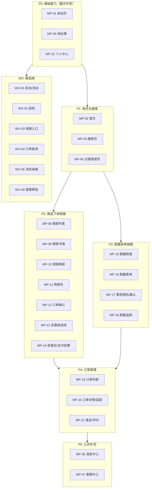

# 阶段04：用户端开发（小程序 + 微信端）

> 版本: v1.0  
> 状态: 待执行  
> 前置阶段: 阶段03（后端核心服务）

---

## 一、阶段目标

完成**用户微信小程序（22个页面）**和**用户微信端（6个页面）**的全部前端开发工作，实现用户侧商品下单和跑腿发单双主线完整交易闭环。

### 核心交付目标

1. 用户微信小程序22个页面全部开发完成，覆盖公共能力、商品下单链路、跑腿发单链路、订单与个人中心
2. 用户微信端6个页面全部开发完成，作为微信生态轻量入口实现活动承接、快捷查询和跳转小程序
3. 双端与后端核心服务（阶段03产出）完成接口联调
4. 商品下单全流程和跑腿发单全流程可完整走通
5. 微信端到小程序的跳转链路通畅

---

## 二、技术栈

### 用户微信小程序

| 项目 | 选型 | 说明 |
|------|------|------|
| 开发框架 | uni-app x (Vue3 + UTS) | 跨端框架，一套代码适配安卓+iOS+微信小程序 |
| UI框架 | uXui (unix-ui) v1.2.0 | uni-app x 专属 UI 组件库 |
| 状态管理 | Pinia | Vue3官方推荐状态管理 |
| 网络请求 | 封装uni.request | 统一拦截器、鉴权、错误处理 |
| 地图能力 | 腾讯地图SDK（小程序版） | 地址选择、配送追踪、路径展示 |
| 支付能力 | 微信支付（小程序端） | wx.requestPayment调起 |
| 编译目标 | 安卓+iOS+微信小程序 | HBuilderX 编译输出 |
| 开发工具 | HBuilderX ^4.66 | uni-app x 专属 IDE |

### 用户微信端

| 项目 | 选型 | 说明 |
|------|------|------|
| 开发框架 | 微信原生开发框架 | WXML + WXSS + JS/TS |
| UI组件 | WeUI + 自定义组件 | 微信原生风格 |
| 网络请求 | wx.request封装 | 统一鉴权和错误处理 |
| 跳转能力 | wx.navigateToMiniProgram | 跳转到小程序指定页面 |
| 消息能力 | 微信模板消息/订阅消息 | 订单状态推送 |

### 公共技术约定

| 约定 | 说明 |
|------|------|
| 编码规范 | ESLint + Prettier，统一代码风格 |
| 接口规范 | RESTful，统一响应格式 `{ code, message, data }` |
| 鉴权方式 | JWT Token，存储在本地Storage，请求时Header携带 |
| 错误处理 | 统一错误码映射，全局Toast提示 |
| 分页规范 | 统一 `{ page, pageSize, total }` |
| 图片上传 | 统一走OSS/COS上传接口，返回URL |
| 环境配置 | 通过 `.env` 文件区分开发/测试/生产环境 |

---

## 三、进入条件

本阶段启动前，必须满足以下条件：

| 序号 | 条件 | 验证方式 |
|------|------|----------|
| 1 | 阶段03后端核心服务全部开发完成并通过自测 | 后端提供接口文档和Postman集合 |
| 2 | 统一接口网关已部署，接口可正常调用 | 前端可通过网关访问各服务接口 |
| 3 | 认证授权中心已上线，支持微信登录和JWT鉴权 | 前端可完成登录流程并获取Token |
| 4 | 用户中心接口可用（注册、登录、地址CRUD、个人信息） | Postman验证通过 |
| 5 | 商品中心接口可用（类目、商品列表、商品详情、SKU） | Postman验证通过 |
| 6 | 商家中心接口可用（商家列表、商家详情、配送范围） | Postman验证通过 |
| 7 | 订单中心接口可用（创建、支付、状态流转、列表、详情） | Postman验证通过 |
| 8 | 计价中心接口可用（商品单配送费、跑腿单费用预估） | Postman验证通过 |
| 9 | 支付回调接口可用（微信支付创建、回调、查询） | 使用微信支付沙箱验证 |
| 10 | 消息中心接口可用（消息列表、已读标记） | Postman验证通过 |
| 11 | 调度中心接口可用（订单池查询、骑手状态查询） | Postman验证通过 |
| 12 | 微信小程序AppID和商户号已申请完成 | 微信开放平台确认 |
| 13 | UI设计稿已交付（或已确认页面布局规格） | 设计文件可访问 |

---

## 四、退出条件

本阶段完成时，必须满足以下条件：

| 序号 | 条件 | 验证方式 |
|------|------|----------|
| 1 | 用户小程序22个页面全部开发完成 | 逐页面检查 |
| 2 | 用户微信端6个页面全部开发完成 | 逐页面检查 |
| 3 | 商品下单全流程可走通（浏览→加购→下单→支付→追踪） | 主流程测试 |
| 4 | 跑腿发单全流程可走通（选类型→填表单→支付→追踪） | 主流程测试 |
| 5 | 微信端跳转小程序链路通畅 | 跨端跳转测试 |
| 6 | 所有页面与后端接口联调完成 | 接口调用验证 |
| 7 | 页面在主流微信版本（最近3个大版本）兼容 | 兼容性测试 |
| 8 | 无阻断级别Bug | Bug清单确认 |

---

## 五、产出物清单

| 序号 | 产出物 | 格式 | 说明 |
|------|--------|------|------|
| 1 | 用户小程序完整源码 | uni-app x 工程 | 22个页面 + 公共组件 + 工具库 |
| 2 | 用户微信端完整源码 | 微信小程序工程 | 6个页面 + 公共组件 |
| 3 | 接口联调记录 | Markdown/Excel | 每个接口的调用状态和问题记录 |
| 4 | 主流程测试报告 | Markdown | 商品下单和跑腿发单双主线测试结果 |
| 5 | 兼容性测试报告 | Markdown | 不同微信版本和设备型号测试结果 |
| 6 | 公共组件文档 | Markdown | 组件API、Props、Events说明 |

---

## 六、本阶段不做什么

| 序号 | 不做内容 | 说明 |
|------|----------|------|
| 1 | 商家端APP开发 | 属于阶段05 |
| 2 | 骑手端APP开发 | 属于阶段06 |
| 3 | 平台管理后台前端 | 属于阶段07 |
| 4 | 自动派单算法实现 | 不属于首期范围 |
| 5 | 复杂会员等级体系 | 不属于首期范围 |
| 6 | 高级营销编排（如拼团、秒杀） | 不属于首期范围 |
| 7 | 多端小程序适配（支付宝/抖音） | 首期只做微信小程序 |
| 8 | 性能极致优化（骨架屏、虚拟列表高级方案） | 首期保证基本体验即可 |

---

## 七、页面总览

### 7.1 用户微信小程序页面清单（22个）

| 分组 | 页面编号 | 页面名称 | 路由 |
|------|----------|----------|------|
| 公共页面 | MP-01 | 启动页 | pages/launch/index |
| 公共页面 | MP-02 | 首页 | pages/home/index |
| 公共页面 | MP-03 | 搜索页 | pages/search/index |
| 公共页面 | MP-04 | 分类频道页 | pages/category/index |
| 公共页面 | MP-05 | 地址簿 | pages/address/index |
| 公共页面 | MP-06 | 消息中心 | pages/message/index |
| 公共页面 | MP-07 | 客服中心 | pages/service/index |
| 商品下单链路 | MP-08 | 商家列表页 | pages/merchant/list |
| 商品下单链路 | MP-09 | 商家详情页 | pages/merchant/detail |
| 商品下单链路 | MP-10 | 商品规格弹层 | 组件（非独立页面） |
| 商品下单链路 | MP-11 | 购物车页 | pages/cart/index |
| 商品下单链路 | MP-12 | 订单确认页 | pages/order/confirm |
| 商品下单链路 | MP-13 | 优惠券选择页 | pages/coupon/select |
| 商品下单链路 | MP-14 | 收银台/支付结果页 | pages/pay/index |
| 跑腿发单链路 | MP-15 | 跑腿频道页 | pages/errand/index |
| 跑腿发单链路 | MP-16 | 跑腿表单页 | pages/errand/form |
| 跑腿发单链路 | MP-17 | 费用预估/发单确认页 | pages/errand/confirm |
| 跑腿发单链路 | MP-18 | 跑腿订单追踪页 | pages/errand/track |
| 订单与个人 | MP-19 | 订单列表页 | pages/order/list |
| 订单与个人 | MP-20 | 订单详情/配送追踪页 | pages/order/detail |
| 订单与个人 | MP-21 | 取消/退款/售后/评价页 | pages/order/aftersale |
| 订单与个人 | MP-22 | 个人中心 | pages/mine/index |

### 7.2 用户微信端页面清单（6个）

| 页面编号 | 页面名称 | 说明 |
|----------|----------|------|
| WX-01 | 启动/活动承接页 | 承接分享、活动、推广链接 |
| WX-02 | 微信授权页 | 微信授权登录、手机号绑定 |
| WX-03 | 快捷入口页 | 附近服务和热门活动展示 |
| WX-04 | 订单快捷查询页 | 最近订单查看和配送进度 |
| WX-05 | 消息承接页 | 模板消息和活动消息承接 |
| WX-06 | 客服与帮助页 | 客服说明和帮助中心 |

---

## 八、与后端接口对接清单概览

### 8.1 认证授权域

| 接口 | 方法 | 路径 | 调用页面 |
|------|------|------|----------|
| 微信登录 | POST | /api/auth/wechat-login | MP-01, WX-02 |
| 手机号绑定 | POST | /api/auth/bindPhone | WX-02 |
| 刷新Token | POST | /api/auth/refresh | 全局拦截器 |
| 获取用户信息 | GET | /api/user/profile | MP-22 |
| 更新用户信息 | PUT | /api/user/profile | MP-22 |

### 8.2 用户中心域

| 接口 | 方法 | 路径 | 调用页面 |
|------|------|------|----------|
| 地址列表 | GET | /api/user/address/list | MP-05, MP-12, MP-16 |
| 新增地址 | POST | /api/user/address | MP-05 |
| 编辑地址 | PUT | /api/user/address/:id | MP-05 |
| 删除地址 | DELETE | /api/user/address/:id | MP-05 |
| 设默认地址 | PUT | /api/user/address/:id/default | MP-05 |
| 消息列表 | GET | /api/user/message/list | MP-06, WX-05 |
| 标记已读 | PUT | /api/user/message/:id/read | MP-06 |
| 未读数量 | GET | /api/user/message/unread-count | MP-02, MP-06 |

### 8.3 商品与商家域

| 接口 | 方法 | 路径 | 调用页面 |
|------|------|------|----------|
| 首页数据 | GET | /api/home/data | MP-02 |
| 搜索 | GET | /api/search | MP-03 |
| 类目列表 | GET | /api/category/list | MP-04 |
| 商家列表 | GET | /api/merchant/list | MP-04, MP-08 |
| 商家详情 | GET | /api/merchant/:id | MP-09 |
| 商品列表（商家维度） | GET | /api/merchant/:id/products | MP-09 |
| 商品详情/SKU | GET | /api/product/:id | MP-10 |
| 优惠券列表 | GET | /api/coupon/available | MP-13 |

### 8.4 订单域

| 接口 | 方法 | 路径 | 调用页面 |
|------|------|------|----------|
| 购物车列表 | GET | /api/cart/list | MP-11 |
| 加入购物车 | POST | /api/cart/add | MP-10 |
| 更新购物车 | PUT | /api/cart/update | MP-11 |
| 清空购物车 | DELETE | /api/cart/clear | MP-11 |
| 订单预览（确认页数据） | POST | /api/order/preview | MP-12 |
| 创建订单 | POST | /api/order/create | MP-12 |
| 订单列表 | GET | /api/order/list | MP-19, WX-04 |
| 订单详情 | GET | /api/order/:id | MP-20 |
| 取消订单 | POST | /api/order/:id/cancel | MP-21 |
| 申请退款 | POST | /api/order/:id/refund | MP-21 |
| 提交评价 | POST | /api/order/:id/review | MP-21 |
| 配送追踪 | GET | /api/order/:id/track | MP-18, MP-20 |

### 8.5 跑腿域

| 接口 | 方法 | 路径 | 调用页面 |
|------|------|------|----------|
| 跑腿服务类型列表 | GET | /api/errand/types | MP-15 |
| 费用预估 | POST | /api/errand/estimate | MP-17 |
| 创建跑腿订单 | POST | /api/errand/create | MP-17 |
| 跑腿订单详情 | GET | /api/errand/:id | MP-18 |
| 跑腿订单追踪 | GET | /api/errand/:id/track | MP-18 |

### 8.6 支付域

| 接口 | 方法 | 路径 | 调用页面 |
|------|------|------|----------|
| 创建支付 | POST | /api/pay/create | MP-14 |
| 查询支付结果 | GET | /api/pay/:id/status | MP-14 |

---

## 九、页面开发优先级与依赖关系



---

## 十、工程结构约定

### 10.1 小程序工程目录

```
user-miniapp/
├── src/
│   ├── pages/                    # 页面目录
│   │   ├── launch/               # 启动页
│   │   ├── home/                 # 首页
│   │   ├── search/               # 搜索页
│   │   ├── category/             # 分类频道
│   │   ├── address/              # 地址簿
│   │   ├── message/              # 消息中心
│   │   ├── service/              # 客服中心
│   │   ├── merchant/             # 商家相关（列表+详情）
│   │   ├── cart/                 # 购物车
│   │   ├── order/                # 订单相关（确认+列表+详情+售后）
│   │   ├── coupon/               # 优惠券选择
│   │   ├── pay/                  # 支付
│   │   ├── errand/               # 跑腿相关（频道+表单+确认+追踪）
│   │   └── mine/                 # 个人中心
│   ├── components/               # 公共组件
│   │   ├── NavBar.uvue            # 自定义导航栏
│   │   ├── TabBar.uvue            # 底部TabBar
│   │   ├── AddressPicker.uvue     # 地址选择器
│   │   ├── OrderCard.uvue         # 订单卡片
│   │   ├── MerchantCard.uvue      # 商家卡片
│   │   ├── ProductCard.uvue       # 商品卡片
│   │   ├── SkuSelector.uvue       # 规格选择器
│   │   ├── CouponCard.uvue        # 优惠券卡片
│   │   ├── MapTrack.uvue          # 地图追踪组件
│   │   ├── EmptyState.uvue        # 空状态占位
│   │   └── LoadMore.uvue          # 加载更多
│   ├── store/                    # Pinia状态管理
│   │   ├── user.uts               # 用户状态
│   │   ├── cart.uts               # 购物车状态
│   │   ├── order.uts              # 订单状态
│   │   └── location.uts           # 定位状态
│   ├── api/                      # 接口封装
│   │   ├── request.uts            # 请求基础封装
│   │   ├── auth.uts               # 认证接口
│   │   ├── user.uts               # 用户接口
│   │   ├── merchant.uts           # 商家接口
│   │   ├── product.uts            # 商品接口
│   │   ├── cart.uts               # 购物车接口
│   │   ├── order.uts              # 订单接口
│   │   ├── errand.uts             # 跑腿接口
│   │   ├── pay.uts                # 支付接口
│   │   └── message.uts            # 消息接口
│   ├── utils/                    # 工具函数
│   │   ├── format.uts             # 格式化（时间、金额、距离）
│   │   ├── validate.uts           # 校验工具
│   │   ├── location.uts           # 定位工具
│   │   └── storage.uts            # 本地存储
│   ├── styles/                   # 全局样式
│   │   ├── variables.scss        # 变量定义
│   │   ├── mixins.scss           # 混入
│   │   └── global.scss           # 全局样式
│   ├── static/                   # 静态资源
│   ├── App.uvue
│   ├── main.uts
│   ├── pages.json                # 页面路由配置
│   ├── manifest.json             # 应用配置
│   └── uni.scss                  # uni-app样式变量
├── .env.development              # 开发环境配置
├── .env.production               # 生产环境配置
└── package.json
```

### 10.2 微信端工程目录

```
user-wechat/
├── pages/
│   ├── launch/                   # WX-01 启动/活动承接页
│   ├── auth/                     # WX-02 微信授权页
│   ├── entry/                    # WX-03 快捷入口页
│   ├── order-query/              # WX-04 订单快捷查询页
│   ├── message/                  # WX-05 消息承接页
│   └── help/                     # WX-06 客服与帮助页
├── components/                   # 公共组件
├── utils/                        # 工具函数
│   ├── request.js                # 网络请求封装
│   ├── auth.js                   # 鉴权工具
│   └── navigate.js               # 跳转小程序工具
├── images/                       # 图片资源
├── styles/                       # 样式文件
├── app.js                        # 应用入口
├── app.json                      # 全局配置
├── app.wxss                      # 全局样式
├── project.config.json           # 项目配置
└── sitemap.json                  # 站点地图
```

---

## 十一、风险与注意事项

| 风险 | 影响 | 应对措施 |
|------|------|----------|
| 后端接口未按时交付 | 前端页面开发受阻 | 使用Mock数据先行开发，后续联调 |
| 微信审核政策变化 | 部分功能可能受限 | 提前研究微信最新审核指南 |
| 地图SDK调用限额 | 高频页面可能受限 | 做好请求频率控制和缓存 |
| 支付接口沙箱环境与正式差异 | 支付流程可能有偏差 | 开发阶段用沙箱，上线前在正式环境回归 |
| 不同微信版本兼容性 | 部分API不可用 | 做好API可用性检测和降级方案 |
| 小程序包体积超限 | 无法上传审核 | 分包加载，图片走CDN |
