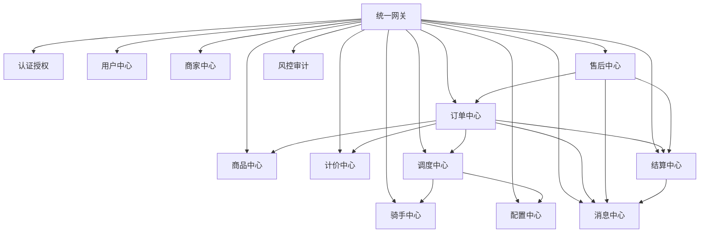
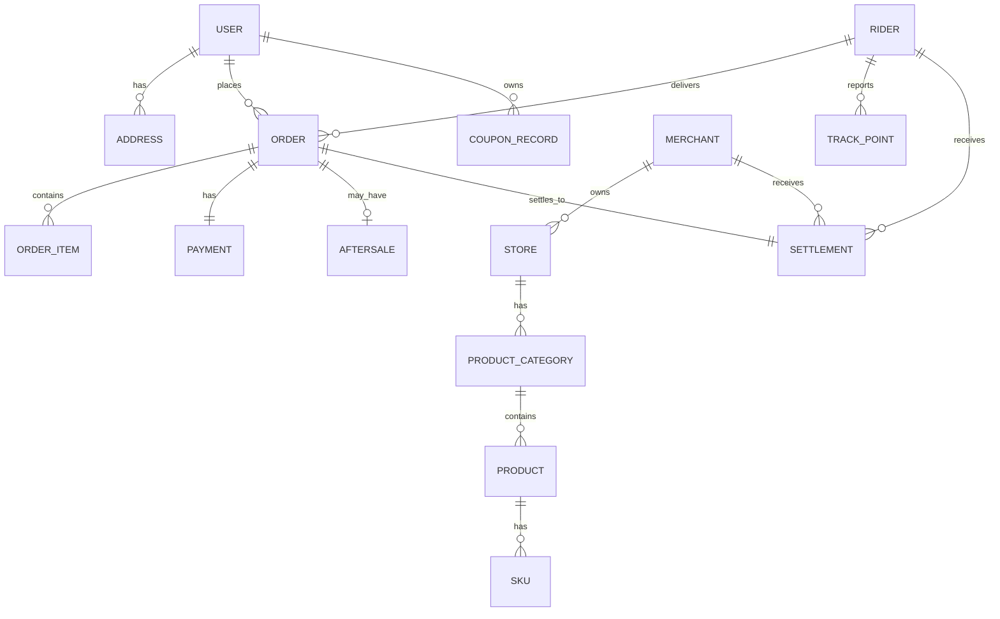

# 同城O2O配送系统 - 产品需求文档（PRD）

> 版本: v1.0  
> 状态: 基线版  
> 适用范围: 首期全量交付

---

## 一、文档说明

### 1.1 文档目的

本文档是《同城O2O配送系统》首期建设的产品需求规格说明书（PRD），为产品设计、技术研发、测试验收和项目交付提供统一基线。所有终端、页面、接口、状态、规则和验收标准均以本文档为准。

### 1.2 读者对象

| 角色 | 用途 |
|------|------|
| 产品经理 | 确认需求边界、页面逻辑、状态流转 |
| 前端开发 | 按页面规格和交互规则实现各终端 |
| 后端开发 | 按接口域和业务规则实现服务层 |
| 测试人员 | 按验收标准和异常场景编写用例 |
| 项目经理 | 按阶段拆分任务、跟踪交付进度 |

### 1.3 基线文档关系

| 文档 | 定位 |
|------|------|
| `同城O2O配送系统定制开发方案.md` | 原始方案基线，定义项目定位、终端范围、技术方向 |
| `需求.md` | 原始需求概述 |
| 本文档（PRD_完整版.md） | 将方案细化为可执行的产品需求规格 |
| 各阶段子文件夹 | 将PRD拆分为可独立执行的开发阶段任务 |

---

## 二、产品概述

### 2.1 产品定位

面向同城生活服务场景的综合型O2O配送平台，采用 **商家商品下单 + 跑腿任务发单** 双主线并行模式，覆盖外卖餐饮、生鲜果蔬、商超便利、帮送帮取帮买代办等业务场景。

### 2.2 核心价值

- 用户侧：一站式满足商品购买和跑腿服务需求，实时追踪配送进度
- 商家侧：数字化门店经营、订单管理、财务结算
- 骑手侧：高效接单配送、透明收入管理
- 平台侧：全流程监管、灵活规则配置、财务风控

### 2.3 终端矩阵

| 终端 | 技术栈 | 核心定位 | 首期必交付 |
|------|--------|----------|------------|
| 用户微信端 | 微信原生开发框架 | 微信生态轻量入口，活动触达、快捷访问 | 是 |
| 用户微信小程序 | uni-app x (Vue3+UTS) | 主交易入口，承载完整下单和跑腿能力 | 是 |
| 商家端APP | uni-app x (Vue3+UTS) | 店铺经营、订单履约、售后、财务 | 是(安卓+iOS) |
| 骑手端APP | uni-app x (Vue3+UTS) | 接单配送、轨迹上报、收入管理 | 是(安卓+iOS) |
| 平台管理后台 | Vue3 + Element Plus + Tailwind CSS 4 + TS (art-design-pro) | 全系统配置、监控、审核、财务 | 是 |
| 后端核心服务 | Node.js (Express 4+TS) | 统一业务逻辑、数据、第三方对接 | 是 |

### 2.4 首期范围声明

**纳入首期：**
- 商品订单完整流程（浏览→下单→支付→商家接单→骑手配送→用户收货→结算）
- 跑腿订单完整流程（发单→支付→审核(可选)→骑手接单→执行→完成→结算）
- 帮送、帮取、帮买、代办四种跑腿类型
- 抢单为主 + 平台人工干预的调度模式
- 基础营销（优惠券、满减、Banner活动）
- 基础结算与提现
- 基础风控与审计日志

**不纳入首期：**
- 自动派单完整算法
- 多门店深度经营体系
- 复杂BI和数据驾驶舱
- 高级营销编排
- 复杂会员等级体系
- 超复杂财务清结算模型

---

## 三、角色与权限模型

### 3.1 角色定义

| 角色 | 终端 | 核心权限 | 数据边界 |
|------|------|----------|----------|
| 普通用户 | 小程序/微信端 | 浏览、下单、支付、评价、投诉、售后 | 仅本人数据 |
| 商家管理员 | 商家APP | 店铺管理、商品管理、订单处理、财务查看 | 仅所属店铺 |
| 商家店员 | 商家APP | 接单、备货、打印 | 按门店+岗位授权 |
| 骑手 | 骑手APP | 抢单、配送、异常上报、收入查看 | 仅本人数据 |
| 平台超级管理员 | 管理后台 | 系统参数、角色权限、全局配置 | 全平台 |
| 平台运营人员 | 管理后台 | 活动、内容、服务类型配置 | 运营范围 |
| 平台审核人员 | 管理后台 | 商家/骑手入驻审核 | 审核流程 |
| 平台客服人员 | 管理后台 | 投诉、退款协同、异常订单 | 订单日志+售后 |
| 平台财务人员 | 管理后台 | 结算、提现审核、对账 | 财务数据 |

### 3.2 权限控制原则

- 后台权限基于RBAC模型，支持菜单权限 + 数据权限 + 操作权限三级控制
- 商家店员权限由商家管理员分配，平台不直接管理
- 骑手仅可查看自己的订单和收入数据
- 敏感操作（退款、提现审核、账号封禁）必须记录审计日志
- 支付和财务相关配置仅超级管理员和财务角色可操作

---

## 四、业务模式详解

### 4.1 主线A：商品订单

#### 业务流程

```
用户浏览商家 → 选择商品加购物车 → 确认订单(地址/优惠/备注) → 微信支付
→ 商家接单(语音提醒) → 商家备货(可打印小票) → 进入骑手订单池
→ 骑手抢单 → 到店取货(扫码核验) → 配送中(实时定位) → 送达确认
→ 用户确认收货 → 系统自动结算 → 可评价
```

#### 适用场景

| 场景 | 说明 |
|------|------|
| 外卖餐饮 | 餐厅、快餐、饮品店 |
| 生鲜果蔬 | 水果店、菜市场、生鲜超市 |
| 商超便利 | 便利店、超市、日用品 |
| 鲜花蛋糕 | 花店、蛋糕店 |
| 本地零售 | 其他本地零售商家 |

#### 关键规则

| 规则项 | 说明 |
|--------|------|
| 下单前置校验 | 库存充足、商家营业中、地址在配送范围内、金额达起送价 |
| 支付超时 | 默认15分钟，超时自动关闭订单，后台可配置 |
| 商家接单时限 | 默认5分钟，超时自动关闭并退款，后台可配置 |
| 配送费 | 按门店/距离/区域/时段差异化配置 |
| 打包费 | 按商品数量或固定收取，商家可配置 |

### 4.2 主线B：跑腿订单

#### 业务流程

```
用户选择跑腿类型 → 填写任务信息(地址/说明/物品) → 系统预估费用
→ 用户确认支付 → 平台审核(可选，代办类需要) → 进入骑手订单池
→ 骑手抢单 → 前往取件/办事地点 → 执行任务 → 送达/完成确认
→ 用户确认完成 → 系统结算 → 可评价
```

#### 四种跑腿类型

| 类型 | 用户填写内容 | 骑手执行动作 | 特殊规则 |
|------|-------------|-------------|----------|
| 帮送 | 取件地址、收件地址、物品说明、重量 | 取件→配送→送达 | 标准流程 |
| 帮取 | 代取地址、收件地址、取件码/说明 | 到点取件→配送→送达 | 需取件码或联系人验证 |
| 帮买 | 购买需求、预算金额、品牌偏好 | 代购→配送→送达 | 涉及垫付和差价结算 |
| 代办 | 任务说明、目标地点、完成要求 | 前往→执行→反馈 | 可配置是否需人工审核 |

#### 跑腿计价模型

```
跑腿总价 = 基础服务费 + 距离费 + 重量费 + 楼层费 + 时段加价 + 天气加价 + 小费
         + 代买垫付金额(帮买专属)
```

| 费用项 | 计算方式 | 说明 |
|--------|----------|------|
| 基础服务费 | 按服务类型固定 | 帮送/帮取/帮买/代办各不同 |
| 距离费 | 按公里阶梯计价 | 后台可配置阶梯规则 |
| 重量费 | 按重量阶梯计价 | 超过基础重量后加收 |
| 楼层费 | 按楼层加收 | 无电梯高楼加收 |
| 时段加价 | 高峰/夜间加价 | 后台可配置时段和比例 |
| 天气加价 | 恶劣天气加价 | 后台可配置天气类型和金额 |
| 小费 | 用户自愿 | 全额归骑手 |

---

## 五、订单状态机

### 5.1 商品订单状态

| 状态码 | 状态名 | 触发条件 | 可流转至 |
|--------|--------|----------|----------|
| PENDING_PAYMENT | 待支付 | 用户提交订单 | CLOSED_UNPAID, PENDING_MERCHANT |
| CLOSED_UNPAID | 已关闭(未支付) | 支付超时 | 终态 |
| PENDING_MERCHANT | 待商家接单 | 支付成功回调 | MERCHANT_REJECTED, MERCHANT_TIMEOUT, PENDING_RIDER, REFUNDED |
| MERCHANT_REJECTED | 商家拒单 | 商家主动拒绝 | REFUNDED |
| MERCHANT_TIMEOUT | 商家超时 | 超时未接单 | REFUNDED |
| PENDING_RIDER | 待骑手接单 | 商家接单成功 | PENDING_PICKUP, REFUNDED |
| PENDING_PICKUP | 待取货 | 骑手抢单成功 | DELIVERING, AFTERSALE |
| DELIVERING | 配送中 | 骑手确认取货 | DELIVERED, AFTERSALE |
| DELIVERED | 已送达 | 骑手确认送达 | COMPLETED, AFTERSALE |
| COMPLETED | 已完成 | 用户确认/自动确认 | 终态 |
| AFTERSALE | 售后处理中 | 用户/客服发起 | REFUNDED, COMPLETED |
| REFUNDED | 已退款 | 退款完成 | 终态 |

### 5.2 跑腿订单状态

| 状态码 | 状态名 | 触发条件 | 可流转至 |
|--------|--------|----------|----------|
| PENDING_PAYMENT | 待支付 | 用户提交订单 | CLOSED_UNPAID, PENDING_REVIEW, PENDING_DISPATCH |
| CLOSED_UNPAID | 已关闭(未支付) | 支付超时 | 终态 |
| PENDING_REVIEW | 待审核 | 支付成功(需审核类) | PENDING_DISPATCH, REFUNDED |
| PENDING_DISPATCH | 待接单 | 支付成功/审核通过 | RIDER_ACCEPTED, CANCELLED |
| CANCELLED | 已取消 | 用户取消(骑手未接) | REFUNDED |
| RIDER_ACCEPTED | 骑手已接单 | 骑手抢单成功 | ON_THE_WAY, AFTERSALE |
| ON_THE_WAY | 前往取件 | 骑手出发 | IN_PROGRESS, AFTERSALE |
| IN_PROGRESS | 服务进行中 | 骑手开始执行 | DELIVERED, AFTERSALE |
| DELIVERED | 任务已送达 | 骑手完成送达 | COMPLETED, AFTERSALE |
| COMPLETED | 已完成 | 用户确认/自动确认 | 终态 |
| AFTERSALE | 售后处理中 | 用户/客服发起 | REFUNDED, COMPLETED |
| REFUNDED | 已退款 | 退款完成 | 终态 |

### 5.3 售后状态

| 状态 | 说明 |
|------|------|
| PENDING_ACCEPT | 待受理 |
| PROCESSING | 处理中 |
| PENDING_REFUND | 待退款 |
| REFUNDED | 已退款 |
| REJECTED | 已驳回 |
| CLOSED | 已关闭 |

### 5.4 支付状态（独立于订单状态）

| 状态 | 说明 |
|------|------|
| UNPAID | 未支付 |
| PAYING | 支付中 |
| PAID | 已支付 |
| REFUNDING | 退款中 |
| PARTIAL_REFUNDED | 部分退款 |
| FULL_REFUNDED | 全额退款 |
| PAY_FAILED | 支付失败 |

### 5.5 结算状态（独立于订单状态）

| 状态 | 说明 |
|------|------|
| UNSETTLED | 未结算 |
| FROZEN | 冻结中(售后进行中) |
| SETTLED | 已结算 |
| WITHDRAWN | 已提现 |

---

## 六、终端页面规格总览

### 6.1 用户微信端（共6个页面）

| 编号 | 页面 | 核心功能 | 入口 | 优先级 |
|------|------|----------|------|--------|
| WX-01 | 启动/活动承接页 | 承接分享链接、活动推广、拉新 | 微信分享/二维码 | P0 |
| WX-02 | 微信授权页 | 微信授权登录、手机号绑定 | 首次进入 | P0 |
| WX-03 | 快捷入口页 | 附近服务、热门活动、快捷下单入口 | 授权后首页 | P0 |
| WX-04 | 订单快捷查询页 | 最近订单、支付结果、配送进度 | 消息通知跳转 | P0 |
| WX-05 | 消息承接页 | 模板消息、活动消息跳转 | 微信通知 | P1 |
| WX-06 | 客服与帮助页 | 客服说明、常见问题 | 个人中心 | P1 |

### 6.2 用户微信小程序（共22个页面）

#### 首页与公共

| 编号 | 页面 | 核心功能 | 优先级 |
|------|------|----------|--------|
| MP-01 | 启动页 | 加载配置、拉取定位、检查登录态 | P0 |
| MP-02 | 首页 | Banner、分类、附近商家、跑腿入口 | P0 |
| MP-03 | 搜索页 | 商家/商品/服务搜索 | P0 |
| MP-04 | 分类频道页 | 按品类筛选商家和商品 | P0 |
| MP-05 | 地址簿 | 地址CRUD、默认地址 | P0 |
| MP-06 | 消息中心 | 订单消息、系统通知 | P1 |
| MP-07 | 客服中心 | 在线客服、投诉入口 | P1 |

#### 商品下单链路

| 编号 | 页面 | 核心功能 | 优先级 |
|------|------|----------|--------|
| MP-08 | 商家列表页 | 浏览附近商家、筛选排序 | P0 |
| MP-09 | 商家详情页 | 店铺信息、商品列表、评价 | P0 |
| MP-10 | 商品规格弹层 | 选规格、数量、加入购物车 | P0 |
| MP-11 | 购物车页 | 编辑商品、去结算 | P0 |
| MP-12 | 订单确认页 | 确认地址、优惠券、备注、支付 | P0 |
| MP-13 | 优惠券选择页 | 选券、查看使用条件 | P1 |
| MP-14 | 收银台/支付结果页 | 发起支付、展示结果 | P0 |

#### 跑腿发单链路

| 编号 | 页面 | 核心功能 | 优先级 |
|------|------|----------|--------|
| MP-15 | 跑腿频道页 | 选择帮送/帮取/帮买/代办 | P0 |
| MP-16 | 跑腿表单页 | 填写取送地址、物品、需求 | P0 |
| MP-17 | 费用预估/发单确认页 | 查看预估费用、确认发单 | P0 |
| MP-18 | 跑腿订单追踪页 | 骑手位置、联系入口 | P0 |

#### 订单与个人

| 编号 | 页面 | 核心功能 | 优先级 |
|------|------|----------|--------|
| MP-19 | 订单列表页 | 全部/待支付/进行中/售后/已完成 | P0 |
| MP-20 | 订单详情/配送追踪页 | 详情、状态流转、费用、骑手位置 | P0 |
| MP-21 | 取消/退款/售后/评价页 | 取消、退款、评价、投诉 | P0 |
| MP-22 | 个人中心 | 头像、订单入口、优惠券、设置 | P0 |

### 6.3 商家端APP（共20个页面）

#### 账号与入驻

| 编号 | 页面 | 核心功能 | 优先级 |
|------|------|----------|--------|
| MC-01 | 注册登录页 | 手机号/验证码登录 | P0 |
| MC-02 | 入驻申请页 | 提交营业执照、门店资料 | P0 |
| MC-03 | 审核进度页 | 查看审核状态、驳回重提 | P0 |
| MC-04 | 账号设置页 | 密码、手机号、员工管理 | P1 |

#### 工作台与订单

| 编号 | 页面 | 核心功能 | 优先级 |
|------|------|----------|--------|
| MC-05 | 工作台首页 | 待处理订单、营业状态、实时数据 | P0 |
| MC-06 | 新订单弹窗/播报 | 新订单提醒、快速接单/拒单 | P0 |
| MC-07 | 订单列表页 | 按状态筛选订单 | P0 |
| MC-08 | 订单详情页 | 商品明细、地址、骑手状态 | P0 |
| MC-09 | 售后处理页 | 同意/驳回退款 | P0 |
| MC-10 | 异常上报页 | 缺货、门店异常上报 | P1 |

#### 商品与店铺

| 编号 | 页面 | 核心功能 | 优先级 |
|------|------|----------|--------|
| MC-11 | 商品分类页 | 分类CRUD、排序 | P0 |
| MC-12 | 商品管理页 | 商品CRUD、上下架 | P0 |
| MC-13 | 规格库存页 | SKU、库存管理 | P0 |
| MC-14 | 店铺设置页 | 门店信息、公告 | P0 |
| MC-15 | 营业/配送配置页 | 营业时间、起送价、配送范围 | P0 |
| MC-16 | 打印配置页 | 绑定打印机、模板 | P1 |

#### 财务与消息

| 编号 | 页面 | 核心功能 | 优先级 |
|------|------|----------|--------|
| MC-17 | 数据看板页 | 订单量、营业额、热销 | P1 |
| MC-18 | 账单中心页 | 结算单、流水、佣金 | P0 |
| MC-19 | 提现申请页 | 发起提现、查看进度 | P0 |
| MC-20 | 消息中心 | 订单/系统/活动通知 | P1 |

### 6.4 骑手端APP（共18个页面）

#### 账号与入驻

| 编号 | 页面 | 核心功能 | 优先级 |
|------|------|----------|--------|
| RD-01 | 注册登录页 | 手机号注册/登录 | P0 |
| RD-02 | 入驻申请页 | 身份证、健康证、车辆信息 | P0 |
| RD-03 | 审核进度页 | 审核状态、补件 | P0 |
| RD-04 | 接单设置页 | 在线状态、服务时段、偏好 | P0 |

#### 接单与配送

| 编号 | 页面 | 核心功能 | 优先级 |
|------|------|----------|--------|
| RD-05 | 首页/接单大厅 | 可抢订单列表、在线状态切换 | P0 |
| RD-06 | 订单池筛选页 | 按距离/收入/类型筛选 | P1 |
| RD-07 | 订单详情页 | 取送地址、备注、费用 | P0 |
| RD-08 | 抢单确认页 | 确认抢单、查看约束 | P0 |
| RD-09 | 到店取货页 | 扫码核验、确认取货 | P0 |
| RD-10 | 导航配送页 | 地图导航、联系用户 | P0 |
| RD-11 | 送达确认页 | 拍照/签收/验证码确认 | P0 |
| RD-12 | 异常上报页 | 联系不上/破损/拒收上报 | P0 |

#### 收入与管理

| 编号 | 页面 | 核心功能 | 优先级 |
|------|------|----------|--------|
| RD-13 | 我的订单页 | 待取货/配送中/已完成/异常 | P0 |
| RD-14 | 收入统计页 | 日/周/月收入、明细 | P0 |
| RD-15 | 提现页 | 发起提现、到账状态 | P0 |
| RD-16 | 申诉中心 | 处罚申诉、异常申诉 | P1 |
| RD-17 | 消息中心 | 系统/订单/处罚通知 | P1 |
| RD-18 | 个人资料页 | 头像、手机号、紧急联系人 | P1 |

### 6.5 平台管理后台（共24个页面/菜单）

#### 总览与主体管理

| 编号 | 菜单/页面 | 核心功能 | 优先级 |
|------|-----------|----------|--------|
| AD-01 | 数据看板 | 实时订单、交易、活跃数据 | P0 |
| AD-02 | 用户管理 | 用户列表、冻结、黑名单 | P0 |
| AD-03 | 商家管理 | 入驻审核、店铺管控 | P0 |
| AD-04 | 骑手管理 | 资质审核、状态管控 | P0 |

#### 商品与订单

| 编号 | 菜单/页面 | 核心功能 | 优先级 |
|------|-----------|----------|--------|
| AD-05 | 商品类目管理 | 平台类目维护 | P0 |
| AD-06 | 商品巡检页 | 违规商品处理 | P1 |
| AD-07 | 订单中心 | 全平台订单查询、干预 | P0 |
| AD-08 | 异常订单中心 | 超时/取消/投诉/异常单 | P0 |
| AD-09 | 售后退款中心 | 退款审核、处理 | P0 |
| AD-10 | 投诉工单中心 | 投诉处理、工单管理 | P0 |

#### 区域与配置

| 编号 | 菜单/页面 | 核心功能 | 优先级 |
|------|-----------|----------|--------|
| AD-11 | 城市/区域管理 | 城市、行政区、商圈 | P0 |
| AD-12 | 围栏配置 | 配送范围、服务范围 | P0 |
| AD-13 | 配送规则配置 | 抢单、扩圈规则 | P0 |
| AD-14 | 计价规则管理 | 配送费、距离费模板 | P0 |
| AD-15 | 服务类型管理 | 跑腿服务类型配置 | P0 |
| AD-16 | 时间/节假日配置 | 营业日、加价规则 | P1 |

#### 财务与系统

| 编号 | 菜单/页面 | 核心功能 | 优先级 |
|------|-----------|----------|--------|
| AD-17 | 结算中心 | 商家/骑手结算单 | P0 |
| AD-18 | 提现审核 | 提现申请审核 | P0 |
| AD-19 | 营销运营 | Banner、活动、优惠券 | P1 |
| AD-20 | 消息模板管理 | 推送模板配置 | P1 |
| AD-21 | 风控与黑名单 | 风险管理 | P1 |
| AD-22 | 系统参数 | 支付/地图/推送配置 | P0 |
| AD-23 | 角色权限管理 | RBAC权限配置 | P0 |
| AD-24 | 操作审计日志 | 操作日志查询 | P0 |

---

## 七、后端服务域划分

### 7.1 服务总览

| 服务域 | 职责 | 核心实体 | 对外接口数(预估) |
|--------|------|----------|-------------------|
| 统一网关 | 接入、鉴权、限流、日志 | 请求、令牌 | 无直接业务接口 |
| 认证授权中心 | 登录、注册、权限、令牌管理 | 用户、商家、骑手、管理员 | 15-20 |
| 用户中心 | 地址、收藏、消息订阅、资料 | 用户、地址 | 10-15 |
| 商家中心 | 店铺、入驻、营业配置 | 商家、门店 | 15-20 |
| 骑手中心 | 资料、审核、接单状态、轨迹 | 骑手、轨迹 | 15-20 |
| 商品中心 | 分类、商品、规格、库存 | 类目、商品、SKU | 15-20 |
| 订单中心 | 商品单+跑腿单创建、流转、关闭 | 订单、订单明细 | 20-30 |
| 计价中心 | 配送费、跑腿费计算 | 计价规则、费用明细 | 5-10 |
| 调度中心 | 订单池、扩圈、抢单 | 订单池、调度记录 | 10-15 |
| 售后中心 | 退款、取消、投诉、异常 | 售后单、投诉工单 | 10-15 |
| 结算中心 | 账单、结算、佣金、提现 | 结算单、流水、提现单 | 10-15 |
| 消息中心 | 站内消息、推送、短信 | 消息、模板 | 5-10 |
| 配置中心 | 区域、围栏、规则、模板 | 配置项 | 10-15 |
| 风控审计中心 | 黑名单、审计日志 | 黑名单、审计记录 | 5-10 |

### 7.2 服务间调用关系



---

## 八、数据模型概览

### 8.1 核心实体关系



### 8.2 核心表清单

| 表名 | 说明 | 关键字段 |
|------|------|----------|
| users | 用户表 | id, phone, nickname, avatar, openid, unionid, status |
| user_addresses | 用户地址表 | id, user_id, name, phone, province, city, district, address, lat, lng, is_default |
| merchants | 商家表 | id, name, contact_phone, license_no, status, audit_status |
| stores | 门店表 | id, merchant_id, name, address, lat, lng, business_hours, delivery_range, min_order_amount, status |
| riders | 骑手表 | id, phone, name, id_card, health_cert, vehicle_type, status, audit_status, online_status |
| product_categories | 商品分类表 | id, store_id, name, sort, status |
| products | 商品表 | id, store_id, category_id, name, description, images, base_price, status |
| skus | SKU表 | id, product_id, spec_values, price, stock, status |
| orders | 订单主表 | id, order_no, user_id, store_id, rider_id, order_type, status, payment_status, settlement_status, total_amount, paid_amount, discount_amount |
| order_items | 订单明细表 | id, order_id, product_id, sku_id, quantity, price, subtotal |
| errand_orders | 跑腿订单扩展表 | id, order_id, service_type, pickup_address, delivery_address, item_desc, budget_amount |
| payments | 支付表 | id, order_id, payment_no, amount, channel, status, paid_at |
| aftersales | 售后表 | id, order_id, type, reason, refund_amount, status |
| settlements | 结算表 | id, target_type, target_id, order_id, amount, commission, net_amount, status |
| withdrawals | 提现表 | id, target_type, target_id, amount, account_info, status, audit_status |
| rider_tracks | 骑手轨迹表 | id, rider_id, order_id, lat, lng, recorded_at |
| messages | 消息表 | id, target_type, target_id, type, title, content, is_read |
| audit_logs | 审计日志表 | id, operator_id, operator_type, action, target, detail, created_at |
| configs | 配置表 | id, category, key, value, status |
| areas | 区域表 | id, parent_id, name, level, lat, lng, status |
| pricing_rules | 计价规则表 | id, type, rule_name, conditions, formula, status |
| coupons | 优惠券模板表 | id, name, type, discount_value, min_amount, valid_days, status |
| coupon_records | 用户优惠券表 | id, coupon_id, user_id, status, used_order_id |
| banners | 轮播图表 | id, title, image, link_type, link_value, position, status |
| order_logs | 订单操作日志表 | id, order_id, operator_type, action, from_status, to_status |
| complaints | 投诉工单表 | id, complaint_no, order_id, complainant_type, status |
| blacklist | 黑名单表 | id, type, value, reason, status |
| admins | 管理员表 | id, username, password_hash, role_id, status |
| roles | 角色表 | id, name, code, status |
| role_permissions | 角色权限表 | id, role_id, permission |

---

## 九、核心业务规则汇总

### 9.1 下单规则

| 规则 | 商品订单 | 跑腿订单 |
|------|----------|----------|
| 地址校验 | 必须在商家配送范围内 | 必须在平台服务范围内 |
| 前置校验 | 库存、营业状态、起送价 | 服务类型启用、表单完整 |
| 支付方式 | 微信支付 | 微信支付 |
| 支付超时 | 15分钟(可配置) | 15分钟(可配置) |
| 金额下限 | 不低于支付系统最小金额 | 不低于支付系统最小金额 |

### 9.2 商家履约规则

| 规则项 | 说明 |
|--------|------|
| 接单时限 | 默认5分钟，后台可配置 |
| 超时处理 | 自动关闭订单并发起原路退款 |
| 拒单处理 | 自动退款并通知用户 |
| 缺货处理 | 商家发起异常上报，平台介入 |
| 备货通知 | 备货完成后可通知骑手取货 |

### 9.3 骑手调度规则

| 规则项 | 说明 |
|--------|------|
| 调度模式 | 抢单为主 + 平台人工干预 |
| 订单池范围 | 按区域、距离、在线状态、订单类型筛选 |
| 商品单入池时机 | 商家接单后 |
| 跑腿单入池时机 | 支付成功且审核通过后 |
| 无人接单处理 | 扩圈推送或人工干预 |
| 抢单锁定 | 抢单成功后绑定骑手，其他人不可再接 |

### 9.4 取消与退款规则

| 阶段 | 商品订单 | 跑腿订单 |
|------|----------|----------|
| 待支付 | 直接取消 | 直接取消 |
| 商家未接单 | 允许取消，原路退款 | - |
| 商家已接单/骑手未取货 | 按规则判定，可能需客服审核 | - |
| 骑手已取货 | 不可直接取消，需售后 | - |
| 骑手未接单 | - | 按规则允许取消 |
| 骑手已接单/执行中 | - | 结合进度判定退款金额 |
| 帮买已垫付 | - | 区分服务费、垫付款和退款责任 |

### 9.5 结算规则

| 规则项 | 说明 |
|--------|------|
| 商品单结算 | 拆分商家收入、平台佣金、骑手配送费 |
| 跑腿单结算 | 拆分骑手收入、平台服务费、垫付款差额 |
| 售后冻结 | 有售后进行中的订单，结算冻结 |
| 提现条件 | 可用余额范围内发起 |
| 提现审核 | 后台可配置自动/人工审核 |

### 9.6 通知触点

| 触发节点 | 接收方 | 通道 |
|----------|--------|------|
| 下单成功 | 用户 | 小程序消息 |
| 支付成功 | 用户、商家 | 小程序消息、APP推送+语音 |
| 商家接单 | 用户 | 小程序消息 |
| 商家拒单/超时 | 用户 | 小程序消息 |
| 骑手接单 | 用户、商家 | 小程序消息、APP推送 |
| 骑手取货 | 用户 | 小程序消息 |
| 配送中 | 用户 | 小程序消息 |
| 已送达 | 用户 | 小程序消息 |
| 退款结果 | 用户 | 小程序消息 |
| 新订单提醒 | 商家 | APP推送+语音播报 |
| 新订单推送 | 骑手 | APP推送+语音播报 |
| 提现审核结果 | 商家、骑手 | APP推送 |

---

## 十、异常场景与处理策略

### 10.1 支付异常

| 场景 | 处理策略 |
|------|----------|
| 支付超时 | 自动关闭订单 |
| 支付成功但回调延迟 | 轮询+主动查询支付结果，确认后推进状态 |
| 重复回调 | 幂等处理，忽略重复通知 |
| 支付金额不一致 | 拒绝确认，记录异常日志，人工介入 |

### 10.2 履约异常

| 场景 | 处理策略 |
|------|----------|
| 商家拒单 | 自动退款，通知用户 |
| 商家超时未接单 | 自动关闭退款 |
| 商品缺货 | 商家上报，平台介入协调 |
| 门店临时关闭 | 商家上报，订单关闭退款 |
| 骑手长时间无人接 | 扩圈推送、加价提示、人工干预 |
| 骑手联系不上用户 | 骑手上报，客服介入 |
| 商品破损 | 骑手上报(含拍照)，进入售后 |
| 用户拒收 | 进入售后流程 |

### 10.3 系统异常

| 场景 | 处理策略 |
|------|----------|
| 推送失败 | 降级为站内消息+短信补发 |
| 定位服务不可用 | 缓存最后位置，恢复后同步 |
| 第三方服务超时 | 重试+降级+报警 |

---

## 十一、非功能需求

| 类别 | 要求 |
|------|------|
| 响应性能 | 列表页 < 1s，详情页 < 500ms，订单创建 < 2s |
| 并发支持 | 核心链路支撑高峰并发（具体指标实施阶段确认） |
| 安全要求 | 接口鉴权、支付回调验签、提现审核、敏感信息加密存储 |
| 一致性 | 以服务端状态为准，防止前端漂移 |
| 幂等性 | 支付回调、状态更新等关键接口幂等处理 |
| 审计 | 核心操作记录审计日志，支持追溯 |
| 扩展性 | 支持后续多区域、多服务类型、多派单策略扩展 |
| 兼容性 | iOS/Android双端体验一致，小程序兼容主流微信版本 |

---

## 十二、验收标准总览

### 12.1 通用验收标准

- [ ] 所有终端均有完整功能入口和业务闭环
- [ ] 商品订单和跑腿订单均具备从创建到完成的完整主流程
- [ ] 支付、通知、状态同步、结算规则完整可用
- [ ] 异常场景和售后流程有清晰处理逻辑
- [ ] 平台后台支撑配置、审核、监控、售后、财务、审计

### 12.2 高风险专项验收

- [ ] 支付成功但回调延迟
- [ ] 商家拒单与自动退款
- [ ] 商家超时未接单
- [ ] 订单长时间无人接单
- [ ] 骑手异常上报
- [ ] 用户取消与部分退款
- [ ] 帮买差价补偿
- [ ] 提现审核驳回
- [ ] 推送失败降级

---

## 十三、开发阶段概览

本项目按以下9个阶段推进，每个阶段的详细任务和规格见对应子文件夹：

| 阶段 | 名称 | 核心产出 |
|------|------|----------|
| 01 | 项目启动与架构设计 | 技术架构、项目规范、开发环境 |
| 02 | 数据库设计与基础服务 | 数据库表结构、认证鉴权、网关 |
| 03 | 后端核心业务服务开发 | 订单、计价、调度、结算、售后服务 |
| 04 | 用户端开发(小程序+微信端) | 用户小程序22个页面 + 微信端6个页面 |
| 05 | 商家端APP开发 | 商家APP 20个页面 |
| 06 | 骑手端APP开发 | 骑手APP 18个页面 |
| 07 | 平台管理后台开发 | 管理后台24个菜单页面 |
| 08 | 联调测试与优化 | 全链路联调、性能优化、Bug修复 |
| 09 | 部署上线与项目验收 | 生产部署、UAT测试、正式验收 |

---

## 十四、术语表

| 术语 | 说明 |
|------|------|
| 商品订单 | 用户通过商家商品目录完成的交易订单 |
| 跑腿订单 | 用户直接发起的帮送/帮取/帮买/代办任务订单 |
| 订单池 | 骑手可抢单的待接单列表 |
| 扩圈 | 订单长时间无人接单时，扩大推送范围 |
| 抢单 | 骑手主动选择并锁定订单 |
| 垫付 | 帮买场景中骑手代用户支付商品费用 |
| 围栏 | 基于地理坐标定义的服务/配送范围 |
| 结算 | 订单完成后，按规则拆分各方收入 |
| 售后 | 订单完成前后的退款、取消、投诉等处理 |
| 工单 | 投诉和异常处理的任务单 |
