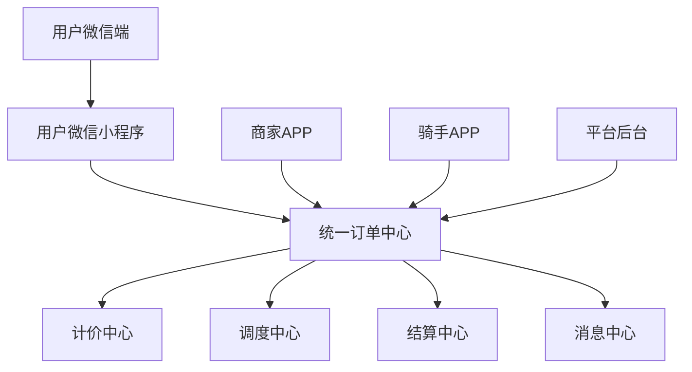
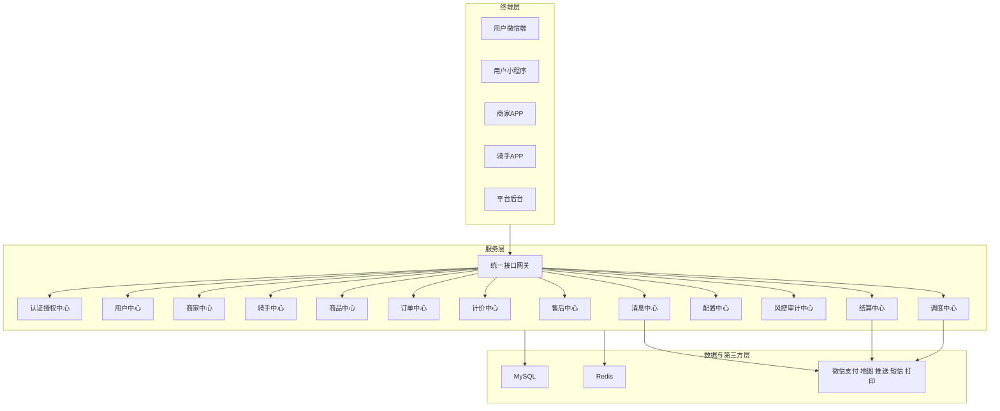
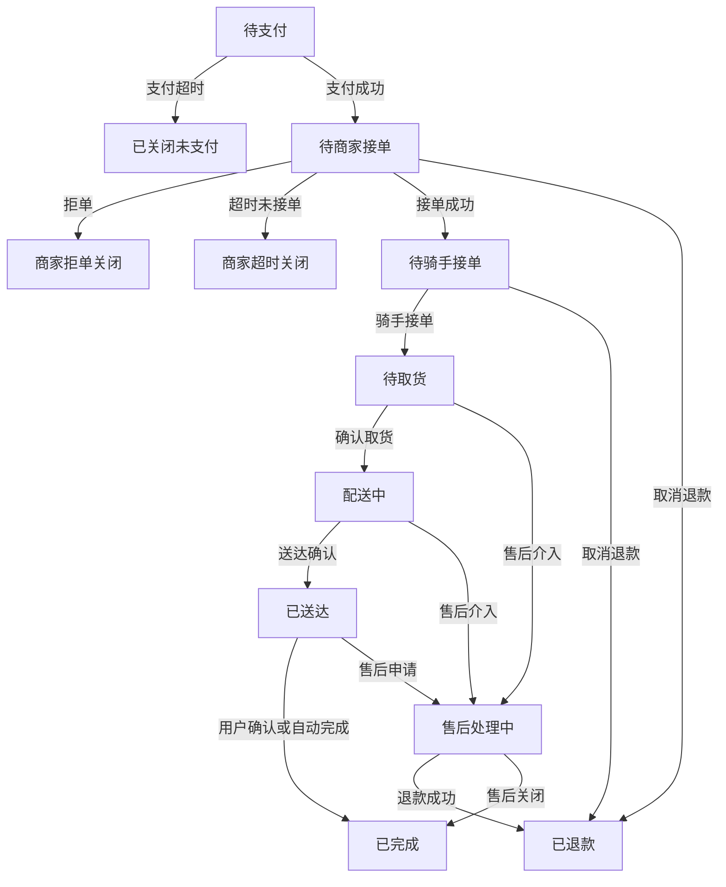
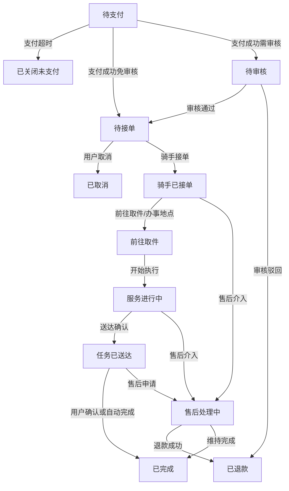
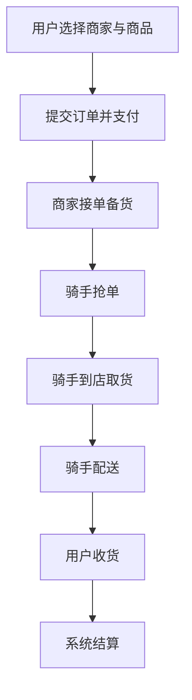
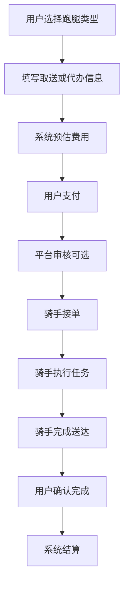

# 同城O2O配送系统定制开发方案

## 一、文档定位

本文件为《同城O2O配送系统》首期建设的混合型主文档，兼具以下两类作用：

- 方案文档：用于说明项目定位、终端覆盖、技术选型、系统价值和整体交付边界。
- 准PRD文档：用于明确业务模式、页面清单、关键规则、状态流转、异常场景和验收标准，为后续设计、研发、测试和实施提供统一基线。

本次文档补全采用 `商家商品下单 + 跑腿发单` 双主线并行模式，目标是让文档不再停留于能力罗列，而是具备可继续拆解为原型、接口和任务的颗粒度。

### 1.1 与原始方案的关系说明

本文件基于原始《同城O2O配送系统定制开发方案》扩写而来，原始文档更偏方案级表达，重点说明终端覆盖、技术栈和核心能力方向；本次版本在保持原始终端和技术方向不变的前提下，补充了页面、规则、状态机、异常流程和验收口径，用于帮助产品、研发和实施团队对齐颗粒度。

为避免误读，以下内容在本文件中统一按“补充说明”理解：

- 本文新增的页面清单、状态流转、异常流程、验收标准，属于对原始方案的细化，不代表原始方案曾逐条明确写出。
- 本文中出现的默认策略、建议时限、推荐配置，均应理解为 `建议口径` 或 `可配置默认值`，而不是不可调整的固定合同条款。
- 本文将跑腿业务补充为重点主线之一，是基于当前对业务方向的对齐结果所做的扩展性设计；若后续实施需要收敛首期范围，可在范围优先级文档中调整。
- 本文中所有第三方能力、规则模板、配置项和状态说明，均以项目后续评审和实施确认结果为准。

---

## 二、项目概述

### 2.1 建设背景

同城生活服务业务具备高频、即时、场景碎片化的特点，单一的商家下单模式无法覆盖全部需求，单一的跑腿撮合模式又难以承载平台化经营。因此，本项目需要打造一套统一平台，既支持商家商品交易和即时配送，又支持用户直接发起帮送、帮取、帮买、代办等跑腿任务，形成完整的本地生活履约闭环。

### 2.2 项目定位

本项目定位为面向同城生活服务场景的综合型 O2O 配送平台，采用：

- 用户微信生态入口
- 用户全功能小程序入口
- 商家双端应用 APP
- 骑手双端应用 APP
- 平台 PC 管理后台
- Node.js 后端核心服务

平台在首期即覆盖同城零售、生鲜果蔬、便利到家、帮送、帮取、帮买、代办等业务方向，并按照广区域覆盖、便于后续扩类目和扩服务类型的思路进行规划。

补充说明：

- 商家端和骑手端在本方案中采用 `UniApp + 原生能力适配` 的实现口径，即通过跨端方案完成安卓与 iOS 双端交付，并结合原生插件或厂商 SDK 满足定位、推送、打印、扫码、播报等能力。
- 若后续对外文件需要严格区分“纯原生开发”与“跨端开发 + 原生能力适配”，应以实施阶段的技术确认结果为准，避免语义误解。

### 2.3 项目目标

- 打通用户下单、商家履约、骑手配送、平台监管、财务结算全流程。
- 建立商品订单和跑腿订单双业务主线的统一交易底座。
- 建立标准化的区域、计价、调度、通知、售后和结算规则。
- 在保证首期范围完整的前提下，为后续多区域、多商圈、多服务类型扩展留足空间。

### 2.4 首期范围

首期交付范围覆盖以下终端与角色：

|角色|终端|定位|
|---|---|---|
|用户|用户微信端|微信生态轻量入口，用于活动触达、快捷访问、消息跳转、轻量查询|
|用户|用户微信小程序|用户主交易入口，承载商品下单与跑腿发单完整能力|
|商家|商家端 APP|店铺经营、订单履约、售后处理、财务查询入口|
|骑手|骑手端 APP|接单、导航、取货、配送、异常处理、收入管理入口|
|平台运营/财务/客服/审核|平台管理后台|全系统配置、监控、审核、售后、结算、风控管控入口|
|系统服务|后端核心服务|统一鉴权、交易、调度、结算、消息和配置支撑|

### 2.5 非目标范围

本主文档不直接展开以下内容：

- 数据库表结构设计
- API 逐字段协议
- 页面原型图和交互稿
- 详细研发排期与人天拆分
- 代码仓库结构与部署脚本

这些内容将在后续工作流文档和实施阶段继续细化。

---

## 三、业务模式与系统边界

### 3.1 双主线业务模式

本系统首期采用双主线并行：

#### 主线A：商家商品下单

用户浏览附近商家和商品，加入购物车，完成在线支付，由商家接单备货，再由平台骑手完成取货和配送。

适用场景：

- 外卖餐饮
- 生鲜果蔬
- 商超便利
- 鲜花蛋糕
- 本地零售

#### 主线B：跑腿任务发单

用户不依赖商家商品目录，直接创建任务，由骑手接单执行。首期支持以下类型：

- 帮送：用户将物品从 A 点送到 B 点
- 帮取：骑手前往指定地点代取后送达
- 帮买：骑手代为购买指定商品或代垫费用
- 代办：符合平台规则的轻量代办任务

### 3.2 系统边界

#### 平台负责

- 统一用户、商家、骑手账号体系
- 统一订单中心、计价中心、调度中心、结算中心
- 统一区域、规则、服务类型、风控和消息能力
- 统一售后和投诉处理
- 统一日志、审计和配置管理

#### 商家负责

- 店铺资料维护
- 商品和库存维护
- 接单、拒单、备货、售后协同
- 对账、提现和门店运营

#### 骑手负责

- 资质提交和接单状态维护
- 接单、到店、取货、配送、异常上报
- 收入查询、提现申请、违规申诉

#### 用户负责

- 地址维护
- 下单和支付
- 跑腿需求填写
- 取消、退款、评价、投诉

### 3.3 首期边界口径

- 商品单和跑腿单均为首期核心能力，不是后续扩展项。
- 平台首期默认采用 `抢单为主 + 平台人工干预` 的调度模式，后续可平滑扩展为自动派单或混合派单。
- 商品订单要求用户在商家配送范围内方可下单。
- 跑腿订单按平台服务范围和计价规则执行，可支持更广区域覆盖。
- 用户微信端为轻量入口，小程序为主交易入口，避免重复建设导致维护成本过高。

---

## 四、角色定义与终端关系

### 4.1 核心角色

|角色|核心职责|关键权限|
|---|---|---|
|普通用户|浏览、下单、发起跑腿、支付、评价、投诉|仅可访问本人订单、地址、资产、消息|
|商家管理员|经营店铺、管理商品、处理订单、查看结算|仅可访问所属店铺和门店数据|
|商家店员|协助接单、备货、打印、售后处理|按门店和岗位授权访问|
|骑手|抢单、取货、配送、上报异常、查看收入|仅可访问本人抢单池和订单数据|
|平台审核人员|审核商家和骑手入驻资料|可操作审核流程，不参与财务配置|
|平台运营人员|管理活动、内容、服务类型、消息模板|可操作运营配置，不可操作财务审核|
|平台客服人员|处理投诉、退款协同、异常订单跟进|可查看订单日志、介入售后处理|
|平台财务人员|处理结算、提现审核、对账导出|可访问财务菜单和流水数据|
|平台超级管理员|系统参数、角色权限、第三方配置|拥有平台系统管理能力|

### 4.2 终端与业务关系图

---

## 五、技术选型方案

本方案严格遵循既定技术栈，针对 APP 端特性做原生能力适配，同时兼顾跨端开发效率、性能和未来迭代能力。

|业务终端|核心技术选型|技术说明|
|---|---|---|
|用户微信端|微信原生开发框架|基于微信生态原生能力实现快捷访问、授权、支付跳转、消息承接、活动承接等轻量能力|
|用户端微信小程序|UniApp（Vue3 + TypeScript）|承载用户完整交易流程，一套代码便于扩展至更多小程序平台|
|商家端 APP|UniApp（Vue3 + TypeScript）|支持安卓+iOS 双端，适配接单提醒、蓝牙打印、后台保活、离线推送等能力|
|骑手端 APP|UniApp（Vue3 + TypeScript）|支持安卓+iOS 双端，适配持续定位、锁屏播报、导航、扫码核验等能力|
|平台管理后台|Vue3 + Element Plus + TypeScript|支撑多角色后台管理、复杂表单和数据可视化|
|后端核心服务|Node.js（Koa2 + TypeScript）|适配高并发订单处理、实时状态流转、消息推送和集群扩展|
|数据存储|MySQL 8.0 + Redis 7.0|MySQL 存主交易数据，Redis 存热点缓存、令牌、抢单池、幂等与状态缓存|
|第三方能力|微信、地图、推送、短信、打印、支付 SDK|支撑支付、定位、轨迹、通知、打印、消息触达等关键链路|

---

## 六、系统信息架构

---

## 七、终端页面与功能清单

## 7.1 用户微信端

用户微信端定位为微信生态轻量入口，重点承接分享、活动、通知跳转、快捷下单和订单查询，不与小程序完整能力重复建设。

|页面/模块|核心动作|关键字段/状态|说明|
|---|---|---|---|
|启动页/活动承接页|承接分享链接、活动推广、拉新入口|活动编号、跳转类型、来源渠道|支持跳转到小程序指定页面|
|微信授权页|微信授权登录、手机号绑定|openid、unionid、手机号、授权状态|首次进入触发授权|
|快捷入口页|展示附近服务、热门活动、快捷下单入口|定位城市、服务类型、入口状态|引导进入商品单或跑腿单|
|订单快捷查询页|查看最近订单、支付结果、配送进度|订单号、订单状态、支付状态|适合消息通知跳转|
|消息承接页|承接模板消息、活动消息|消息类型、订单关联、已读状态|跳转至小程序详情页|
|客服与帮助页|客服说明、常见问题、联系入口|问题分类、联系方式|可接入微信客服能力|

## 7.2 用户微信小程序

用户小程序为用户主交易入口，需完整覆盖商品下单和跑腿发单双主线。

### 7.2.1 首页与公共能力

|页面/模块|核心动作|关键字段/状态|说明|
|---|---|---|---|
|启动页|加载配置、拉取定位、检查登录态|城市、定位状态、登录状态|支持城市切换和权限引导|
|首页|展示 Banner、分类、附近商家、跑腿入口、活动入口|当前地址、服务范围、频道配置|首页为双主线统一入口|
|搜索页|按商家、商品、服务词搜索|关键词、历史词、热搜词|支持最近搜索和推荐词|
|分类频道页|按品类筛选商家和商品|一级类目、二级类目、排序方式|适用于零售类场景|
|地址簿|新增、编辑、删除、默认地址设置|联系人、手机号、经纬度、门牌号|商品单和跑腿单共用|
|消息中心|查看订单消息、活动消息、系统通知|消息类型、已读状态、跳转目标|消息需与订单节点联动|
|客服中心|在线客服、投诉入口、帮助中心|会话状态、问题类型、订单关联|售后和投诉的重要入口|

### 7.2.2 商品下单链路页面

|页面/模块|核心动作|关键字段/状态|说明|
|---|---|---|---|
|商家列表页|浏览附近商家、筛选、排序|距离、配送费、起送价、营业状态|仅展示服务范围内商家|
|商家详情页|查看店铺信息、分类、商品、评价、公告|门店状态、配送时效、活动标签|展示起送价、配送费、营业中状态|
|商品详情/规格弹层|选择规格、数量、加入购物车|SKU、库存、限购、价格|支持多规格和加料|
|购物车页|编辑商品数量、清空、去结算|商品金额、打包费、配送费|需校验起送价和库存|
|订单确认页|确认地址、配送时间、备注、优惠券、支付方式|收货地址、优惠金额、应付金额|支持预约时间和备注|
|优惠券选择页|选择优惠券或平台红包|使用门槛、有效期、适用范围|与商品单金额联动|
|收银台页|发起支付、查看支付结果|支付单号、支付状态、倒计时|支持微信支付|
|支付结果页|展示成功或失败、下一步引导|支付状态、订单号|支持重新支付|

### 7.2.3 跑腿发单链路页面

|页面/模块|核心动作|关键字段/状态|说明|
|---|---|---|---|
|跑腿频道页|选择帮送、帮取、帮买、代办服务|服务类型、说明文案、是否可用|双主线中的一级入口|
|帮送表单页|填写取件地址、收件地址、物品说明|地址、物品类型、重量、期望时间|适用于用户自己已有物品|
|帮取表单页|填写代取地址、收件地址、取件码等|地址、取件说明、验证码、时间|适用于代取快递或文件|
|帮买表单页|填写购买需求、预算金额、商品备注|商品名称、预算、品牌偏好、垫付规则|涉及代买垫付和差价说明|
|代办表单页|填写任务内容、地点、完成要求|任务说明、目标地点、时间要求|需后台可配置是否人工审核|
|费用预估页|查看预估费用、附加费、加小费|基础费、距离费、重量费、时段费、小费|最终价格以下单时为准|
|发单确认页|确认服务内容、地址、联系人、费用|服务类型、联系人、备注、应付金额|支持再次编辑|
|跑腿收银台页|完成跑腿订单支付|订单号、支付状态|支付成功后进入待接单状态|
|跑腿订单追踪页|查看接单状态、骑手位置、联系入口|接单状态、骑手信息、实时轨迹|支持取消申请和客服介入|

### 7.2.4 订单与售后页面

|页面/模块|核心动作|关键字段/状态|说明|
|---|---|---|---|
|订单列表页|按全部、待支付、进行中、售后中、已完成筛选|订单类型、订单状态、支付状态|商品单和跑腿单统一展示|
|订单详情页|查看详情、状态流转、费用明细、日志摘要|订单号、类型、状态、时间轴|统一承接售后和投诉|
|配送追踪页|实时查看骑手位置、预计送达时间|骑手坐标、轨迹、预计时长|商品单和跑腿单均支持|
|取消/退款申请页|提交取消或退款原因|取消原因、退款原因、申请状态|按状态控制是否可提交|
|售后详情页|查看处理进度和处理结果|售后单号、售后状态、处理结果|支持客服介入记录|
|评价页|评价商家、骑手、订单体验|评分、文字、图片、匿名状态|订单完成后开放|
|投诉页|提交商家/骑手/订单投诉|投诉类型、附件、描述|进入平台客服处理流程|

### 7.2.5 个人中心与资产页面

|页面/模块|核心动作|关键字段/状态|说明|
|---|---|---|---|
|个人中心首页|查看头像、订单入口、资产入口|昵称、会员信息、快捷入口|聚合常用能力|
|优惠券/红包页|查看可用、已用、过期券|券类型、有效期、适用条件|用于商品单和跑腿单营销|
|收藏页|收藏商家或常用服务|收藏类型、更新时间|便于复购|
|浏览历史页|查看最近浏览商家和商品|浏览时间、商家信息|提升转化|
|设置页|账号安全、隐私设置、授权管理|手机号、消息订阅状态|支持注销入口|

## 7.3 商家端 APP

商家端 APP 聚焦经营与履约，不仅要能接单，还要能管理商品、门店、活动和财务。

### 7.3.1 账号与入驻

|页面/模块|核心动作|关键字段/状态|说明|
|---|---|---|---|
|注册登录页|手机号登录、验证码登录、密码登录|手机号、验证码、登录状态|支持多账号门店角色|
|入驻申请页|提交营业执照、法人信息、门店资料|店铺名称、类目、证照、地址|进入后台审核流程|
|审核进度页|查看审核状态和驳回原因|审核状态、驳回原因、补充材料|支持重新提交|
|账号设置页|修改密码、绑定手机、员工管理|账号角色、最后登录时间|员工角色由门店管理员分配|

### 7.3.2 工作台与订单中心

|页面/模块|核心动作|关键字段/状态|说明|
|---|---|---|---|
|工作台首页|查看待处理订单、营业状态、实时数据|待接单数、营业状态、今日营业额|登录后默认首页|
|新订单弹窗/播报|新订单提醒、快速接单/拒单|订单号、倒计时、订单类型|支持锁屏提醒和语音播报|
|订单列表页|按待接单、待备货、待取货、配送中、售后中筛选|订单状态、下单时间、金额|商品单和跑腿代买商家单均可承接|
|订单详情页|查看商品明细、地址、备注、骑手状态|订单号、商品列表、骑手信息|支持打印、联系用户、联系骑手|
|售后处理页|同意退款、驳回、备注说明|售后状态、原因、处理意见|需与平台客服流程联动|
|异常上报页|上报缺货、门店关闭、商品异常|异常类型、说明、附件|触发平台介入流程|

### 7.3.3 商品与店铺经营

|页面/模块|核心动作|关键字段/状态|说明|
|---|---|---|---|
|商品分类页|新增、编辑、排序、上下架分类|分类名、排序、状态|支持多级分类扩展|
|商品管理页|新增商品、编辑商品、上下架、批量操作|商品名、价格、库存、标签|支持图文详情|
|规格库存页|管理 SKU、规格组合、库存预警|SKU、库存、规格值、售价|库存变更影响下单|
|店铺设置页|维护门店信息、头像、公告、营业执照|门店名、地址、公告、联系方式|支持门店图片展示|
|营业配置页|设置营业时间、节假日、打烊状态|营业时段、临时休息状态|影响前台可下单状态|
|配送配置页|设置起送价、配送费模板、配送范围|起送价、范围、时效|与平台配置协同生效|
|打印配置页|绑定打印机、打印联数、模板|设备编号、模板状态|订单接单后触发打印|
|营销活动页|配置满减、折扣、新人券、推荐位|活动类型、开始时间、结束时间|与平台活动可叠加受限|

### 7.3.4 财务与消息

|页面/模块|核心动作|关键字段/状态|说明|
|---|---|---|---|
|数据看板页|查看今日订单、营业额、热销商品|订单量、销售额、客单价|支持日周月切换|
|账单中心页|查看结算单、订单流水、佣金明细|账单周期、应结金额、状态|支持筛选与导出|
|提现申请页|提交提现申请、查看到账进度|提现金额、账户信息、审核状态|受平台审核控制|
|消息中心|查看订单、系统、活动、售后通知|消息类型、已读状态|支持跳转订单详情|

## 7.4 骑手端 APP

骑手端 APP 重点是接单效率、履约稳定性、定位可靠性和异常处理能力。

### 7.4.1 账号与入驻

|页面/模块|核心动作|关键字段/状态|说明|
|---|---|---|---|
|注册登录页|手机号注册、验证码登录|手机号、登录状态|支持协议确认|
|入驻申请页|提交身份证、健康证、车辆信息|证件照、车辆类型、服务区域|进入后台审核|
|审核进度页|查看审核状态、补件入口|审核状态、驳回原因|支持重新提交|
|接单设置页|设置接单状态、服务时段、偏好类型|在线状态、接单半径、订单类型|影响订单池展示|

### 7.4.2 接单与配送

|页面/模块|核心动作|关键字段/状态|说明|
|---|---|---|---|
|首页/接单大厅|查看可抢订单、切换在线状态|订单数、距离、配送费、类型|支持商品单和跑腿单混合展示|
|订单池筛选页|按距离、收入、订单类型、预约时间筛选|筛选条件、排序方式|提升抢单效率|
|订单详情页|查看取送地址、备注、费用、联系人|订单号、取件码、路线距离|抢单前后均可查看不同信息|
|抢单确认页|确认抢单、查看约束条件|履约时效、服务费、超时责任|防止误抢|
|到店取货页|扫码核验、确认到店、确认取货|取货码、取货状态、到店时间|商品单重点页面|
|导航配送页|内置导航、查看路线、联系用户|当前位置、目标地址、预计时长|支持地图 SDK 调起|
|送达确认页|拍照、签收、验证码确认|签收方式、签收时间、证明附件|不同订单类型可配置|
|异常上报页|上报联系不上、商品破损、用户拒收等|异常类型、说明、图片、处理状态|触发平台客服介入|

### 7.4.3 收入与服务管理

|页面/模块|核心动作|关键字段/状态|说明|
|---|---|---|---|
|我的订单页|查看待取货、配送中、已完成、异常单|订单状态、收入金额|骑手订单中心|
|收入统计页|查看日、周、月收入|订单数、收入、奖励、扣罚|支持明细查询|
|账单明细页|查看每单收入、平台扣点、补贴|订单号、实际到账金额|作为结算依据展示|
|提现页|发起提现、查看到账状态|提现金额、到账账户、审核状态|与后台审核联动|
|申诉中心|提交处罚申诉、异常申诉|申诉类型、证据、处理状态|平台可回写结果|
|消息中心|查看系统消息、订单消息、处罚通知|消息类型、已读状态|支持跳转对应页面|
|个人资料页|管理头像、手机号、紧急联系人、设备权限|身份状态、接单状态|支持权限引导|

## 7.5 平台管理后台

平台后台必须兼顾运营、审核、客服、财务、系统配置和审计，需要按角色拆分菜单与权限。

### 7.5.1 平台总览与主体管理

|菜单/页面|核心动作|关键字段/状态|说明|
|---|---|---|---|
|数据看板|查看实时订单、交易、活跃用户、活跃骑手|订单量、GMV、完成率、取消率|首页概览|
|用户管理|查询用户、冻结账号、查看订单与投诉|账号状态、手机号、注册时间|支持黑名单处理|
|商家管理|审核商家入驻、管理店铺状态、查看经营数据|审核状态、类目、门店状态|支持上架/下架店铺|
|骑手管理|审核骑手、管理接单状态、处罚与奖励|审核状态、在线状态、服务范围|支持查看轨迹摘要|

### 7.5.2 商品、订单与售后

|菜单/页面|核心动作|关键字段/状态|说明|
|---|---|---|---|
|商品类目管理|维护平台类目、敏感商品规则|类目名、排序、状态|商家商品类目基线|
|商品巡检页|查看违规商品、下架处理|商品状态、违规原因|平台质检入口|
|订单中心|查询全平台订单、查看详情、干预状态|订单类型、订单状态、支付状态|统一订单运营中心|
|异常订单中心|查看超时单、取消单、投诉单、异常单|异常类型、处理状态|客服和运营协同处理|
|售后退款中心|审核退款、回写处理意见|售后状态、退款金额、责任归属|与支付和结算联动|
|投诉工单中心|处理用户、商家、骑手投诉|投诉对象、投诉类型、工单状态|平台客服核心入口|

### 7.5.3 区域、服务与调度配置

|菜单/页面|核心动作|关键字段/状态|说明|
|---|---|---|---|
|城市/区域管理|维护城市、行政区、商圈、服务片区|城市状态、区域边界|支撑广区域覆盖|
|围栏配置|配置商家配送范围、跑腿服务范围|围栏类型、经纬度、多边形|与下单和调度联动|
|配送规则配置|设置抢单、扩圈、预约单提醒规则|抢单时长、扩圈层级、预约提醒时间|调度中心配置入口|
|计价规则管理|配置配送费、距离费、时段费、天气费|规则模板、适用范围、状态|商品单和跑腿单分开管理|
|服务类型管理|配置帮送、帮取、帮买、代办等服务|服务类型、表单模板、审核开关|决定前台跑腿入口|
|时间与节假日配置|配置营业日、节假日、夜间时段|日期、时间段、加价规则|与计价联动|

### 7.5.4 财务、运营与系统

|菜单/页面|核心动作|关键字段/状态|说明|
|---|---|---|---|
|结算中心|查看商家和骑手结算单|结算周期、应结金额、状态|支持导出|
|提现审核|审核商家和骑手提现|提现金额、账户、审核状态|财务人员使用|
|营销运营|配置 Banner、活动专区、优惠券模板|活动类型、投放范围、时间|影响前台首页与转化|
|消息模板管理|维护小程序订阅消息、APP 推送模板|模板类型、触发节点、状态|用于通知标准化|
|风控与黑名单|管理黑名单、风险订单、异常账户|风险等级、处理方式|保护平台安全|
|系统参数|维护支付、地图、短信、推送等参数|配置项、启用状态|敏感信息需走安全配置方式|
|角色权限管理|配置菜单权限、数据权限、岗位权限|角色名、权限点、状态|后台多角色基础能力|
|操作审计日志|查询后台操作日志|操作者、时间、操作对象|满足追责和审计需求|

## 7.6 后端核心服务

后端不仅承担接口能力，还需要承担规则统一、状态统一和全链路审计能力。

|模块|职责说明|关键输出|
|---|---|---|
|统一接口网关|统一接入、鉴权、限流、日志记录|接口安全、流量治理|
|认证授权中心|用户、商家、骑手、后台管理员认证与权限控制|登录态和权限边界|
|用户中心|地址、收藏、消息订阅、账户资料管理|用户基础数据|
|商家中心|店铺、商品、库存、营业配置管理|商家经营数据|
|骑手中心|骑手资料、审核、接单状态、轨迹接入|骑手履约数据|
|商品中心|商品分类、商品信息、规格、库存管理|商品展示与库存控制|
|订单中心|商品单和跑腿单创建、流转、关闭、售后|统一交易状态|
|计价中心|商品单配送费和跑腿单费用计算|价格结果和费用明细|
|调度中心|订单池、扩圈、抢单、人工干预、预约提醒|履约分发结果|
|售后中心|退款、取消、投诉、异常处理流程|售后状态与处理记录|
|结算中心|账单、结算、佣金、提现、流水|财务结算结果|
|消息中心|站内消息、订阅消息、短信、APP 推送|通知触达结果|
|配置中心|区域、围栏、规则、模板、服务类型管理|全局配置基础|
|风控审计中心|黑名单、敏感操作记录、异常行为识别|审计和风控结果|

---

## 八、核心业务规则

## 8.1 订单类型规则

首期订单类型统一分为两大类：

|一级类型|二级类型|说明|
|---|---|---|
|商品订单|外卖、零售、生鲜、商超等|基于商家商品目录完成交易|
|跑腿订单|帮送、帮取、帮买、代办|基于用户填写需求完成交易|

规则口径：

- 商品订单必须绑定商家和商品明细。
- 跑腿订单必须绑定服务类型和任务说明。
- 商品订单以商家履约为前置，跑腿订单以骑手接单为前置。
- 帮买订单允许存在骑手垫付或预算金额机制，具体垫付规则由后台配置。
- 代办订单可按服务类型配置是否需要人工审核后再进入订单池。

## 8.2 区域与范围规则

- 商品订单仅允许在商家配送范围内下单。
- 商家配送范围可按门店独立配置，可使用距离圈或围栏方式。
- 跑腿订单按平台服务范围校验，可支持更广区域覆盖。
- 若用户地址超出商品配送范围，前台需明确提示不可下单原因。
- 若跑腿订单跨较大区域，计价中心需按距离和服务级别自动加价。
- 骑手可配置接单区域偏好，但最终能否展示订单以平台规则为准。

## 8.3 计价规则

### 商品订单计价

商品订单总金额 = 商品金额 + 打包费 + 配送费 + 时段加价 + 天气加价 - 优惠券/红包抵扣

说明：

- 起送价不计入订单金额，但作为能否提交订单的门槛。
- 配送费可按门店、距离、区域、时段差异化配置。
- 优惠券抵扣后的金额不得小于支付系统允许的最小支付金额。

### 跑腿订单计价

跑腿订单总金额 = 基础服务费 + 距离费 + 重量费 + 楼层费 + 时段加价 + 天气加价 + 小费 + 代买差价/垫付金额

说明：

- 基础服务费按服务类型区分。
- 帮买订单应明确预算金额、实际垫付金额和补差价规则。
- 代办任务可按任务复杂度采用固定价或模板价。
- 所有价格以前端展示和下单锁定价格为准，后台可配置算法模板。

## 8.4 下单与支付规则

- 用户提交订单前必须完成地址和联系人信息确认。
- 商品订单提交前需校验库存、营业状态、配送范围、起送价。
- 跑腿订单提交前需校验服务范围、服务类型是否启用、表单是否完整。
- 所有订单在支付完成前均处于 `待支付` 状态。
- 待支付订单在超时后自动关闭，默认超时可配置，建议首期默认 15 分钟。
- 支付成功后由支付回调确认订单生效，禁止仅以前端支付结果作为最终依据。

## 8.5 商家履约规则

- 商品订单支付成功后，商家进入 `待接单` 状态。
- 商家需在规定时间内接单或拒单，默认时限建议 5 分钟，具体由后台配置。
- 商家超时未接单或主动拒单，系统自动关闭订单并发起原路退款。
- 商家接单后进入备货阶段，可打印小票、查看用户备注、联系用户。
- 若商品缺货或门店异常，商家可发起异常上报，由平台客服介入。

## 8.6 骑手接单与调度规则

- 首期以抢单模式为主，系统按区域、距离、在线状态、订单类型筛选订单池。
- 商品订单通常在商家接单后进入骑手订单池。
- 跑腿订单在支付完成且通过必要审核后进入骑手订单池。
- 若订单长时间无人接单，系统支持扩圈推送或人工干预。
- 骑手抢单成功后，订单与骑手绑定，其他骑手不可再接。
- 骑手需按节点完成到店、取货、配送、送达、签收等状态动作。

## 8.7 取消、退款与售后规则

- 用户在 `待支付` 阶段可直接取消订单。
- 商品订单在商家未接单前取消，一般允许直接取消并原路退款。
- 商品订单在商家已接单但骑手未取货阶段，取消需按平台规则判定，可能进入客服审核。
- 商品订单在骑手已取货后，用户不可直接取消，需提交售后申请或客服介入。
- 跑腿订单在骑手未接单前，可按规则申请取消。
- 跑腿订单在骑手已接单或任务已执行阶段，取消需结合执行进度和责任归属判定退款金额。
- 帮买订单如已发生垫付，应区分服务费、垫付款和退款责任。

## 8.8 结算与提现规则

- 商品订单完成后，系统按规则拆分商家收入、平台佣金、骑手配送费。
- 跑腿订单完成后，系统按规则拆分骑手收入、平台服务费及可能的垫付款差额。
- 存在售后中的订单，结算应处于冻结或待确认状态。
- 商家和骑手可在结算可用余额范围内发起提现。
- 提现需进入平台审核流程，平台可配置自动或人工审核策略。

## 8.9 通知与消息规则

以下关键节点必须触发消息通知：

- 下单成功
- 支付成功
- 商家待接单提醒
- 商家拒单/超时关闭
- 订单进入骑手订单池
- 骑手接单成功
- 骑手到店/已取货/配送中
- 订单已送达
- 退款申请结果
- 提现审核结果

通知通道包括：

- 小程序订阅消息
- APP 推送
- 站内消息
- 短信补充通知

## 8.10 数据与日志规则

- 所有核心状态流转必须记录操作日志。
- 后台审核、退款、提现、处罚等动作必须记录审计日志。
- 订单日志需可追溯到操作者、操作时间、来源端和前后状态。
- 关键回调类接口需具备幂等和重复通知保护。

---

## 九、订单状态流转

## 9.1 商品订单状态机

商品订单关键状态说明：

|状态|说明|典型触发者|
|---|---|---|
|待支付|用户已提交订单但尚未完成支付|用户|
|待商家接单|支付成功，等待商家响应|系统/商家|
|待骑手接单|商家接单完成，待骑手抢单|系统|
|待取货|骑手已接单，等待到店取货|骑手|
|配送中|骑手已取货，正在配送|骑手|
|已送达|骑手已确认送达|骑手|
|已完成|用户确认收货或系统自动完成|用户/系统|
|售后处理中|退款、取消、投诉介入中|用户/客服/平台|
|已退款|退款完成|系统/财务|

## 9.2 跑腿订单状态机

跑腿订单状态说明：

|状态|说明|典型适用场景|
|---|---|---|
|待审核|部分敏感代办任务需平台审核|代办、特殊帮买|
|待接单|订单已支付，可进入骑手订单池|帮送、帮取、帮买|
|骑手已接单|骑手抢单成功|全部跑腿场景|
|前往取件|骑手前往取件点或代办地点|帮送、帮取、代办|
|服务进行中|骑手已开始执行任务|帮买、代办、配送|
|任务已送达|骑手完成任务交付|全部跑腿场景|

## 9.3 售后状态口径

|状态|说明|
|---|---|
|待受理|用户已提交售后申请，等待处理|
|处理中|平台客服、商家或财务介入处理中|
|待退款|售后已同意，等待支付或财务退款|
|已退款|退款到账完成|
|已驳回|售后申请不成立|
|已关闭|售后流程结束|

---

## 十、核心业务流程与异常流程

## 10.1 商品订单主流程

### 商品订单异常场景

|异常场景|触发条件|处理口径|
|---|---|---|
|支付超时|用户超过支付时限未完成支付|自动关闭订单|
|商家拒单|商家主动拒绝订单|自动退款并通知用户|
|商家超时未接单|商家未在规定时间内处理|自动关闭并退款|
|商品缺货|商家接单后发现缺货|商家发起异常，平台介入处理退款或改配|
|骑手长时间无人接单|订单进入骑手池后长时间无人响应|扩圈推送或人工干预|
|骑手配送异常|联系不上用户、物品破损、交通异常|骑手上报异常，客服介入|
|用户拒收|送达时用户拒收|进入售后或异常单流程|

## 10.2 跑腿订单主流程

### 跑腿订单异常场景

|异常场景|触发条件|处理口径|
|---|---|---|
|用户填写信息不完整|地址、联系人、任务说明缺失|前端阻止提交并提示补全|
|审核不通过|代办或敏感任务不符合规则|订单关闭并退款|
|长时间无人接单|订单在可接单范围内无骑手响应|扩圈、加价提醒或人工介入|
|帮买预算不足|骑手实际购买金额超过预算|需发起补差价流程或协商取消|
|用户无法联系|骑手执行中无法联系用户|进入异常上报流程|
|任务无法完成|地点关闭、商品停售、任务违法违规|平台客服介入，判定退款责任|

## 10.3 退款与投诉流程

退款与投诉流程需要贯穿全端：

- 用户端发起售后申请或投诉
- 商家或骑手按责任参与说明
- 平台客服查看订单日志、轨迹和证据
- 平台作出退款、驳回、赔付、处罚等处理
- 结算中心同步冻结或回滚应结金额
- 消息中心通知处理结果

---

## 十一、非功能要求

|类别|要求|
|---|---|
|性能要求|核心列表页和详情页应具备可接受响应速度，订单创建、支付回调、状态更新需稳定支撑高峰并发|
|可用性要求|订单、支付、消息、调度等核心链路应支持异常重试和降级策略|
|安全要求|登录鉴权、支付回调、提现审核、后台操作需严格鉴权和审计；敏感配置需安全存储，不允许直接硬编码提交|
|一致性要求|订单状态、支付状态、结算状态必须以服务端最终结果为准，防止前端状态漂移|
|可观测性要求|核心接口、关键状态流转、第三方回调、推送结果必须可追踪、可审计|
|扩展性要求|支持后续扩展多区域、多服务类型、多种派单策略和更多营销玩法|
|兼容性要求|小程序与 APP 端页面能力需保持核心体验一致，但允许按终端能力做差异化适配|

---

## 十二、验收标准

## 12.1 通用验收标准

- 文档定义的全部终端均有对应功能入口和闭环说明。
- 商品订单和跑腿订单均具备从创建到完成的完整主流程。
- 主流程中涉及的支付、通知、状态同步、结算均具备明确规则。
- 异常场景、售后流程、投诉流程均有清晰流转和责任归属。
- 平台后台能够支撑配置、审核、监控、售后、财务和审计能力。

## 12.2 用户侧验收标准

- 用户可完成微信授权登录、地址维护、下单支付、查看订单、取消或申请售后。
- 用户可完成商品下单流程并实时查看配送进度。
- 用户可完成帮送、帮取、帮买、代办任一跑腿服务发单。
- 用户可在订单关键节点收到通知并进入订单详情查看处理结果。
- 用户可在订单完成后进行评价或投诉。

## 12.3 商家侧验收标准

- 商家可完成注册、入驻申请、资料补充和审核进度查看。
- 商家可独立管理商品分类、商品、规格、库存、营业时间、配送配置。
- 商家可接收订单提醒、接单、拒单、打印小票、查看骑手状态。
- 商家可处理售后、查看账单、发起提现。

## 12.4 骑手侧验收标准

- 骑手可完成注册、资质提交、审核进度查看和在线状态切换。
- 骑手可查看订单池、筛选订单、完成抢单。
- 骑手可完成到店、取货、导航、送达、签收全流程动作。
- 骑手可提交异常上报、查看收入明细、发起提现和申诉。

## 12.5 平台侧验收标准

- 平台可审核商家和骑手入驻资料。
- 平台可管理城市、区域、围栏、服务类型和计价模板。
- 平台可查看并干预全平台订单和售后流程。
- 平台可审核提现、导出结算单、查看财务流水。
- 平台可配置消息模板、活动配置、角色权限和系统参数。
- 平台可查看操作日志和风险数据。

## 12.6 高风险流程专项验收

以下场景必须单独验收：

- 支付成功但回调延迟
- 商家拒单与自动退款
- 商家超时未接单
- 订单长时间无人接单
- 骑手异常上报
- 用户取消与部分退款
- 帮买差价补偿
- 提现审核驳回
- 推送失败后的降级提醒

---

## 十三、配套工作流文档目录

为保证后续继续细化，本项目已同步建立工作流文档目录：

- `docs/同城O2O_PRD完善/01_Align`
- `docs/同城O2O_PRD完善/02_Architect`
- `docs/同城O2O_PRD完善/03_Atomize`
- `docs/同城O2O_PRD完善/04_Approve`
- `docs/同城O2O_PRD完善/05_Automate`
- `docs/同城O2O_PRD完善/06_Assess`

各阶段目录内已预留并补充对齐文档、共识文档、设计文档、任务拆分文档、审批清单、实施指引、验收文档、最终总结和待办文档，后续可继续在现有基线上细化原型、接口、数据模型和实施任务。

---

## 十四、后续建议

本主文档完成后，建议后续按以下顺序继续推进：

1. 基于本文件补一版页面原型级目录和页面流。
2. 将商品订单和跑腿订单分别细化为接口域和状态机说明。
3. 将平台后台菜单继续细化为角色权限矩阵。
4. 将结算、退款、异常和投诉流程补成测试用例和验收清单。
